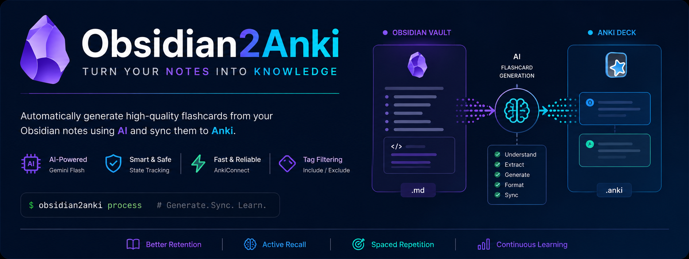
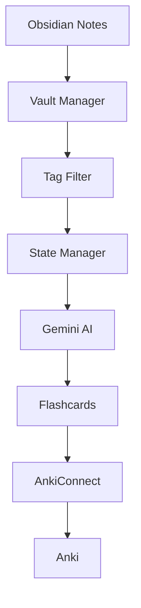
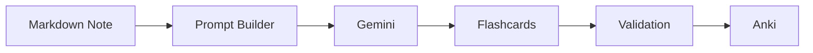
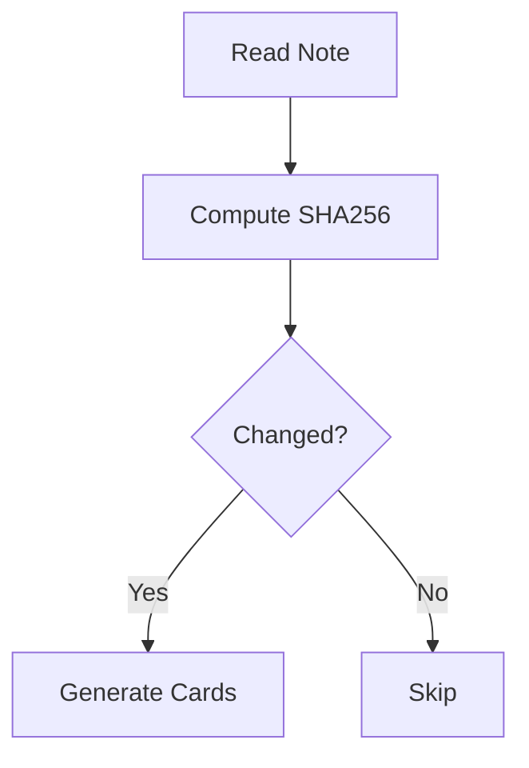

<div align="center">

# Obsidian2Anki

**Generate high-quality Anki flashcards directly from your Obsidian notes using AI.**

Turn your personal knowledge base into a spaced repetition system with a single command.


</div>



## Table of Contents

- Features
- Architecture
- Quick Start
- Configuration
- Project Structure
- CLI Reference
- AI Workflow
- State Manager
- Anki Integration
- FAQ
- Troubleshooting
- Contributing
- License

---

# Features

- 🤖 AI-generated flashcards using Gemini
- 📝 Reads Markdown notes from Obsidian
- 🧠 Automatically creates high-quality question/answer cards
- 🔄 Detects changed notes using SHA-256 hashing
- 📦 Local JSON state management
- 🏷 Include / Exclude tag filtering
- ⚡ Direct integration with AnkiConnect
- 🧩 Modular architecture

# Architecture



# Quick Start

```bash
git clone https://github.com/yourusername/Obsidian2Anki.git

cd Obsidian2Anki

python -m venv .venv

source .venv/bin/activate

pip install -r requirements.txt
```

Create `.env`

```env
API_KEY=your_gemini_api_key
PROMPT_FILE=input/prompt.md
ANKI_URL=http://localhost:8765/
DECK_NAME=Programming
LOCAL_VAULT=/path/to/your/vault
INBOX_FOLDER=00_Inbox
MAIN_NOTES_FOLDER=01_Notes
STATE_FOLDER=data
INCLUDE_TAGS=Programming,Python
EXCLUDE_TAGS=Archive,Ignore
```

Run:

```bash
python -m obsidian2anki process
```

# Configuration

| Variable          | Description                  |
| ----------------- | ---------------------------- |
| API_KEY           | Gemini API key               |
| PROMPT_FILE       | Prompt template              |
| ANKI_URL          | AnkiConnect URL              |
| DECK_NAME         | Default deck                 |
| LOCAL_VAULT       | Obsidian vault               |
| INBOX_FOLDER      | Inbox folder                 |
| MAIN_NOTES_FOLDER | Main notes                   |
| STATE_FOLDER      | State storage                |
| INCLUDE_TAGS      | Allowed tags as an json list |
| EXCLUDE_TAGS      | Ignored tags as an json list |

# Project Structure

```text
src/
└── obsidian2anki/
    ├── app/
    ├── core/
    ├── services/
    ├── utils/
    ├── config.py
    ├── models.py
    └── main.py
data/
input/
logs/
```

# CLI Reference

| Command     | Description         |
| ----------- | ------------------- |
| migrate     | Initial migration   |
| process     | Process inbox notes |
| clear       | Clear state         |
| delete-card | Delete Anki card    |

# AI Workflow



# State Manager

The State Manager stores a SHA-256 hash for every processed note. During
subsequent runs, only modified notes are reprocessed, reducing API usage
and improving performance.



# Anki Integration

Obsidian2Anki communicates with Anki through **AnkiConnect** running on:

    http://localhost:8765

Generated cards are inserted directly into the configured deck.

# FAQ

### Does it modify my notes?

No. Notes are only read unless your workflow explicitly updates
metadata.

### Does it support existing Anki decks?

Yes.

### Does it regenerate unchanged notes?

No.

# Troubleshooting

| Problem                      | Solution                           |
| ---------------------------- | ---------------------------------- |
| Cannot connect to Anki       | Start Anki and enable AnkiConnect  |
| Gemini authentication failed | Verify API_KEY                     |
| No notes processed           | Check folder and tag configuration |

# Contributing

Pull requests are welcome. Please open an issue before submitting large
changes.

# License

MIT License.
