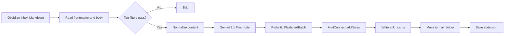

<div align="center">

# Obsidian2Anki

**Turn structured Obsidian notes into AI-generated Anki flashcards.**

Obsidian2Anki is a Python CLI that reads Markdown notes from an Obsidian vault, asks Google Gemini for structured flashcards, sends them to Anki through AnkiConnect, and records synchronization state locally.

[](https://www.python.org/)
[](https://github.com/NikaMalakmadze/Obsidian2Anki)
[](LICENSE)
[](https://ai.google.dev/)

</div>


> [!IMPORTANT]
> The package version is still `0.1.0`. This repository also contains unreleased refactoring, including a diagnostics package that runs `doctor` independently from the main application facade. Back up the Obsidian vault and Anki collection before running migration, formatting, deletion, or clearing commands.

## Overview

The normal inbox workflow is:

1. Create a Markdown note inside `INBOX_FOLDER`.
2. Add YAML frontmatter containing a unique `id` and a `tags` list.
3. Run `obsidian2anki process`.
4. Gemini returns a validated `FlashcardBatch`.
5. AnkiConnect inserts the generated notes into the configured deck.
6. Obsidian2Anki writes `anki_cards` metadata, moves the source file to `MAIN_NOTES_FOLDER`, and stages a state entry.
7. The service saves `state.json` when the command finishes.



## Features

- Gemini structured output validated with Pydantic.
- A bundled prompt that requests one to five concise, concept-focused cards.
- Recursive Markdown discovery for `process` and `migrate`.
- Exact, case-sensitive include and exclude tag filters.
- SHA-256 change detection for notes in the main folder.
- AnkiConnect API version 6 integration for decks, insertion, lookup, and deletion.
- Generated Anki note IDs stored in both source frontmatter and local state.
- `--dry-run` support for bulk mutating commands.
- Rich tables for diagnostics and statistics.
- Two-phase diagnostics that can display malformed or incomplete environment configuration before the main application is constructed.
- Rotating file logs with optional Rich console logging.

## Example

A source note may contain Markdown, Obsidian links, and code:

<div align="center">
  
</div>

Generated Anki notes use `Front`, `Back`, and `NoteID` fields:

<table>
  <tr>
    <td></td>
    <td></td>
  </tr>
  <tr>
    <td></td>
    <td></td>
  </tr>
</table>

## Requirements

- Python `3.12` or newer
- Git
- Obsidian
- Obsidian Templater community plugin
- Anki Desktop
- AnkiConnect
- Google Gemini API key

Python 3.12 is required by `pyproject.toml` and by the modern type-alias and generic syntax used in the source.

## Quick Start

### 1. Clone and install

```bash
git clone https://github.com/NikaMalakmadze/Obsidian2Anki.git
cd Obsidian2Anki

python -m venv venv
source venv/bin/activate
python -m pip install --upgrade pip
python -m pip install -e .
```

Windows PowerShell:

```powershell
python -m venv venv
venv\Scripts\Activate.ps1
python -m pip install --upgrade pip
python -m pip install -e .
```

### 2. Create `.env`

Linux or macOS:

```bash
cp .env.example .env
```

Windows PowerShell:

```powershell
Copy-Item .env.example .env
```

Example:

```env
API_KEY=your_gemini_api_key
PROMPT_FILE=input/prompt.md

ANKI_URL=http://localhost:8765/
DECK_NAME=Programming

LOCAL_VAULT=/absolute/path/to/your/obsidian/vault
INBOX_FOLDER=00_Inbox
MAIN_NOTES_FOLDER=01_Notes

STATE_FOLDER=data

INCLUDE_TAGS=[]
EXCLUDE_TAGS=[]

MAX_RETRIES_ON_ANKI_DUPLICATE_CARD=3
```

`ANKI_URL`, `INCLUDE_TAGS`, and `EXCLUDE_TAGS` have code defaults. The other settings above are required by the current `Settings` model.

### 3. Prepare Anki

1. Install AnkiConnect.
2. Create the deck named by `DECK_NAME`.
3. Open **Tools → Manage Note Types → Basic → Fields**.
4. Add a field named exactly `NoteID`.
5. Keep Anki open while processing notes.

> [!WARNING]
> The Anki note type is hard-coded as `Basic`, and serialization always sends `Front`, `Back`, and `NoteID`.

### 4. Prepare Obsidian

Create the configured folders:

```text
MyVault/
├── 00_Inbox/
├── 01_Notes/
└── Templates/
```

Copy `template/note.md` into the vault template folder and configure Templater to use it for inbox notes.

Required frontmatter:

```yaml
---
id: 9fb66ee5-6778-4bf4-817d-f82646d1237e
tags:
  - Python
  - Programming
---
```

### 5. Diagnose and process

```bash
obsidian2anki doctor
obsidian2anki process --dry-run
obsidian2anki process
```

`doctor` is routed before `build_app()`. Invalid or missing settings are therefore displayed in an **Environment Results** table instead of failing during normal dependency construction.

For complete setup details, see [Installation](docs/installation.md).

## Required Note Format

Every note read by `process` or `migrate` must contain YAML frontmatter with `id` and `tags`:

```markdown
---
id: 9fb66ee5-6778-4bf4-817d-f82646d1237e
tags:
  - Python
  - Algorithms
---

# Iterators

An iterator returns one item at a time and preserves iteration state.
```

After successful processing, generated Anki note IDs are inserted into frontmatter:

```yaml
---
id: 9fb66ee5-6778-4bf4-817d-f82646d1237e
anki_cards: 1749920000001, 1749920000002
tags:
  - Python
  - Algorithms
---
```

### Metadata behavior

- `id` is required and should be unique across the vault.
- `tags` is used only when YAML parses it as a list; otherwise the note receives an empty tag list.
- `anki_cards` may be read as one integer, a comma-separated string, or a YAML list.
- The application calls these values “cards,” but AnkiConnect actions operate on Anki **note IDs**.
- Processing and migration scan nested directories recursively and include only `.md` files.
- The title is derived from the filename before its first period. For example, `python.iterators.md` becomes `python`.
- A successfully processed inbox file is moved to the root of `MAIN_NOTES_FOLDER`; nested source structure is not preserved.

## Tag Filtering

Tag matching is exact and case-sensitive.

```env
INCLUDE_TAGS=["Python", "JavaScript"]
EXCLUDE_TAGS=["Archive", "Draft"]
```

A note passes when both conditions are true:

1. It contains none of the excluded tags.
2. `INCLUDE_TAGS` is empty, or the note contains at least one included tag.

Exclusion takes priority. A note tagged with both `Python` and `Draft` is skipped.

## CLI Reference

Global options belong before the subcommand:

```bash
obsidian2anki --verbose process
obsidian2anki --version
```

| Command                 | Purpose                                                                                    | `--dry-run` |
| ----------------------- | ------------------------------------------------------------------------------------------ | :---------: |
| `process`               | Recursively process eligible Markdown notes from `INBOX_FOLDER`.                           |     Yes     |
| `migrate`               | Recursively process new or changed Markdown notes in `MAIN_NOTES_FOLDER`.                  |     Yes     |
| `format-notes`          | Rewrite immediate legacy files in the main folder into the expected frontmatter structure. |     Yes     |
| `clear`                 | Delete tracked generated Anki notes, remove managed metadata, and clear state.             |     Yes     |
| `delete-card <card_id>` | Delete one tracked Anki note ID and update state/frontmatter.                              |     No      |
| `delete-note <note_id>` | Delete every tracked Anki note associated with one vault note ID.                          |     No      |
| `doctor`                | Display environment-validation or runtime-check results.                                   |     No      |
| `stats`                 | Display folder, state, and Anki counts.                                                    |     No      |

See [CLI Reference](docs/cli.md) for exact behavior, preview limitations, and exit-status caveats.

## Diagnostics

`obsidian2anki doctor` has two phases.

### Environment phase

`EnvironmentChecker` calls `get_settings()` and converts Pydantic errors into rows containing:

- field;
- error type;
- validation location;
- message;
- safely rendered value.

Values for fields containing `key`, `token`, `secret`, or `password` are shown as `<redacted>`.

### Runtime phase

When settings are valid, `RuntimeChecker` checks:

1. Python version (`3.12+`)
2. `.env` file
3. local vault
4. inbox folder
5. main notes folder
6. state folder
7. prompt file
8. Gemini API key
9. Anki connectivity
10. configured Anki deck

The deck check is marked as skipped when Anki is unreachable.

> [!NOTE]
> `doctor` does not construct `StateManager` or the normal service graph, so it does not create `STATE_FOLDER` or `state.json`. It only checks whether the configured state folder already exists.

> [!CAUTION]
> After environment validation succeeds, `Doctor` constructs `AI` before the runtime table is assembled. Because `AI.__init__()` immediately reads the prompt, a missing or unreadable prompt can still raise before the prompt row is printed. Diagnostic failures also currently return shell status `0` when no exception escapes.

See [Diagnostics](docs/diagnostics.md).

## Processing, Migration, and State

### `process`

- Reads `.md` files recursively from the inbox.
- Applies tag filters.
- Processes every eligible inbox note; it does not consult `needs_processing()` first.
- Deletes IDs listed in existing `anki_cards` before generating replacements.
- Writes metadata, moves the file, and stages state only after Anki insertion returns a truthy ID list.

### `migrate`

A main-folder note is eligible when it passes tag filters and either:

- its `id` is absent from state; or
- its normalized content hash or filename-derived title differs from state.

Migration stops after the first `process_note()` failure and saves staged state in a `finally` block.

### State

Normal application construction creates:

```text
<STATE_FOLDER>/state.json
```

Each state entry stores title, absolute path, normalized-content hash, generated Anki note IDs, card count, and UTC timestamps.

`doctor` bypasses this normal initialization. Other commands build `StateManager` before entering the top-level command `try` block, so malformed state JSON or an uncreatable state folder may still abort startup directly.

## AI Generation

The model ID is currently hard-coded:

```text
gemini-3.1-flash-lite
```

The request contains the prompt plus JSON for only these note fields:

- `title`
- `tags`
- normalized `content`

`id`, `path`, and `anki_cards` are excluded.

The prompt requests one to five cards, but the Pydantic schema itself does not enforce card-count, non-empty text, or tag constraints.

> [!CAUTION]
> Eligible note content is sent to Google Gemini. Do not process private or regulated material unless that external processing is appropriate.

See [AI Integration](docs/ai.md).

## Logging

Logs are written to:

```text
logs/obsidian2anki.log
```

The rotating file handler uses a 5 MiB limit and keeps three backups. Use `--verbose` before the command for debug logging:

```bash
obsidian2anki --verbose migrate --dry-run
```

Ordinary console logging is disabled for `doctor` and `stats`; their Rich tables are printed directly while logs continue to the file.

## Project Structure

```text
Obsidian2Anki/
├── data/                       # Default state directory
├── docs/                       # Detailed guides and images
├── input/prompt.md             # Gemini instructions
├── logs/                       # Rotating logs
├── src/obsidian2anki/
│   ├── app/                    # Facade and dependency container
│   ├── cli/                    # Command metadata, parser, and mapping
│   ├── core/                   # AI, Anki, vault, state, note lifecycle
│   ├── diagnostics/            # Doctor orchestration, checks, models, tables
│   ├── services/               # Process, migrate, format, delete, clear, stats
│   ├── utils/                  # Anki transport, logging, normalization, types
│   ├── config.py               # Pydantic settings and repository root
│   ├── main.py                 # CLI entry point and doctor branch
│   └── models.py               # Pydantic data models
├── template/note.md            # Templater note template
├── .env.example
├── CHANGELOG.md
├── ROADMAP.md
├── pyproject.toml
└── requirements.txt
```

## Current Limitations

- Replacement is delete-first: existing generated Anki notes are removed before new AI generation and insertion succeed.
- Gemini `ClientError` retries are unbounded; delay doubles up to 60 seconds and is not reset after success.
- Invalid API-key logging currently includes the provided key in the file log.
- AnkiConnect calls made through `connect()` have no explicit request timeout.
- State writes replace the whole JSON file and are not atomic or backed up.
- `delete-note` logs an unknown state ID but continues, which can raise while constructing `Path(None)`.
- `delete-card` does not update the stored `card_count`, and frontmatter removal assumes a comma-separated string representation.
- `stats` currently contains a debug-logging indexing defect in `_processed_notes()`.
- `format-notes` is non-recursive, examines every immediate file rather than only `.md`, and assumes the first line contains space-separated `#tags`.
- `process --dry-run` reports inbox discovery but does not evaluate and list tag-eligible notes.
- Operational failures logged inside services often still lead to exit status `0`.
- The Gemini model, Anki model, and field mapping are hard-coded.
- There are no automated tests in this repository snapshot.

## Documentation

- [Installation](docs/installation.md)
- [Configuration](docs/configuration.md)
- [Workflow](docs/workflow.md)
- [Architecture](docs/architecture.md)
- [CLI Reference](docs/cli.md)
- [AI Integration](docs/ai.md)
- [Diagnostics](docs/diagnostics.md)
- [Roadmap](ROADMAP.md)
- [Changelog](CHANGELOG.md)

## Support

Before reporting a problem:

1. Run `obsidian2anki doctor`.
2. Retry with `--verbose` before the subcommand.
3. Inspect `logs/obsidian2anki.log`.
4. Remove keys, personal paths, note content, and other private data from reports.

See [SUPPORT.md](SUPPORT.md).

## Contributing

The project is currently maintained by a single developer and is not accepting external pull requests while the architecture evolves. Bug reports and feature suggestions are welcome.

See [CONTRIBUTING.md](CONTRIBUTING.md).

## Security

Never publish API keys, private note content, absolute personal paths, state files, or complete logs. See [SECURITY.md](SECURITY.md).

## License

Obsidian2Anki is released under the [MIT License](LICENSE).

Copyright © 2026 Nika Malakmadze.
