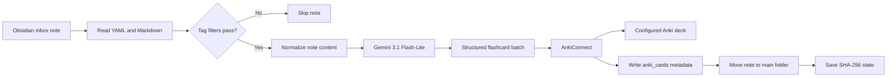
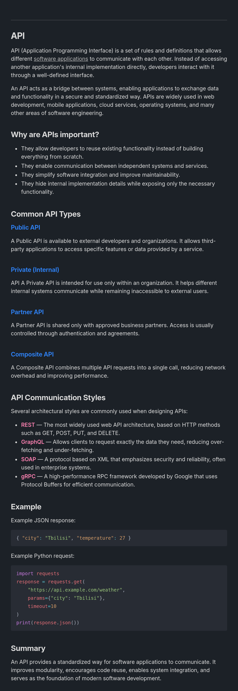
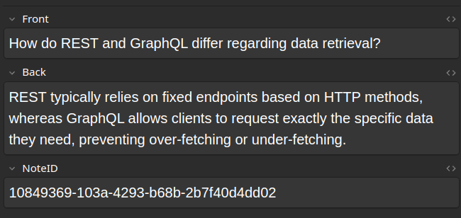
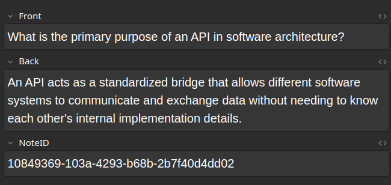
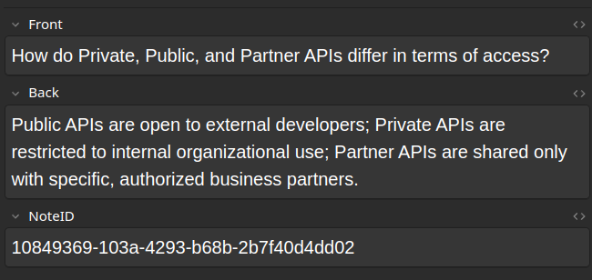
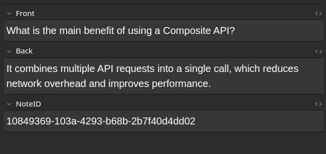

<div align="center">

# Obsidian2Anki

**Turn structured Obsidian notes into AI-generated Anki flashcards.**

Obsidian2Anki reads notes from an Obsidian inbox, generates concise question-and-answer cards with Google Gemini, sends them to Anki through AnkiConnect, and keeps local state so existing notes can be migrated and changed notes can be regenerated.

[](https://www.python.org/)
[](https://github.com/NikaMalakmadze/Obsidian2Anki)
[](LICENSE)
[](https://ai.google.dev/gemini-api/docs/models/gemini-3.1-flash-lite)

</div>


> [!IMPORTANT]
> Obsidian2Anki is currently at version `0.1.0` and is installed from source. Back up your Obsidian vault and Anki collection before running bulk migration, formatting, deletion, or clearing commands.

## Overview

Obsidian2Anki is a Python CLI for an inbox-based learning workflow:

1. Create a Markdown note in an Obsidian inbox.
2. Give it YAML frontmatter containing a unique `id` and a `tags` list.
3. Run `obsidian2anki process`.
4. Gemini generates between one and five focused flashcards.
5. AnkiConnect inserts the generated notes into the configured Anki deck.
6. Obsidian2Anki writes the generated Anki note IDs into the source note, moves it to the main notes folder, and records its content hash in local state.



## Features

- **Structured AI generation** — uses Gemini structured output validated with Pydantic models.
- **Focused cards** — the bundled prompt requests one to five concise cards and avoids duplicate or trivial questions.
- **Obsidian workflow** — reads YAML frontmatter, understands Obsidian wiki links, and preserves fenced code blocks while simplifying other Markdown formatting.
- **Inbox-to-library processing** — successfully processed notes are moved from the configured inbox to the main notes folder.
- **Tag filtering** — exact-match include and exclude lists control which notes are eligible.
- **Incremental migration** — SHA-256 content hashes and note titles are used to detect changed notes in the main folder.
- **Direct Anki integration** — creates and deletes generated Anki notes through AnkiConnect API version 6.
- **Traceable metadata** — generated Anki note IDs are stored both in note frontmatter and in `data/state.json`.
- **Safer previews** — destructive and bulk commands support `--dry-run` where implemented.
- **Diagnostics and statistics** — Rich-powered `doctor` and `stats` tables summarize the environment and current data.
- **Rotating logs** — file logs are written to `logs/obsidian2anki.log`, with optional verbose console output.

## Example

A source note can contain normal Markdown, explanations, Obsidian links, and code:

<div align="center">
  
</div>

The AI response is converted into Anki notes with `Front`, `Back`, and `NoteID` fields:

<table>
  <tr>
    <td></td>
    <td></td>
  </tr>
  <tr>
    <td></td>
    <td></td>
  </tr>
</table>

## Requirements

- Python `3.12` or newer
- Git
- Obsidian
- The Obsidian Templater community plugin
- Anki Desktop
- AnkiConnect add-on `2055492159`
- A Google Gemini API key

Python 3.12 is required by both the package metadata and syntax used in the source code.

## Quick Start

### 1. Clone and install

```bash
git clone https://github.com/NikaMalakmadze/Obsidian2Anki.git
cd Obsidian2Anki

python -m venv venv
source venv/bin/activate
python -m pip install --upgrade pip
python -m pip install -e .
```

Windows PowerShell activation:

```powershell
venv\Scripts\Activate.ps1
```

### 2. Initialize configuration

Linux or macOS:

```bash
cp .env.example .env
```

Windows PowerShell:

```powershell
Copy-Item .env.example .env
```

No manual state-file setup is required. On startup, `StateManager` creates the directory configured by `STATE_FOLDER` and touches its `state.json` file if either is missing. A newly created empty file is loaded as an empty state.

Edit `.env` and provide at least your API key, deck name, and absolute vault path:

```env
API_KEY=your_gemini_api_key
PROMPT_FILE=input/prompt.md

ANKI_URL=http://localhost:8765/
DECK_NAME=Programming

LOCAL_VAULT=/absolute/path/to/your/obsidian/vault
INBOX_FOLDER=00_Inbox
MAIN_NOTES_FOLDER=01_Notes

STATE_FOLDER=data

INCLUDE_TAGS=[]
EXCLUDE_TAGS=[]

MAX_RETRIES_ON_ANKI_DUPLICATE_CARD=3
```

### 3. Prepare Anki

1. Install AnkiConnect using add-on code `2055492159`.
2. Create the deck named by `DECK_NAME`.
3. Open **Tools → Manage Note Types → Basic → Fields**.
4. Add a field named exactly `NoteID`.
5. Keep Anki open while running Obsidian2Anki.

> [!WARNING]
> The current implementation hard-codes the Anki note type as `Basic`. Its fields must therefore be exactly `Front`, `Back`, and `NoteID`.

### 4. Prepare Obsidian

Create the configured folders inside the vault:

```text
MyVault/
├── 00_Inbox/
├── 01_Notes/
└── Templates/
```

Install Templater, copy `template/note.md` into the vault's template folder, and configure it as a folder template for `00_Inbox`.

The generated note frontmatter must resemble:

```yaml
---
id: 9fb66ee5-6778-4bf4-817d-f82646d1237e
tags:
  - Python
  - Programming
---
```

### 5. Verify and process

```bash
obsidian2anki doctor
obsidian2anki process --dry-run
obsidian2anki process
```

For complete setup instructions, see **[Installation](docs/installation.md)**.

## Required Note Format

Every processable note must contain YAML frontmatter with a unique `id` and a `tags` property:

```markdown
---
id: 9fb66ee5-6778-4bf4-817d-f82646d1237e
tags:
  - Python
  - Algorithms
---

# Iterators

An iterator returns one item at a time and preserves iteration state.
```

After successful processing, Obsidian2Anki adds `anki_cards` and moves the file to the main notes folder:

```yaml
---
id: 9fb66ee5-6778-4bf4-817d-f82646d1237e
anki_cards: 1749920000001, 1749920000002
tags:
  - Python
  - Algorithms
---
```

### Metadata rules

- `id` is required and should be unique across the entire vault.
- `tags` is recognized only when parsed as a YAML list; an empty `tags:` property is allowed.
- `anki_cards` is managed by Obsidian2Anki and should not normally be edited manually.
- Duplicate note IDs can cause two files to share one state entry.
- The current folder readers are non-recursive and inspect immediate files only.
- Keep unrelated or non-Markdown files out of the configured inbox and main-note folders.

## Tag Filtering

Tag checks are exact and case-sensitive.

```env
INCLUDE_TAGS=["Python", "JavaScript"]
EXCLUDE_TAGS=["Archive", "Draft"]
```

A note is processed only when:

- it contains none of the excluded tags; and
- the include list is empty, or at least one included tag is present.

Exclusion takes priority. For example, a note tagged with both `Python` and `Draft` is skipped.

## CLI Reference

Global options must appear before the subcommand:

```bash
obsidian2anki --verbose process
obsidian2anki --version
```

| Command                               | Purpose                                                                                                                          | `--dry-run` |
| ------------------------------------- | -------------------------------------------------------------------------------------------------------------------------------- | :---------: |
| `obsidian2anki process`               | Process eligible notes from `INBOX_FOLDER`, create Anki notes, write metadata, and move successful notes to `MAIN_NOTES_FOLDER`. |     Yes     |
| `obsidian2anki migrate`               | Scan `MAIN_NOTES_FOLDER` and process notes that are new or changed according to local state.                                     |     Yes     |
| `obsidian2anki format-notes`          | Convert legacy notes to the required YAML structure. Back up the vault before use.                                               |     Yes     |
| `obsidian2anki clear`                 | Delete generated Anki notes referenced by state, remove managed metadata, and clear state.                                       |     Yes     |
| `obsidian2anki delete-card <card_id>` | Delete one tracked generated Anki note ID and update its source metadata/state.                                                  |     No      |
| `obsidian2anki delete-note <note_id>` | Delete all generated Anki notes associated with one tracked Obsidian note ID.                                                    |     No      |
| `obsidian2anki doctor`                | Display environment, API, folder, deck, and Anki connectivity checks.                                                            |     No      |
| `obsidian2anki stats`                 | Display inbox, main-folder, processed, unprocessed, and generated-card counts.                                                   |     No      |

Use `obsidian2anki <command> --help` for command-specific arguments.

## Processing and Migration

### `process`

`process` reads immediate files from `INBOX_FOLDER`. Eligible notes are generated regardless of whether they already have a state entry. When an inbox note contains existing `anki_cards`, those generated notes are deleted before replacement cards are created.

### `migrate`

`migrate` reads immediate files from `MAIN_NOTES_FOLDER`. A note is processed when it passes tag filters and either:

- its ID is not present in state; or
- its normalized content hash or filename-derived title differs from state.

Migration saves accumulated state even when the operation ends early. The current implementation stops the migration loop after the first note-processing failure.

### State file

State is stored at:

```text
data/state.json
```

Each note ID maps to its title, absolute path, SHA-256 content hash, generated Anki note IDs, card count, and timestamps.

> [!NOTE]
> No manual initialization is required. During application startup, `StateManager` creates the configured state directory and `state.json` when they do not exist. An empty state file is treated as an empty state object.

## Configuration

| Variable                             | Required | Description                                                                       |
| ------------------------------------ | :------: | --------------------------------------------------------------------------------- |
| `API_KEY`                            |   Yes    | Google Gemini API key.                                                            |
| `PROMPT_FILE`                        |   Yes    | Prompt path relative to the repository root.                                      |
| `ANKI_URL`                           |   Yes    | AnkiConnect endpoint, normally `http://localhost:8765/`.                          |
| `DECK_NAME`                          |   Yes    | Exact Anki deck name used for generated notes.                                    |
| `LOCAL_VAULT`                        |   Yes    | Absolute path to the Obsidian vault.                                              |
| `INBOX_FOLDER`                       |   Yes    | Vault-relative folder containing new notes.                                       |
| `MAIN_NOTES_FOLDER`                  |   Yes    | Vault-relative folder containing processed and migrated notes.                    |
| `STATE_FOLDER`                       |   Yes    | Repository-relative state directory.                                              |
| `INCLUDE_TAGS`                       |   Yes    | JSON array of accepted tags; `[]` accepts every non-excluded note.                |
| `EXCLUDE_TAGS`                       |   Yes    | JSON array of tags that always prevent processing.                                |
| `MAX_RETRIES_ON_ANKI_DUPLICATE_CARD` |   Yes    | Maximum number of card-regeneration retries after an unsuccessful Anki insertion. |

All settings are required by the current Pydantic settings model, even when their value is an empty list.

## AI Generation

The AI layer currently uses the hard-coded model ID:

```text
gemini-3.1-flash-lite
```

The bundled prompt is loaded from `input/prompt.md`. It requests:

- important concepts instead of obvious facts;
- conceptual and interview-relevant programming questions;
- unique cards without repeated ideas;
- concise answers;
- one to five cards according to note complexity.

The note title, tags, cleaned content, and current `anki_cards` list are serialized into the model request. The note ID and local path are excluded.

> [!CAUTION]
> Eligible note content is sent to the Google Gemini API. Do not process private, secret, or regulated information unless using the external service is appropriate for that data.

## Logging

Logs are written to:

```text
logs/obsidian2anki.log
```

The file rotates at approximately 5 MiB and keeps three backups. Add `--verbose` before a command to enable debug-level logging:

```bash
obsidian2anki --verbose migrate --dry-run
```

Console logging is intentionally disabled for `doctor` and `stats` so their Rich tables remain readable; those commands still write to the log file.

## Project Structure

```text
Obsidian2Anki/
├── data/                       # Automatically initialized local state directory
├── docs/
│   ├── images/                 # README and documentation screenshots
│   └── installation.md
├── input/
│   └── prompt.md               # Gemini flashcard-generation prompt
├── logs/                       # Rotating application logs
├── src/obsidian2anki/
│   ├── app/                    # Application facade, dependency wiring, doctor
│   ├── cli/                    # Command definitions, parser, dispatch mapping
│   ├── core/                   # AI, Anki, vault, state, and note processing
│   ├── services/               # Workflow-oriented application services
│   ├── utils/                  # Logging, Anki transport, content helpers, types
│   ├── config.py               # Pydantic environment settings
│   ├── main.py                 # CLI entry point
│   └── models.py               # Pydantic domain models
├── template/
│   └── note.md                 # Templater-compatible Obsidian note template
├── .env.example
├── CHANGELOG.md
├── ROADMAP.md
├── pyproject.toml
└── requirements.txt
```

## Current Limitations

- Source installation is required; no packaged release is documented yet.
- Folder scanning is not recursive and does not currently filter by `.md` extension.
- Anki must normally be opened manually before commands that access it.
- The Anki model name is fixed to `Basic`, which must be extended with `NoteID`.
- The Gemini model name and retry behavior are currently hard-coded.
- The `format-notes` workflow assumes a legacy first-line tag format and rewrites files; always use a backup and `--dry-run` first.
- State tracks generated Anki note IDs locally; manual deletion or editing outside the application can create inconsistencies.

## Documentation

- [Installation](docs/installation.md)
- [Configuration](docs/configuration.md)
- [Workflow](docs/workflow.md)
- [Architecture](docs/architecture.md)
- [CLI Reference](docs/cli.md)
- [AI Integration](docs/ai.md)
- [Roadmap](ROADMAP.md)
- [Changelog](CHANGELOG.md)
- Examples and troubleshooting guides are planned as the documentation set continues to be rebuilt.

## Support

Before opening an issue:

1. Run `obsidian2anki doctor`.
2. Retry the command with `--verbose` before the subcommand.
3. Inspect `logs/obsidian2anki.log`.
4. Remove API keys, local paths, note content, and other private data from any report.

See [SUPPORT.md](SUPPORT.md) for the current support policy.

## Contributing

The project is currently maintained by a single developer and is not accepting external pull requests while the architecture evolves. Bug reports and feature suggestions are welcome through GitHub Issues.

See [CONTRIBUTING.md](CONTRIBUTING.md).

## Security

Do not publish API keys, private note content, absolute personal paths, or complete logs in public issues. See [SECURITY.md](SECURITY.md) for vulnerability reporting guidance.

## License

Obsidian2Anki is released under the [MIT License](LICENSE).

Copyright © 2026 Nika Malakmadze.
