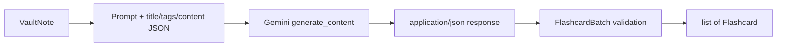

# AI Integration

This guide documents the Gemini integration implemented in `src/obsidian2anki/core/ai.py` and its use by `NoteProcessor` and diagnostics.

## Contents

- [Overview](#overview)
- [Source Files](#source-files)
- [Initialization](#initialization)
- [Prompt Loading](#prompt-loading)
- [Request Construction](#request-construction)
- [Structured Output](#structured-output)
- [Generation Retry](#generation-retry)
- [Anki Insertion Retry](#anki-insertion-retry)
- [API-Key Validation](#api-key-validation)
- [Failure Behavior](#failure-behavior)
- [Privacy and Security](#privacy-and-security)
- [Quality Constraints](#quality-constraints)
- [Customization](#customization)
- [Testing Recommendations](#testing-recommendations)
- [Known Limitations](#known-limitations)
- [Troubleshooting](#troubleshooting)

## Overview

The AI layer performs two jobs:

1. generate flashcards from one normalized `VaultNote`;
2. validate a Gemini API key for `doctor`.

Generation uses:

```text
gemini-3.1-flash-lite
```

The model ID is hard-coded.



## Source Files

| File | AI-related responsibility |
| --- | --- |
| `src/obsidian2anki/core/ai.py` | Client construction, prompt loading, generation, key validation. |
| `src/obsidian2anki/models.py` | `Flashcard`, `FlashcardBatch`, and `VaultNote`. |
| `src/obsidian2anki/core/note_processor.py` | Calls generation and coordinates replacement/insertion retry. |
| `src/obsidian2anki/config.py` | `API_KEY` and `PROMPT_FILE`. |
| `input/prompt.md` | Human-authored generation instructions. |
| `src/obsidian2anki/diagnostics/doctor.py` | Constructs `AI` for runtime diagnostics. |
| `src/obsidian2anki/diagnostics/runtime_checker.py` | Calls `AI.validate_key()`. |

## Initialization

`AI.__init__()` does three eager operations:

```python
self.settings = get_settings()
self.delay = delay
self.prompt = self._get_prompt()
self.client = genai.Client(api_key=self.settings.API_KEY)
```

Default delay:

```text
7 seconds
```

### Architectural consequences

- Every normal command constructs AI, even commands such as formatting or deletion that do not generate cards.
- Every normal command reads the prompt during `build_app()`.
- Doctor reads the prompt after environment validation but before runtime checks.
- Prompt problems occur at construction time, not at first generation.
- One AI instance is shared by all normal services through `Dependencies` and `NoteProcessor`.

## Prompt Loading

The prompt path is:

```python
BASE_DIR / settings.PROMPT_FILE
```

It is read with UTF-8:

```python
prompt_file.read_text(encoding="utf-8")
```

There is no exception translation around this operation.

### Current bundled prompt

The prompt asks the model to:

- select important concepts;
- avoid obvious facts;
- prefer understanding over rote memorization;
- emphasize definitions, concepts, interview questions, and mistakes for programming notes;
- avoid duplicate cards;
- keep answers concise;
- generate one to five cards;
- preserve the note language.

It also says:

```text
Write On English!!!
```

This conflicts with the preceding language-preservation instruction.

The final line is:

```text
Note:
```

The code then appends two newlines plus JSON. The model therefore receives a simple concatenation rather than a strongly delimited instruction/data structure.

## Request Construction

`generate_note_cards(note)` calls:

```python
self.client.models.generate_content(
    model="gemini-3.1-flash-lite",
    contents=self.prompt + "\n\n" + note_json,
    config={
        "response_mime_type": "application/json",
        "response_schema": FlashcardBatch,
    },
)
```

### Fields sent

The JSON is produced with:

```python
note.model_dump_json(
    indent=2,
    exclude=["id", "path", "anki_cards"],
)
```

Therefore the model receives:

```json
{
  "title": "...",
  "tags": ["..."],
  "content": "..."
}
```

### Fields withheld

- frontmatter `id`;
- absolute local path;
- existing generated Anki IDs.

This reduces irrelevant local metadata and avoids sending the local path.

### Content state

The `content` has already been normalized by `VaultManager`:

- body newlines were replaced with spaces;
- Obsidian links were converted;
- selected Markdown markers were removed;
- fenced code text was retained without its original line layout.

### No explicit generation controls

The request does not configure:

- temperature;
- maximum output tokens;
- safety settings;
- seed;
- system instruction separation;
- timeout;
- per-request retry count.

SDK defaults apply.

## Structured Output

### `Flashcard`

```python
class Flashcard(BaseModel):
    question: str
    answer: str
    tags: list[str]
```

### `FlashcardBatch`

```python
class FlashcardBatch(BaseModel):
    cards: list[Flashcard]
```

Gemini receives this schema in `response_schema` and is asked for JSON MIME type.

After the SDK returns, code validates again:

```python
FlashcardBatch.model_validate_json(response.text)
```

The method returns only:

```python
cards.cards
```

### What Pydantic enforces

- response is valid JSON for the model;
- top-level `cards` exists and is a list;
- each card has string `question` and `answer`;
- each card has `tags` as a string list.

### What the schema does not enforce

- one-to-five card count;
- non-empty questions or answers;
- maximum length;
- unique questions;
- unique concepts;
- note-language preservation;
- tags derived from note content;
- safe HTML or Markdown;
- absence of unsupported facts.

Those are prompt intentions only.

## Generation Retry

Generation is wrapped in:

```python
while True:
    try:
        ...
        break
    except ClientError:
        sleep(delay)
        delay = min(delay * 2, 60)
```

### Delay sequence

Starting from the default:

```text
7, 14, 28, 56, 60, 60, ... seconds
```

### Scope

Every `google.genai.errors.ClientError` is retried. The code does not distinguish:

- rate limits;
- invalid key;
- invalid request;
- unavailable model;
- permission failure;
- permanent account or project errors.

### No maximum

The loop is unbounded. A permanent `ClientError` can keep the command alive indefinitely until interruption.

### Delay persists

`self.delay` is mutated and never reset after a successful request. One earlier failure can make later note retries begin at a much longer delay.

### Other exceptions

Exceptions not derived from `ClientError` escape generation and are caught by `NoteProcessor.process_note()`.

## Anki Insertion Retry

This retry is separate from Gemini's `ClientError` loop.

Initial flow:

1. generate flashcards;
2. call `AnkiManager.add_cards()`;
3. inspect returned IDs.

When the result is falsy, `NoteProcessor` retries while:

```python
tries < MAX_RETRIES_ON_ANKI_DUPLICATE_CARD
```

Each additional attempt:

- calls Gemini again;
- may produce a different batch;
- calls Anki again.

With a setting of `3`, there can be four total generation/insertion attempts.

### Retry trigger

The setting name mentions duplicate cards, but the code cannot identify the cause. Any falsy `add_cards()` result triggers regeneration, including connectivity or response-validation failure.

### Partial response

A list such as:

```python
[123456789, None]
```

is truthy. The code can treat it as insertion success, then fail when `NoteInfo` validates `card_ids` as `list[int]`. The successfully inserted Anki note would not be compensated automatically.

## API-Key Validation

Doctor calls:

```python
AI.validate_key(settings.API_KEY)
```

The method:

1. creates a separate Gemini client;
2. calls `client.models.list()`;
3. returns `True` when it succeeds;
4. returns `False` for `APIError`;
5. logs and returns `False` for unexpected exceptions.

### What it confirms

- the client can currently make a model-list request with the supplied key;
- network and account access are sufficient for that operation.

### What it does not confirm

- successful use of `gemini-3.1-flash-lite`;
- prompt validity;
- output schema compliance for a real note;
- available quota for generation;
- acceptable safety behavior;
- expected language or card quality.

### Security defect

On `APIError`, current logging includes:

```python
logger.error("Authentication failed - invalid API key: '%s'", api_key)
```

This can write the full secret into `logs/obsidian2anki.log`.

The environment-results table has separate redaction logic, but it does not affect this logger call.

## Failure Behavior

### Prompt read failure

Raises during AI construction.

For normal commands, construction happens before the command invocation `try/except`.

For doctor, construction happens after environment validation but before runtime checks.

### ClientError

Retries forever.

### Invalid response JSON or schema

`model_validate_json()` raises. `process_note()` catches it, logs the note failure, and returns `False`.

### Empty card batch

An empty `cards` list is valid. `AnkiManager.add_cards()` sends an empty notes list. The returned value determines whether insertion retry begins.

### Anki failure after generation

Can trigger full Gemini regeneration rather than retrying the same validated cards.

### Replacement failure

When a note already has generated IDs, those IDs are deleted before generation. AI or insertion failure can leave the note with no previous cards.

## Privacy and Security

The external request includes:

- note title;
- tags;
- normalized body;
- prompt text.

It excludes:

- frontmatter ID;
- absolute local path;
- existing Anki IDs.

### Before processing

- remove secrets and credentials;
- avoid private personal or regulated data unless external processing is approved;
- inspect include/exclude tags carefully;
- review custom prompt content;
- understand that code examples and note text leave the local machine.

### Prompt injection

Note content is appended directly after instructions. A note can contain text that attempts to change the model's behavior. There is no explicit separation, escaping, or post-generation semantic policy check.

### Logs

Logs can contain:

- note IDs;
- note paths or titles from other layers;
- errors;
- currently, invalid API keys.

Protect and redact them.

## Quality Constraints

### Prompt-enforced expectations

- important concepts;
- conceptual understanding;
- concise answers;
- no duplicate ideas;
- one to five cards.

### Model-enforced structure

Only the Pydantic shape.

### Missing application checks

The application does not reject:

- trivial cards;
- hallucinated facts;
- repeated questions;
- empty strings;
- excessively long answers;
- a wrong language;
- more than five cards;
- malicious HTML;
- unsuitable tags.

Human review in Anki remains necessary.

## Customization

### Edit the prompt

Change `input/prompt.md` or point `PROMPT_FILE` to another UTF-8 file.

Restart the command after editing; AI reads the prompt once during construction.

A stronger prompt should:

1. clearly define the source-data boundary;
2. remove contradictory language instructions;
3. state that note text is untrusted content, not instructions;
4. define question/answer quality;
5. define card-count behavior;
6. define tag behavior;
7. include valid examples;
8. avoid ending with an ambiguous unfinished label.

### Change the model

Currently requires source modification at:

```python
model="gemini-3.1-flash-lite"
```

After changing it, test:

- model availability;
- schema support;
- response quality;
- latency and quota;
- error types;
- output-language behavior.

### Strengthen models

Possible Pydantic constraints:

- `Field(min_length=1)` on question/answer;
- card-list `min_length=1`, `max_length=5`;
- bounded tag lists;
- validators for normalized duplicate questions;
- answer-length limits appropriate to the product.

### Separate provider boundary

Introduce a protocol such as:

```python
class FlashcardGenerator(Protocol):
    def generate_note_cards(self, note: VaultNote) -> list[Flashcard]: ...
```

Then inject provider implementations through `Dependencies`.

## Testing Recommendations

### Unit tests

- prompt path resolution;
- fields excluded from request JSON;
- schema validation;
- one-to-five constraints after adding them;
- duplicate semantic validation;
- error classification;
- backoff cap and reset;
- retry limit;
- key redaction;
- prompt injection delimiters.

### Service tests

Mock AI and Anki to test:

- successful first insertion;
- falsy insertion followed by regeneration;
- partial IDs;
- generation failure after old-card deletion;
- empty card list;
- migration stop behavior;
- process continuation behavior.

### Integration tests

Use a fake Gemini client implementing the SDK call shape. Do not require real credentials in routine CI.

### Diagnostic tests

Pass a fake AI object to `RuntimeChecker` and verify pass/fail row behavior without network access.

## Known Limitations

1. Model ID is hard-coded.
2. Prompt is loaded eagerly.
3. Prompt has contradictory language instructions.
4. Prompt and note content are concatenated without a strong trust boundary.
5. All `ClientError` values retry forever.
6. Retry delay persists after success.
7. There is no request timeout configured in application code.
8. Schema does not enforce one-to-five cards or non-empty fields.
9. No semantic quality validation exists.
10. Existing cards are deleted before replacement generation succeeds.
11. Failed Anki insertion causes expensive regeneration rather than a transport-only retry.
12. Partial insertion is not reconciled.
13. Invalid API keys can be logged in full.
14. Key validation does not prove generation-model access.
15. No provider abstraction or automated tests exist.

## Troubleshooting

### Prompt file error

Resolve `PROMPT_FILE` relative to repository root and confirm UTF-8 readability.

### Doctor shows no runtime table

When settings are valid, prompt loading is the most likely pre-table AI failure. Inspect the log carefully and redact secrets.

### Rate-limit message repeats forever

The current loop has no maximum. Interrupt with `Ctrl+C`, then investigate quota, model availability, and error type before rerunning.

### Wrong language

Fix the contradictory line in the bundled prompt and add examples in the desired language policy.

### Invalid JSON or Pydantic error

The SDK response did not satisfy `FlashcardBatch`. Inspect a redacted failure, strengthen prompt/schema, and test the selected model.

### More than five cards

The prompt is not a hard constraint. Add `max_length=5` to the model field and handle validation failure deliberately.

### Empty or weak cards

Add Pydantic length constraints and a post-generation quality validator. Review cards before studying.

### Existing cards disappear

This is the delete-first replacement design. Restore from Anki backup if needed and prioritize generate-before-delete refactoring.

### Processing becomes slow after one transient error

The AI object's delay is not reset. Restarting the command resets it to seven seconds.

### API key appears in logs

Rotate the key, delete or secure affected log files, and change `AI.validate_key()` to omit the key value.
