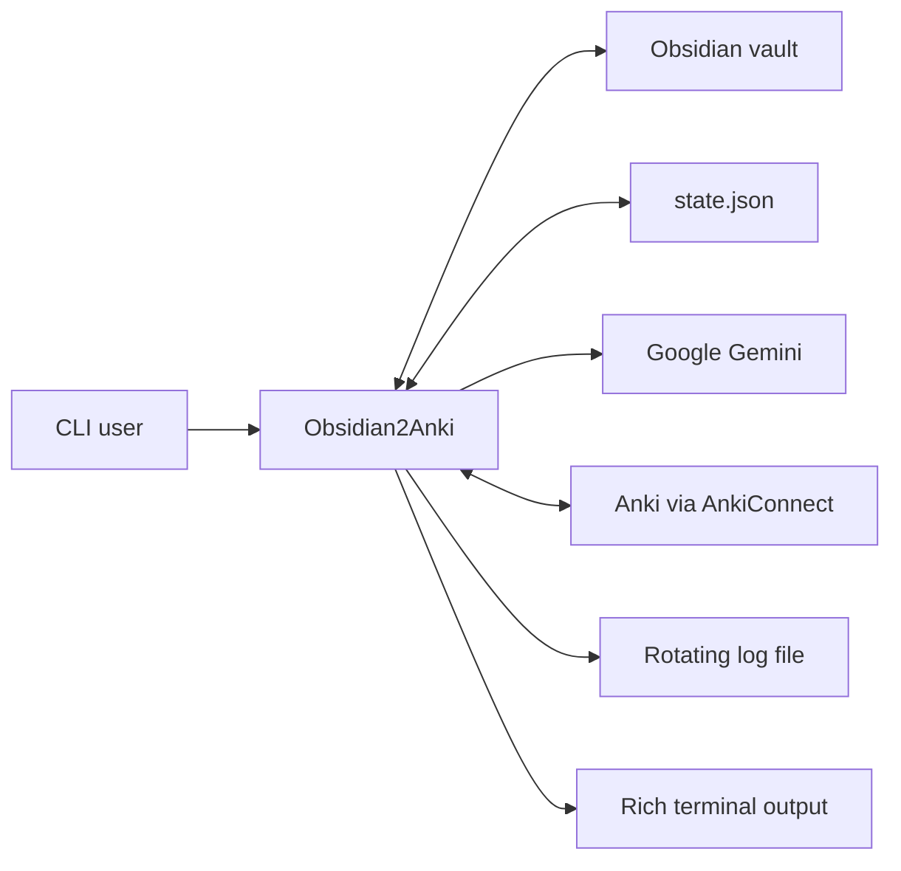
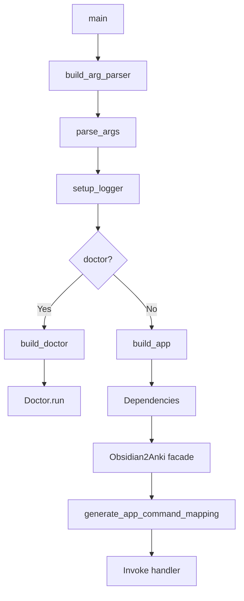
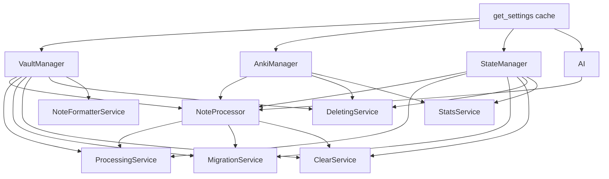
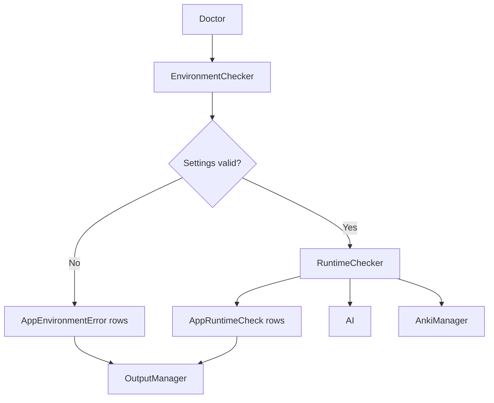
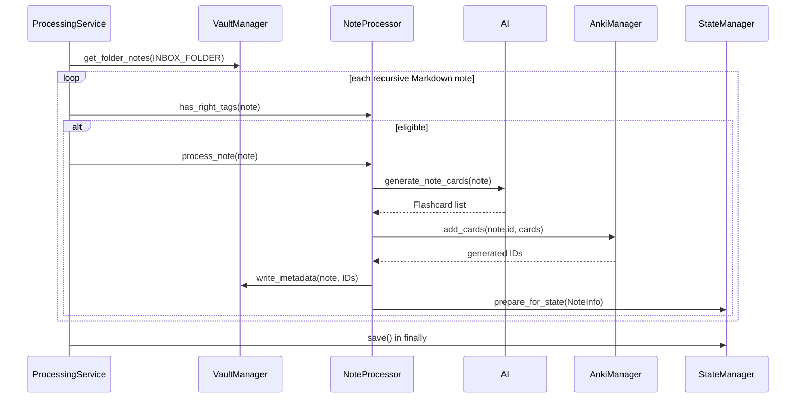

# Architecture

This document describes the current repository implementation, including the unreleased refactor that moved diagnostics out of the application facade and into `src/obsidian2anki/diagnostics/`.

## Contents

- [Architectural Goals](#architectural-goals)
- [System Context](#system-context)
- [Repository Layout](#repository-layout)
- [Startup and Composition](#startup-and-composition)
- [CLI Layer](#cli-layer)
- [Application Facade](#application-facade)
- [Service Layer](#service-layer)
- [Core Layer](#core-layer)
- [Diagnostics Subsystem](#diagnostics-subsystem)
- [Models and Contracts](#models-and-contracts)
- [Persistent Data](#persistent-data)
- [Main Workflows](#main-workflows)
- [Logging and Output](#logging-and-output)
- [Error Boundaries](#error-boundaries)
- [Design Strengths](#design-strengths)
- [Current Constraints](#current-constraints)
- [Recommended Evolution](#recommended-evolution)
- [Extension Guides](#extension-guides)

## Architectural Goals

The codebase is organized around these goals:

1. Keep CLI parsing separate from use-case logic.
2. Construct shared runtime collaborators once for normal application commands.
3. Isolate note-level orchestration inside `NoteProcessor`.
4. Keep vault, state, AI, and Anki responsibilities in distinct classes.
5. Persist explicit synchronization state rather than inferring everything from one external system.
6. Let diagnostics inspect invalid configuration without first constructing the full application.

The current implementation reaches these goals partially. It has clear modules and constructor injection, but still uses concrete dependencies, eager startup, and non-transactional writes across three systems.

## System Context

Obsidian2Anki coordinates four owned or external systems:



| System | Role |
| --- | --- |
| Obsidian vault | Source Markdown, stable note IDs, tags, and generated `anki_cards` metadata. |
| Gemini | Converts note title, tags, and normalized content into structured flashcards. |
| AnkiConnect | Creates, finds, and deletes Anki notes in the configured deck. |
| `state.json` | Records the last locally known successful note/card relationship. |
| CLI | Selects a use case and controls verbosity or preview mode. |
| Diagnostics | Validates configuration and runtime dependencies without building the normal app graph. |

## Repository Layout

```text
src/obsidian2anki/
├── __init__.py
├── app/
│   ├── __init__.py              # build_app composition helper
│   ├── app.py                   # protocols and Obsidian2Anki facade
│   └── dependencies.py          # normal-command dependency container
├── cli/
│   ├── __init__.py              # parser assembly and argcomplete
│   ├── commands.py              # command metadata
│   ├── handlers.py              # command callable and ID types
│   ├── mapping.py               # facade-to-command dispatch
│   └── parser.py                # argparse wrapper
├── core/
│   ├── ai.py                    # Gemini client and prompt loading
│   ├── anki_manager.py          # Anki-domain operations
│   ├── note_processor.py        # single-note lifecycle
│   ├── state_manager.py         # JSON state repository
│   └── vault_manager.py         # vault discovery and metadata writes
├── diagnostics/
│   ├── __init__.py              # build_doctor
│   ├── columns.py               # Rich column factories
│   ├── doctor.py                # diagnostic orchestration
│   ├── environment_checker.py   # Pydantic settings errors
│   ├── models.py                # renderable diagnostic rows
│   ├── output_manager.py        # generic Rich table output
│   └── runtime_checker.py       # filesystem, Gemini, and Anki checks
├── services/
│   ├── clear_service.py
│   ├── deleting_service.py
│   ├── migration_service.py
│   ├── notes_formatter.py
│   ├── processing_service.py
│   └── stats_service.py
├── utils/
│   ├── anki_connecter.py        # HTTP transport and Anki startup
│   ├── helpers.py               # Markdown normalization
│   ├── logger.py                # rotating file and Rich handlers
│   └── type.py                  # Literal aliases
├── config.py                    # Settings and BASE_DIR
├── exceptions.py
├── main.py                      # process entry point
└── models.py                    # Pydantic models
```

The package uses a `src/` layout and exposes:

```toml
[project.scripts]
obsidian2anki = "obsidian2anki.main:main"
```

## Startup and Composition

### Entry point

`main(argv)` performs:

1. build and run the argument parser;
2. choose `INFO` or `DEBUG` logging;
3. disable ordinary console logging for `doctor` and `stats`;
4. route `doctor` directly to `build_doctor().run()`;
5. build the normal application for every other command;
6. generate the command mapping;
7. invoke the selected handler inside a top-level `try/except`.



### Normal composition root

`Dependencies` eagerly creates one instance of:

- `VaultManager`
- `AnkiManager`
- `StateManager`
- `AI`
- `NoteProcessor`
- each normal application service

The shared graph is:



`build_app()` passes private service attributes from `Dependencies` into the facade.

### Startup side effects

Normal application construction may:

- parse and validate all settings;
- create `STATE_FOLDER`;
- create `state.json`;
- load and validate existing state JSON;
- read the prompt file;
- create the Gemini client.

These operations happen before the command handler `try/except` in `main.py`. A malformed state file or unreadable prompt can therefore escape the normal top-level error boundary.

The doctor path avoids the normal composition root, but its own `AI` construction still reads the prompt before the runtime table is completed.

## CLI Layer

### Command metadata

`commands.py` defines:

- `BaseCommandDefinition`
- `CommandDefinition`
- `ArgCommandDefinition`

`CommandDefinition` can enable or disable `--dry-run`. `ArgCommandDefinition` describes one required positional argument and does not currently support dry-run metadata.

`DOCTOR_COMMAND` is intentionally separate from `APP_COMMANDS`.

### Parser

`ArgParser` owns one top-level parser and required subparsers. It adds:

- global `-v` / `--verbose`;
- global `--version`;
- a positional argument for delete commands;
- `--dry-run` for eligible no-argument commands.

Because the options are registered at different parser levels:

```bash
obsidian2anki --verbose migrate --dry-run
```

is valid, while moving `--verbose` after the subcommand is not.

### Mapping

`generate_app_command_mapping()` reflects on the facade using each command's `func_name`.

- dry-run commands receive the parsed Boolean through a zero-argument closure;
- commands without dry run call the method directly;
- argument commands capture the parsed positional value.

Doctor is absent because it bypasses the application facade.

## Application Facade

`Obsidian2Anki` is a thin logging and delegation layer for:

- `migrate`
- `process`
- `clear`
- `format_notes`
- `delete_card`
- `delete_note`
- `stats`

It does not own core domain behavior. Constructor arguments are typed through protocols declared in the same module.

### Protocol status

The protocols for migration, processing, clearing, deletion, formatting, and statistics correspond to constructor dependencies.

`DoctorService` remains declared but is not accepted by `Obsidian2Anki.__init__()` and has no facade method. It should either be removed or reused deliberately to avoid implying an architectural relationship that no longer exists.

### Type mismatch

`delete_card()` is annotated with `card_id: str` in the facade even though CLI parsing produces `CardId`, a `NewType` over `int`. `DeletingService` converts the value to `int` again. The code works dynamically, but the contract is inconsistent.

## Service Layer

### `ProcessingService`

- recursively reads Markdown notes from `INBOX_FOLDER` through `VaultManager`;
- logs the discovered count;
- returns immediately on dry run before tag evaluation;
- processes every note that passes tag filters;
- saves state in a `finally` block.

It does not call `needs_processing()`, so an eligible inbox note is always passed to `NoteProcessor`.

### `MigrationService`

- recursively reads Markdown notes from `MAIN_NOTES_FOLDER`;
- computes the notes that pass tags and need processing;
- logs candidate names at debug level;
- returns on dry run;
- processes candidates sequentially;
- stops after the first note-processing failure;
- saves state in a `finally` block.

### `NoteFormatterService`

- inspects only immediate entries in `MAIN_NOTES_FOLDER`;
- does not filter by extension before parsing frontmatter;
- identifies files missing required `id` or `tags` keys;
- rewrites each such file using the legacy first-line tag convention;
- does not use `VaultManager.get_folder_notes()` and is therefore not recursive.

### `DeletingService`

`delete_card()`:

1. normalizes the supplied ID to `int`;
2. removes it from state;
3. resolves the source path;
4. deletes the Anki note;
5. removes the ID from `anki_cards` frontmatter;
6. removes the entire state entry when no IDs remain.

`delete_note()` deletes all recorded Anki note IDs, removes `anki_cards`, then removes the state entry. The missing-state path currently logs but does not return.

### `ClearService`

- reads all state entries;
- returns without mutation on dry run;
- delegates generated-note deletion to `NoteProcessor`;
- removes managed metadata;
- clears state after the loop.

`delete_note_cards()` already removes metadata, so `ClearService` performs a second `remove_property()` call for each item.

### `StatsService`

Collects:

- immediate file count in inbox;
- immediate file count in main folder;
- state-entry count;
- unprocessed immediate main-folder files;
- Anki note count in the configured deck.

It prints a Rich table directly. `_processed_notes()` currently tries `processed_note[1].title` even though `processed_note` is already a `StateNote`; this can raise when debug logging is enabled and state is non-empty.

## Core Layer

### `VaultManager`

Responsibilities:

- recursively discover `.md` files;
- parse frontmatter and body;
- normalize `anki_cards` from integer, string, or list;
- convert each file into `VaultNote`;
- write or remove generated metadata;
- move successful inbox notes;
- convert legacy notes.

`get_folder_notes()` catches a missing root folder, logs it, and implicitly returns `None` despite its `list[VaultNote]` annotation.

`_process_file()` derives the title with:

```python
file.name.split(".")[0]
```

and replaces body newlines with spaces before Markdown normalization.

### `StateManager`

Responsibilities:

- create the configured state directory and file;
- load JSON into `StateNote` models;
- detect title/content changes;
- stage new successful entries;
- mutate generated ID lists;
- save the full state dictionary.

State writes are full-file replacements, not atomic transactions.

`prepare_for_state()` appends to `_temp_data`; `save()` merges staged data and writes once. Some deletion methods call `save()` immediately.

### `NoteProcessor`

This is the central single-note coordinator.

It owns:

- tag eligibility;
- state-based change detection;
- empty-content handling;
- replacement deletion;
- Gemini generation;
- Anki insertion retry;
- vault metadata write/move;
- state staging.

It catches every exception around `process_note()`, logs it, and returns `False`.

### `AI`

- loads settings;
- reads the prompt during construction;
- creates a Gemini client;
- calls hard-coded `gemini-3.1-flash-lite`;
- requests `application/json` matching `FlashcardBatch`;
- retries every `ClientError` indefinitely with exponential delay capped at 60 seconds.

### `AnkiManager`

Extends `AnkiConnecter` with deck and note operations. It serializes every generated item as Anki model `Basic` with fields `Front`, `Back`, and `NoteID`.

### `AnkiConnecter`

- stores `ANKI_URL`;
- auto-starts Anki through `shutil.which("anki")` when normal `connect()` calls find it unreachable;
- posts AnkiConnect API version 6 payloads;
- validates response shape;
- logs and returns `None` on request or response-validation errors.

Only `anki_running()` has an explicit one-second timeout. General `connect()` calls do not.

## Diagnostics Subsystem

Diagnostics are a sibling subsystem, not a normal service in the facade graph.



### `EnvironmentChecker`

Takes a `Callable[[], Settings]`, catches Pydantic errors, normalizes them, redacts sensitive values, and returns either settings or a list of errors.

### `RuntimeChecker`

Receives valid settings and concrete AI/Anki collaborators. It checks Python, files, folders, API access, Anki connectivity, and the deck.

### Diagnostic models

`AppRuntimeCheck` and `AppEnvironmentError` are frozen slotted dataclasses that implement `render()`.

`TableDataItem` is a structural protocol for any row object returning `tuple[str, ...]`.

### `OutputManager`

Builds Rich tables and rejects row/column width mismatches.

See [Diagnostics](diagnostics.md) for exact check order and limitations.

## Models and Contracts

### `VaultNote`

```text
id, title, tags, content, path, anki_cards
```

### `Flashcard`

```text
question, answer, tags
```

No length or emptiness constraints are configured.

### `FlashcardBatch`

```text
cards: list[Flashcard]
```

The one-to-five rule is prompt-only.

### `AnkiCard`

Serializes to:

```json
{
  "deckName": "...",
  "modelName": "Basic",
  "fields": {
    "Front": "...",
    "Back": "...",
    "NoteID": "..."
  },
  "tags": []
}
```

### `StateNote`

```text
title
path
content_hash
card_count
anki_note_ids
processed_at
updated_at
```

### `NoteInfo`

Combines one `VaultNote` with the generated Anki note IDs returned by insertion.

## Persistent Data

### Obsidian note

The source note is the content source and also stores generated IDs. Required identity keys are:

```text
id, tags
```

`anki_cards` is application-managed.

### State ledger

The state file is keyed by frontmatter `id`. It records the last successful local understanding of title, normalized content, source path, and generated IDs.

### Anki

Anki owns the actual generated notes. Obsidian2Anki does not query `NoteID` to reconcile them; it relies primarily on locally recorded IDs.

### Source-of-truth tradeoff

No single store is authoritative for every field:

- content comes from Obsidian;
- generated study items live in Anki;
- relationship and change data live in frontmatter and state.

This makes synchronization drift possible when users manually edit any store.

## Main Workflows

### Inbox processing



If `note.anki_cards` is non-empty, deletion occurs before AI generation in this sequence.

### Migration

Migration adds two guards before processing:

```text
has_right_tags(note)
AND
(not in state OR title/hash changed)
```

It stops after the first `False` from `process_note()`.

### Change detection

The hash is calculated from normalized `VaultNote.content`, not raw Markdown bytes. Changes removed by normalization may not trigger migration. Tag changes alone are not part of the hash.

### Successful commit order

Current order:

1. delete old generated notes when present;
2. generate candidate cards;
3. insert into Anki;
4. write `anki_cards` and move source file;
5. stage state;
6. save state at service completion.

The sequence is not transactional. A failure after any external mutation can leave stores inconsistent.

## Logging and Output

`setup_logger()` configures the root logger once per process.

### File handler

- path: `logs/obsidian2anki.log`
- max size: 5 MiB
- backups: 3
- encoding: UTF-8

### Console handler

Most commands use `RichHandler`. `doctor` and `stats` do not add it, because they print dedicated tables directly.

### Repeated setup

If the root logger already has handlers, `setup_logger()` returns. Repeated in-process calls cannot change level or console policy without first resetting handlers.

## Error Boundaries

### CLI boundary

The normal handler invocation catches:

- `KeyboardInterrupt` and returns `130`;
- any other exception and returns `1`.

Application construction and command mapping occur before this `try` block.

The doctor branch also occurs before it, so unexpected doctor exceptions escape.

### Note boundary

`NoteProcessor.process_note()` catches all exceptions and returns `False`. This prevents one note exception from crashing `process`, but `ProcessingService` ignores the Boolean and continues. `MigrationService` stops on the first `False`.

### Transport boundary

`AnkiConnecter.connect()` catches request and response-validation failures, logs them, and returns `None`.

### State boundary

State loading has no recovery wrapper. Invalid JSON or model data raises during normal app construction.

## Design Strengths

- Clear use-case services.
- A dedicated composition root for normal commands.
- Reusable single-note lifecycle.
- Structured Pydantic output from Gemini.
- Stable frontmatter identity and explicit state.
- Metadata-driven command parser construction.
- Diagnostics isolated from normal application startup.
- Environment-error normalization with sensitive-value redaction.
- Generic renderable diagnostic rows and table output.

## Current Constraints

1. **Eager normal dependencies** — every normal command constructs AI, state, Anki, and vault collaborators, even when a command does not need all of them.
2. **Startup outside error boundary** — state and prompt failures can escape before command dispatch.
3. **Unused doctor protocol** — `DoctorService` remains in the facade module after the refactor.
4. **Concrete infrastructure types** — services and diagnostics depend directly on classes rather than narrow protocols.
5. **No transaction** — vault, Anki, and state changes cannot be committed atomically.
6. **Delete-first replacement** — previous cards are removed before replacements are ready.
7. **Unbounded Gemini retry** — all `ClientError` values are retried forever.
8. **Whole-file state writes** — no atomic replace, backup, lock, or schema version.
9. **Mixed scan policies** — process/migrate are recursive Markdown-only; formatter/stats are immediate and less selective.
10. **Frontmatter positional write** — `write_metadata()` inserts at source line index 2 rather than updating parsed YAML structurally.
11. **Anki note/card terminology** — IDs are called card IDs although `deleteNotes` and `findNotes` operate on notes.
12. **Hard-coded integration schema** — Gemini model and Anki model/fields are fixed.
13. **Partial-insertion handling** — a non-empty `addNotes` result containing `None` can pass the truthiness check and fail later.
14. **Stats defect** — verbose processed-note logging is incorrectly indexed.
15. **No tests** — behavior is not protected by automated regression tests.

## Recommended Evolution

### Stage 1: Correctness

- remove or deliberately reintroduce `DoctorService`;
- place all startup and doctor execution inside explicit error boundaries;
- return structured service and diagnostic results;
- fix delete, stats, and frontmatter-type defects;
- redact API keys everywhere.

### Stage 2: Persistence safety

- write state atomically;
- keep a backup;
- add schema versioning and validation recovery;
- update frontmatter through parsed metadata rather than line insertion.

### Stage 3: Synchronization safety

- generate and validate replacements before deleting old notes;
- treat partial Anki insertion explicitly;
- add reconciliation by source note ID;
- make deletion idempotent.

### Stage 4: Testable boundaries

- introduce AI, Anki, vault, state, and diagnostics protocols;
- inject settings rather than calling `get_settings()` inside each object;
- build command-specific dependency graphs;
- mock external services in unit and integration tests.

### Stage 5: Extensibility

- configure model IDs, Anki model/fields, card limits, and retry policy;
- support additional providers;
- add machine-readable output and a reconciliation command.

## Extension Guides

### Add a CLI command

1. Implement or extend a service.
2. Add a facade protocol when the command belongs to the normal application.
3. Inject the service through `Dependencies` and `build_app()`.
4. Add command metadata to `COMMANDS` or `ARG_COMMANDS`.
5. Confirm option placement and dry-run behavior.
6. Add CLI, architecture, workflow, and changelog documentation.

A command that must run before normal settings/state construction may need a direct `main.py` branch similar to doctor, but such exceptions should remain rare.

### Add a runtime diagnostic

1. Return `AppRuntimeCheck` from a focused method.
2. Add it to `check_runtime()` in dependency order.
3. Catch expected failures and render them as rows.
4. Avoid mutating user data.
5. Add tests and update `docs/diagnostics.md`.

### Add an AI provider

1. Define a provider protocol around generation and credential validation.
2. Move prompt loading out of provider construction.
3. Return `list[Flashcard]` or a provider-neutral result.
4. Inject the selected provider through the composition root.
5. Separate transient from permanent retry errors.

### Add a state backend

Implement the operations currently consumed by services and `NoteProcessor`:

- membership and change detection;
- property lookup;
- stage/save;
- card and note deletion;
- state enumeration.

Preserve frontmatter note ID as the stable key or provide an explicit migration.

### Add another Anki model

Make model name and field mapping configurable. Validate the target schema before insertion, preferably in diagnostics and before any note mutation.
