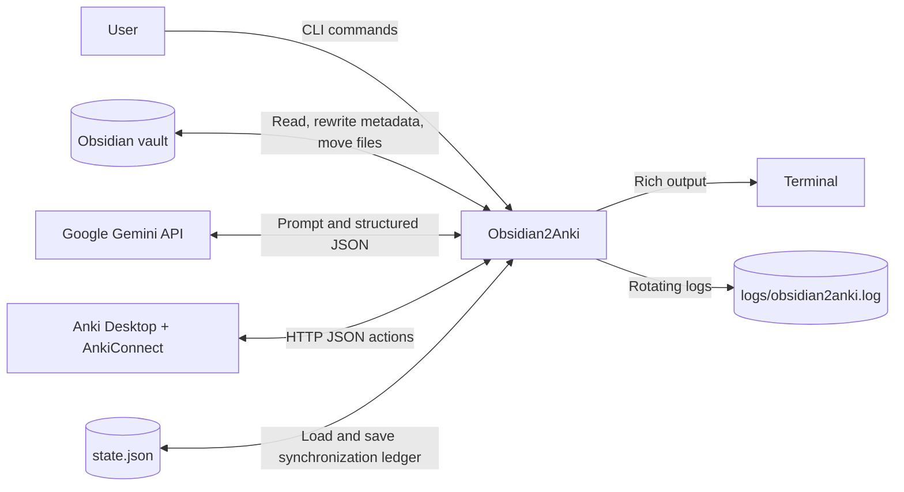
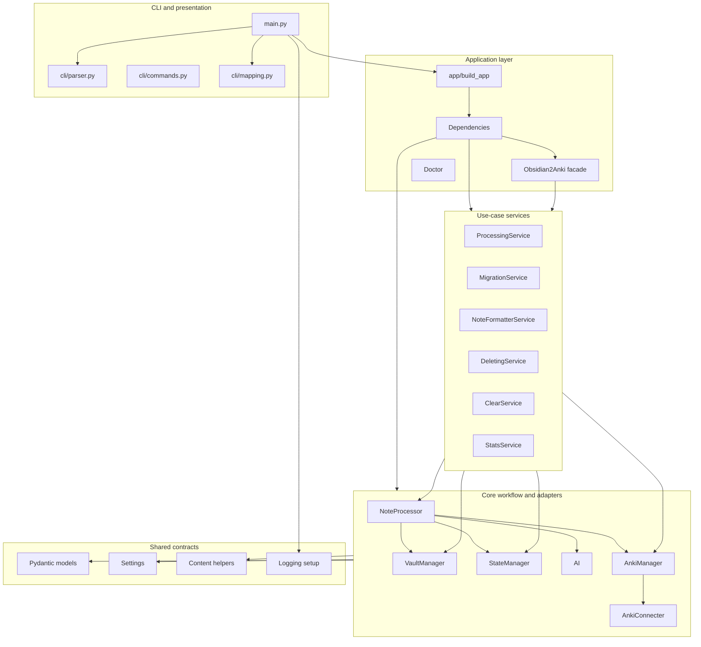
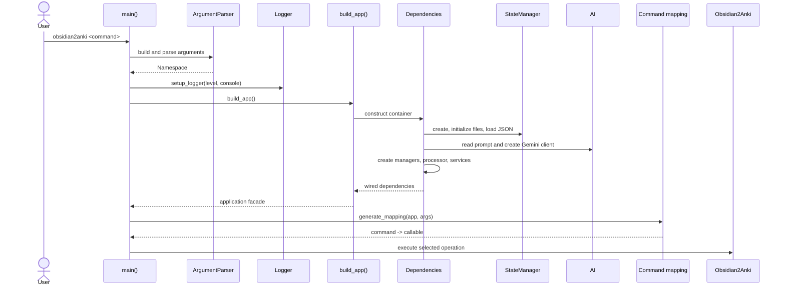
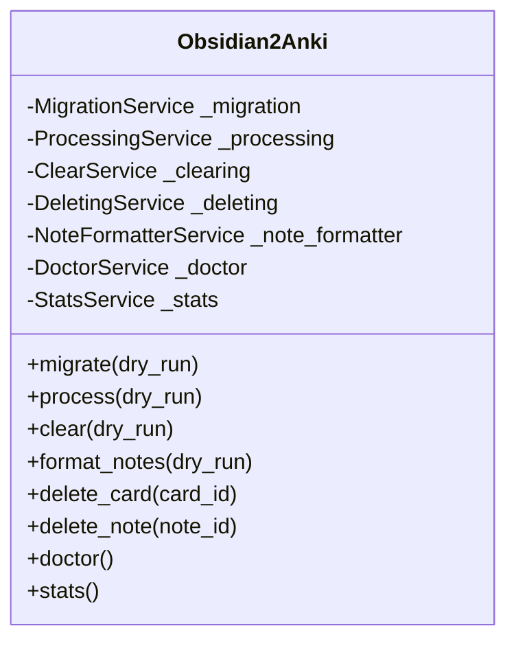
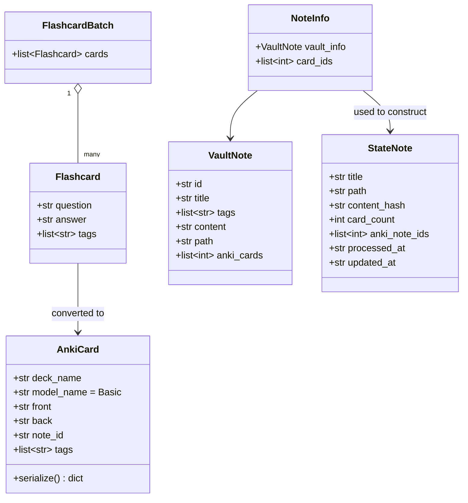
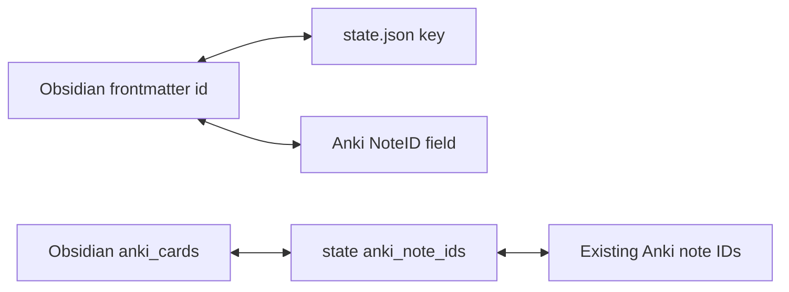
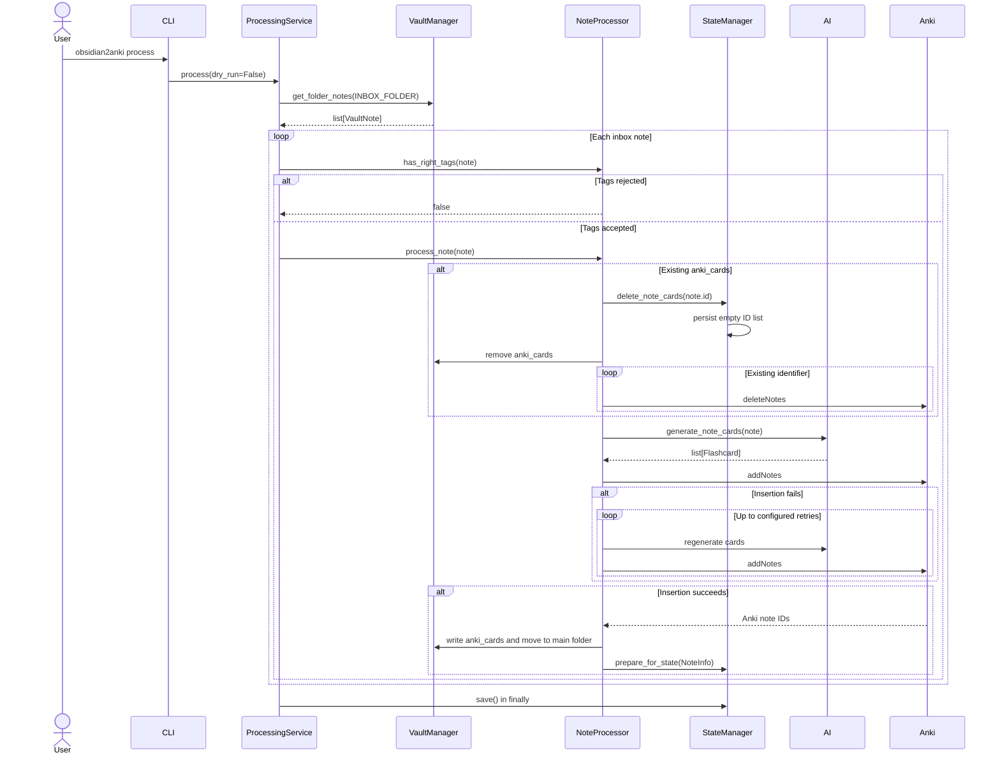
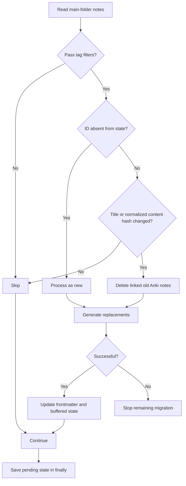
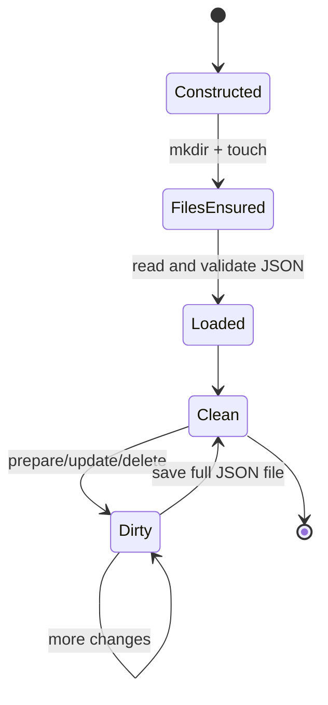
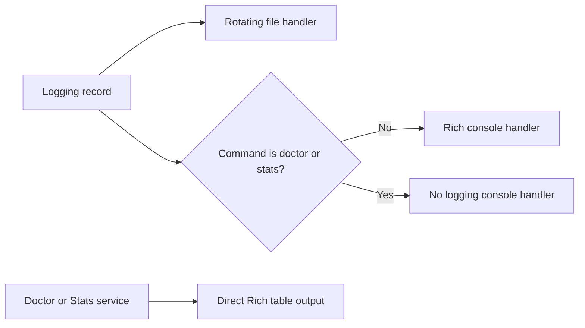

# Architecture

This document describes the current architecture of **Obsidian2Anki 0.1.0**: its layers, dependency wiring, runtime lifecycle, data model, synchronization invariants, command flows, external integrations, failure behavior, and extension points.

It reflects the updated implementation in which `StateManager` automatically creates the configured state directory and touches `state.json` before loading it.

For setup instructions, see [Installation](installation.md). For environment variables, see [Configuration](configuration.md). For command-by-command behavior, see [Workflow](workflow.md).

> [!IMPORTANT]
> Obsidian2Anki is a synchronous local integration application, not a server. One CLI process coordinates a local Obsidian vault, the Gemini API, AnkiConnect, and a JSON state ledger.

## Contents

- [Architectural Goals](#architectural-goals)
- [System Context](#system-context)
- [High-Level Structure](#high-level-structure)
- [Repository Layout](#repository-layout)
- [Dependency Direction](#dependency-direction)
- [Application Startup](#application-startup)
- [Composition Root and Dependency Injection](#composition-root-and-dependency-injection)
- [CLI Layer](#cli-layer)
- [Application Facade](#application-facade)
- [Service Layer](#service-layer)
- [Core Layer](#core-layer)
- [Models and Data Contracts](#models-and-data-contracts)
- [Persistent Data and Ownership](#persistent-data-and-ownership)
- [Synchronization Invariants](#synchronization-invariants)
- [Normal Processing Sequence](#normal-processing-sequence)
- [Migration Sequence](#migration-sequence)
- [Deletion and Clear Sequences](#deletion-and-clear-sequences)
- [State Architecture](#state-architecture)
- [Change Detection](#change-detection)
- [Vault Architecture](#vault-architecture)
- [AI Integration](#ai-integration)
- [Anki Integration](#anki-integration)
- [Logging and Terminal Output](#logging-and-terminal-output)
- [Error Handling and Recovery](#error-handling-and-recovery)
- [Dry-Run Architecture](#dry-run-architecture)
- [Security and Trust Boundaries](#security-and-trust-boundaries)
- [Performance Characteristics](#performance-characteristics)
- [Design Strengths](#design-strengths)
- [Current Architectural Constraints](#current-architectural-constraints)
- [Recommended Evolution Path](#recommended-evolution-path)
- [Extension Guides](#extension-guides)
- [Testing Strategy](#testing-strategy)

## Architectural Goals

The current design aims to provide:

1. **A simple local workflow** — one CLI command performs one complete synchronization operation.
2. **Separation of responsibilities** — CLI parsing, use-case orchestration, note processing, filesystem access, state persistence, Gemini access, and Anki access live in separate modules.
3. **Stable note identity** — a frontmatter UUID connects an Obsidian note to state records and generated Anki notes.
4. **Incremental migration** — existing main-folder notes are processed only when new or changed.
5. **Recoverable local state** — synchronization metadata is stored in readable JSON rather than a database.
6. **Constructor injection** — shared managers are built once and passed into services.
7. **Validated boundaries** — Pydantic models validate settings, note data, state records, and Gemini structured output.

The application currently favors simplicity and explicit synchronous control flow over concurrency, plugins, database transactions, or background processing.

## System Context

Obsidian2Anki sits between four systems:



### External responsibilities

| System             | Responsibility                                                                         |
| ------------------ | -------------------------------------------------------------------------------------- |
| Obsidian vault     | Owns source Markdown, stable note IDs, tags, and generated `anki_cards` metadata.      |
| Gemini             | Converts normalized note content into validated flashcard objects.                     |
| Anki + AnkiConnect | Stores generated Anki notes and returns their identifiers.                             |
| `state.json`       | Records the last synchronized representation of every managed source note.             |
| Obsidian2Anki      | Coordinates all reads, writes, filtering, generation, deletion, and state transitions. |

Obsidian2Anki does not embed either Obsidian or Anki. It operates through files for Obsidian and HTTP requests for AnkiConnect.

## High-Level Structure

The package follows a practical layered architecture:



### Layer responsibilities

| Layer                   | Primary responsibility                                                |
| ----------------------- | --------------------------------------------------------------------- |
| CLI                     | Convert command-line input into a callable application operation.     |
| Application             | Construct dependencies and expose a small high-level API.             |
| Services                | Implement command-level use cases and multi-note orchestration.       |
| Core                    | Perform single-note work and interact with external resources.        |
| Models/config/utilities | Define shared validated data, settings, logging, and transformations. |

The layers are mostly directional, although the code currently uses concrete manager classes within services rather than abstract ports.

## Repository Layout

```text
Obsidian2Anki/
├── .env.example
├── pyproject.toml
├── requirements.txt
├── input/
│   └── prompt.md
├── template/
│   └── note.md
├── data/
│   └── state.json              # created automatically at runtime
├── logs/
│   └── obsidian2anki.log       # created automatically by logging
├── docs/
│   └── ...
└── src/
    └── obsidian2anki/
        ├── __init__.py
        ├── main.py
        ├── config.py
        ├── models.py
        ├── app/
        │   ├── __init__.py
        │   ├── app.py
        │   ├── dependencies.py
        │   └── doctor.py
        ├── cli/
        │   ├── commands.py
        │   ├── handlers.py
        │   ├── mapping.py
        │   └── parser.py
        ├── services/
        │   ├── processing_service.py
        │   ├── migration_service.py
        │   ├── notes_formatter.py
        │   ├── deleting_service.py
        │   ├── clear_service.py
        │   └── stats_service.py
        ├── core/
        │   ├── note_processor.py
        │   ├── vault_manager.py
        │   ├── state_manager.py
        │   ├── ai.py
        │   └── anki_manager.py
        └── utils/
            ├── anki_connecter.py
            ├── helpers.py
            ├── logger.py
            └── type.py
```

### Packaging

The project uses the `src` layout and setuptools:

```toml
[project.scripts]
obsidian2anki = "obsidian2anki.main:main"
```

After installation, the operating-system command `obsidian2anki` invokes `obsidian2anki.main:main`.

## Dependency Direction

The intended dependency direction is:

```text
CLI
  ↓
Application facade
  ↓
Use-case services
  ↓
Core managers and NoteProcessor
  ↓
Filesystem / Gemini / AnkiConnect
```

Shared Pydantic models and settings are imported by multiple layers.

### Current dependency graph

| Component              | Direct dependencies                                  |
| ---------------------- | ---------------------------------------------------- |
| `main`                 | parser, command mapping, logger, application builder |
| `Obsidian2Anki`        | service protocols                                    |
| `Dependencies`         | every concrete manager and service                   |
| `ProcessingService`    | vault, state, note processor                         |
| `MigrationService`     | vault, state, note processor                         |
| `ClearService`         | vault, state, note processor                         |
| `DeletingService`      | vault, state, Anki manager                           |
| `NoteFormatterService` | vault manager                                        |
| `StatsService`         | state and Anki manager                               |
| `NoteProcessor`        | AI, Anki, state, vault                               |
| `VaultManager`         | filesystem, frontmatter parser, normalization helper |
| `StateManager`         | filesystem, JSON, SHA-256, state models              |
| `AI`                   | Gemini client, prompt file, flashcard models         |
| `AnkiManager`          | AnkiConnecter and Anki models                        |
| `AnkiConnecter`        | HTTP requests, subprocess, settings                  |

The `Obsidian2Anki` facade is typed against `Protocol` interfaces, which allows it to be tested with substitutes. Lower layers currently depend on concrete classes.

## Application Startup

Every command follows the same startup sequence:



### Startup side effects

Dependency construction is eager. Before the selected command method runs, the application currently:

- validates every required `.env` setting;
- creates `logs/` when logging is initialized;
- creates the configured state folder;
- creates an empty `state.json` when absent;
- reads and validates existing state JSON;
- reads the prompt file;
- constructs the Gemini client;
- constructs all managers and all services, including those unused by the chosen command.

This simplifies wiring but broadens the startup requirements of every command. For example, a command that only needs local state may still fail if the prompt file cannot be read because the AI adapter is eagerly constructed.

## Composition Root and Dependency Injection

`app/dependencies.py` is the composition root. It creates one instance of each shared manager:

```text
VaultManager
AnkiManager
StateManager
AI
└── NoteProcessor(AI, AnkiManager, StateManager, VaultManager)
```

It then injects those instances into command services:

```text
MigrationService(VaultManager, StateManager, NoteProcessor)
ProcessingService(VaultManager, StateManager, NoteProcessor)
ClearService(VaultManager, StateManager, NoteProcessor)
DeletingService(VaultManager, StateManager, AnkiManager)
NoteFormatterService(VaultManager)
StatsService(StateManager, AnkiManager)
Doctor(AI, AnkiManager)
```

Finally, `build_app()` injects the services into the `Obsidian2Anki` facade.

### Benefits

- Shared state is loaded only once per CLI process.
- Services do not construct their own infrastructure dependencies.
- The facade can accept test doubles through its protocols.
- Construction is centralized and easy to discover.

### Current tradeoffs

- The container exposes service attributes prefixed with `_`, and `build_app()` accesses them directly.
- All dependencies are constructed for all commands.
- Services type concrete managers rather than interfaces.
- Module-level `settings = get_settings()` values are created during imports, making configuration replacement in tests less flexible.

## CLI Layer

The CLI is metadata-driven rather than built as one manual branch per command.

### Command definitions

`cli/commands.py` stores immutable command metadata in dataclasses:

- `CommandDefinition` for commands without positional arguments;
- `ArgCommandDefinition` for commands with one positional argument.

The same definitions drive both parser creation and command dispatch.

Current commands:

| Command        | Facade method  | Dry-run support |
| -------------- | -------------- | :-------------: |
| `process`      | `process`      |       Yes       |
| `migrate`      | `migrate`      |       Yes       |
| `format-notes` | `format_notes` |       Yes       |
| `clear`        | `clear`        |       Yes       |
| `doctor`       | `doctor`       |       No        |
| `stats`        | `stats`        |       No        |
| `delete-card`  | `delete_card`  |       No        |
| `delete-note`  | `delete_note`  |       No        |

### Parser construction

`cli/parser.py`:

- creates the root parser;
- adds global `--verbose` and `--version` options;
- generates subparsers from command metadata;
- adds `--dry-run` only where supported;
- uses the declared handler type to convert positional arguments;
- enables shell completion through `argcomplete` in `main()`.

### Dispatch mapping

`cli/mapping.py` dynamically looks up the corresponding facade method and wraps it in a zero-argument callable. `main()` then executes:

```python
commands_mapping[args.command]()
```

This avoids a long `if`/`elif` command dispatcher and keeps command metadata centralized.

## Application Facade

`app/app.py` defines `Obsidian2Anki`, the high-level API exposed to the CLI.

The facade:

- owns no domain state;
- does not read files or call external APIs directly;
- adds operation-level logging;
- delegates each command to exactly one service;
- defines service `Protocol` interfaces for loose coupling.



This facade is an application boundary: alternative interfaces, such as a GUI, could call it without reusing argparse.

## Service Layer

Services represent complete user-facing use cases. They coordinate collections of notes and ensure state is saved at command boundaries.

### `ProcessingService`

Purpose: process notes directly inside the configured inbox folder.

Behavior:

1. Read all regular files in the inbox directory.
2. Return when the folder is empty.
3. In dry-run mode, report and stop.
4. For each note that passes tag filters, call `NoteProcessor.process_note()`.
5. Save pending state in a `finally` block.

It does not call `needs_processing()`. Every eligible inbox note is treated as work to process.

### `MigrationService`

Purpose: synchronize existing notes in the main notes folder.

Behavior:

1. Read all regular files in the main folder.
2. Select notes that pass tag filters and are new or changed.
3. Report candidates.
4. In dry-run mode, stop before note processing.
5. Process candidates sequentially.
6. Stop the migration at the first `False` result from `NoteProcessor`.
7. Save pending state in a `finally` block.

### `NoteFormatterService`

Purpose: add required YAML frontmatter to legacy main-folder notes.

It delegates formatting of an individual file to `VaultManager.ensure_note_format()`.

### `DeletingService`

Purpose: maintain consistency when deleting one generated Anki identifier or all generated Anki identifiers linked to one source note.

It coordinates:

- state mutation;
- Anki deletion;
- frontmatter cleanup.

### `ClearService`

Purpose: remove all Anki notes tracked by local state, remove their frontmatter references, and clear the local ledger.

### `StatsService`

Purpose: combine counts from:

- the inbox folder;
- the main notes folder;
- local state;
- AnkiConnect.

It renders a Rich table directly.

### `Doctor`

`Doctor` lives in the application package because it checks the assembled runtime environment rather than representing core note-processing logic. It checks Python, paths, the API key, Anki, and the configured deck.

## Core Layer

The core package contains the central single-note workflow and external-resource adapters.

### `NoteProcessor`

`NoteProcessor` is the domain workflow coordinator for one source note. It decides:

- whether a migration note needs processing;
- whether its tags allow processing;
- whether existing generated notes must be deleted;
- when Gemini is called;
- when Anki insertion is retried;
- when vault metadata is written;
- when a new state record is prepared.

It is the most important orchestration component below the service layer.

### `VaultManager`

Owns all direct Obsidian vault file operations:

- enumerate folder files;
- parse frontmatter;
- construct `VaultNote` objects;
- normalize Markdown content;
- add or remove metadata;
- format legacy notes;
- move processed notes from inbox to main folder.

### `StateManager`

Owns local synchronization state:

- ensure state directory and file exist;
- load JSON into validated `StateNote` objects;
- calculate SHA-256 hashes;
- answer lookup and change-detection queries;
- buffer newly prepared state entries;
- update deletion metadata;
- serialize the ledger back to JSON.

### `AI`

Owns Gemini-specific behavior:

- load the prompt;
- construct the Gemini client;
- append note JSON to the prompt;
- request structured output;
- validate the response as `FlashcardBatch`;
- retry Gemini `ClientError` responses with exponential delay;
- validate an API key for `doctor`.

### `AnkiManager`

Owns application-level Anki operations:

- list decks and tags;
- find generated notes in a deck;
- build `AnkiCard` payloads;
- add batches of notes;
- delete a generated note;
- attempt deck creation.

It inherits transport behavior from `AnkiConnecter`.

### `AnkiConnecter`

Owns the low-level AnkiConnect transport:

- build version-6 request payloads;
- send HTTP POST requests;
- validate the two-field AnkiConnect response shape;
- check whether Anki is reachable;
- attempt to start the `anki` executable when unreachable.

## Models and Data Contracts

Pydantic models define the data that moves between layers.



### Contract boundaries

| Boundary                           | Validation                       |
| ---------------------------------- | -------------------------------- |
| `.env` → application               | `Settings`                       |
| vault file → core                  | `VaultNote`                      |
| Gemini JSON → application          | `FlashcardBatch` and `Flashcard` |
| generated payload → AnkiConnect    | `AnkiCard.serialize()`           |
| JSON ledger → memory               | `StateNote`                      |
| processed note → state preparation | `NoteInfo`                       |

Pydantic validation prevents malformed structured Gemini output or malformed state entries from silently propagating.

## Persistent Data and Ownership

Obsidian2Anki maintains information in three persistent stores. None alone contains the complete synchronization relationship.

### Obsidian note

The source note owns:

- the original knowledge content;
- stable `id`;
- tags;
- generated `anki_cards` identifiers after successful insertion.

Example:

```yaml
---
id: 9fb66ee5-6778-4bf4-817d-f82646d1237e
anki_cards: 1712345678901, 1712345678902
tags:
  - python
  - backend
---
```

### Anki

Each generated note owns:

- `Front`;
- `Back`;
- `NoteID` containing the Obsidian UUID;
- generated Anki tags.

### State ledger

The ledger owns the last synchronized snapshot:

```json
{
	"9fb66ee5-6778-4bf4-817d-f82646d1237e": {
		"title": "Python Functions",
		"path": "/vault/01_Notes/Python Functions.md",
		"content_hash": "...",
		"card_count": 2,
		"anki_note_ids": [1712345678901, 1712345678902],
		"processed_at": "2026-07-25T07:00:00+00:00",
		"updated_at": "2026-07-25T07:00:00+00:00"
	}
}
```

### Source-of-truth model

| Information                | Primary source                  |
| -------------------------- | ------------------------------- |
| Knowledge content          | Obsidian note body              |
| Stable source identity     | Obsidian `id`                   |
| Filtering tags             | Obsidian `tags`                 |
| Last synchronized content  | State hash                      |
| Generated Anki identifiers | State and Obsidian `anki_cards` |
| Generated question/answer  | Anki                            |

The architecture does not currently reconcile conflicting copies automatically. Correctness depends on coordinated writes.

## Synchronization Invariants

After a successful processing transaction, these conditions should hold:

1. The source note contains a stable `id`.
2. The state dictionary contains an entry keyed by that same ID.
3. Every generated Anki note contains the same ID in its `NoteID` field.
4. The source note's `anki_cards` values match the state's `anki_note_ids`.
5. Each listed Anki identifier exists in Anki.
6. The state `path` points to the source note's current absolute path.
7. The state `content_hash` matches the normalized source content used during generation.
8. `card_count` equals the number of stored Anki identifiers.



There is no database constraint enforcing these relationships. The services and `NoteProcessor` maintain them procedurally.

## Normal Processing Sequence

`obsidian2anki process` handles inbox notes.



### Successful commit order

For a new note, successful processing writes in this order:

1. Add generated notes to Anki.
2. Write `anki_cards` into the source note.
3. Move the source note to the main folder when it came from the inbox.
4. Buffer the new state entry.
5. Save the state file when the service exits.

This is a multi-resource operation without an atomic transaction. A process interruption between steps can temporarily leave stores inconsistent.

## Migration Sequence

`obsidian2anki migrate` differs from normal processing in candidate selection.



Migration is incremental but sequential. It stops at the first note-processing failure, preserving any work completed before the failure.

## Deletion and Clear Sequences

### Delete one generated identifier

`delete-card` performs a three-store mutation:

1. Find the identifier in local state.
2. Remove it from `anki_note_ids` and save state.
3. Call AnkiConnect `deleteNotes`.
4. Remove it from the source note's `anki_cards` value.
5. Delete the state entry when no identifiers remain.

> [!NOTE]
> The public command calls the value a “card ID,” but AnkiConnect's `addNotes` action returns **Anki note IDs**, and `deleteNotes` accepts note IDs. Under the hardcoded `Basic` model one Anki note normally creates one card, but the identifier stored by this project is an Anki note identifier.

### Delete all generated notes for one source note

`delete-note`:

1. Find the state entry by Obsidian note UUID.
2. Delete every stored Anki note ID.
3. Remove `anki_cards` from source frontmatter.
4. Delete the local state entry.

It does not delete the Markdown source file.

### Clear all managed data

`clear` iterates through every state entry and deletes its linked Anki notes, removes frontmatter metadata, then replaces the ledger with an empty JSON object.

The operation is based on local state, not a broad Anki deck query. Anki notes not represented in state are not deleted by this command.

## State Architecture

### Initialization

The updated constructor performs:

```python
self.state_folder = BASE_DIR / settings.STATE_FOLDER
self.state_folder.mkdir(parents=True, exist_ok=True)

self.state_file = self.state_folder / "state.json"
self.state_file.touch(exist_ok=True)
```

It then loads the file. Empty text becomes an empty dictionary.

This makes first-run initialization automatic. It also means constructing `StateManager` has a filesystem side effect, including during commands that do not intend to write synchronization data.

### In-memory structures

`StateManager` keeps:

- `_state`: committed in-memory entries loaded from or written to JSON;
- `_temp_data`: newly prepared entries waiting to be merged;
- `_is_changed`: whether a write is needed.

New successful processing does not immediately write the new `StateNote`; it appends it to `_temp_data`. `save()` merges the buffer and serializes the complete dictionary.

### Persistence model



### Save boundaries

- `ProcessingService` and `MigrationService` call `save()` in `finally`.
- `prepare_for_state()` buffers entries until that save.
- deletion methods such as `delete_card()`, `delete_note_cards()`, and `delete_state_item()` call `save()` immediately.
- `clear_state()` also saves immediately.

This produces mixed persistence semantics: newly generated state is command-batched, while deletion-related changes are eagerly durable.

### File-write characteristics

The complete JSON object is rewritten on every save. There is currently:

- no file lock;
- no temporary-file-and-rename atomic write;
- no revision number;
- no backup of the previous state file;
- no multi-process coordination.

The supported operating model is one Obsidian2Anki process at a time.

## Change Detection

Migration change detection uses:

```text
new note = note ID is absent from state
changed note = normalized content SHA-256 differs OR filename-derived title differs
```

The state hash is calculated from `VaultNote.content`, not the raw Markdown file.

### Normalization before hashing

The vault adapter:

1. reads only the Markdown body after frontmatter;
2. replaces newline characters with spaces;
3. protects fenced code blocks temporarily;
4. converts Obsidian wikilinks to visible text;
5. removes selected Markdown styling outside code blocks;
6. restores protected code blocks.

Consequences:

- frontmatter changes do not directly alter the content hash;
- changing only tags does not count as a content change;
- changing only Markdown presentation may not count as a content change;
- title changes are detected separately;
- metadata written by Obsidian2Anki does not trigger a false content change.

Tag filtering is still evaluated every migration. A note that becomes excluded is skipped, but the current architecture does not automatically delete Anki notes generated during an earlier eligible state.

## Vault Architecture

### Folder model

The vault is treated as two configured flat directories:

```text
LOCAL_VAULT/
├── INBOX_FOLDER/
└── MAIN_NOTES_FOLDER/
```

`VaultManager.get_folder_notes()` reads regular files directly inside one folder.

Current boundaries:

- no recursive traversal;
- no `.md` extension filter;
- no hidden-file exclusion;
- no ordering guarantee beyond filesystem iteration order.

Every regular file is assumed to be parseable frontmatter-backed note content.

### Required note identity

`VaultManager._process_file()` accesses `note["id"]`, so normal processing requires an `id` field. Tags are accepted only when parsed as a list.

### Metadata writes

`write_metadata()` inserts a line at a fixed location in the source file:

```yaml
anki_cards: 1712345678901, 1712345678902
```

It then moves the file to the main notes directory when its current resolved path differs from the destination path.

### Legacy formatting

`ensure_note_format()`:

- treats the first line as whitespace-separated hashtags;
- removes leading `#` characters;
- generates a UUID;
- writes YAML `id` and list-form `tags`;
- appends the remaining original lines.

This converter is based on a specific legacy-note assumption rather than a general Markdown migration engine.

## AI Integration

The `AI` adapter sends Gemini:

```text
<prompt file contents>

<JSON-serialized VaultNote excluding id and path>
```

The model is currently hardcoded as:

```text
gemini-3.1-flash-lite
```

The request specifies:

- `application/json` response MIME type;
- `FlashcardBatch` as the response schema.

Gemini therefore returns data shaped as:

```json
{
	"cards": [
		{
			"question": "...",
			"answer": "...",
			"tags": ["..."]
		}
	]
}
```

### Retry architecture

`generate_note_cards()` catches `ClientError`, sleeps, doubles its delay, and caps the delay at 60 seconds. The loop has no maximum attempt count.

The same `AI` instance is reused across all notes in one command. Once its delay increases, it remains increased for later calls because the delay is instance state and is not reset after success.

### Validation

The response text is validated again through `FlashcardBatch.model_validate_json()`. Invalid JSON or an incompatible structure raises an exception, which `NoteProcessor` catches and converts into a `False` processing result.

## Anki Integration

### Transport

AnkiConnect requests use:

```json
{
	"action": "addNotes",
	"version": 6,
	"params": {}
}
```

The connector validates that every response contains exactly:

- `error`;
- `result`.

A non-null `error` becomes a `ValueError` inside the connector and is caught by the request wrapper, which logs the failure and returns `None`.

### Note payload

Generated cards are converted to the hardcoded `Basic` note model:

```json
{
	"deckName": "Configured Deck",
	"modelName": "Basic",
	"fields": {
		"Front": "Generated question",
		"Back": "Generated answer",
		"NoteID": "Obsidian UUID"
	},
	"tags": ["generated-tag"]
}
```

The Anki `Basic` model must therefore contain a custom `NoteID` field.

### Insertion retry

`NoteProcessor` performs:

1. one initial Gemini generation and Anki insertion;
2. up to `MAX_RETRIES_ON_ANKI_DUPLICATE_CARD` additional regeneration-and-insertion attempts.

A configured value of `3` therefore allows up to four insertion attempts in total.

### Anki availability

Before each connection, `AnkiConnecter` checks whether Anki responds. If not, it searches the operating system for an `anki` executable and starts it through `subprocess.Popen`.

This makes Anki launch a transport concern rather than a service concern.

## Logging and Terminal Output

`main()` configures the root logger after argument parsing.

### File logging

All commands can write to:

```text
logs/obsidian2anki.log
```

The file handler:

- rotates at 5 MiB;
- keeps three backups;
- uses UTF-8;
- includes timestamp, level, logger name, and message.

### Console logging

Most commands add a Rich logging handler. `doctor` and `stats` are listed in `IGNORE_CONSOLE`, so their normal log messages remain in the file while their services render dedicated Rich tables directly to the console.



`--verbose` switches the root level from `INFO` to `DEBUG`.

## Error Handling and Recovery

### Top-level boundary

`main()` catches:

- `KeyboardInterrupt`, returning exit code `130`;
- every other unhandled exception, logging a traceback and returning `1`.

A successful command returns `0`.

### Per-note boundary

`NoteProcessor.process_note()` catches every exception and returns `False`. This prevents a single exception from escaping directly to `main`, but the calling service determines what happens next:

- migration stops at the first `False`;
- inbox processing continues to later notes because it ignores the returned Boolean.

### State-save boundary

Processing and migration use `try/finally`, so pending state is saved even when their internal loop exits because of an exception.

### Non-atomic multi-system writes

The application cannot atomically commit changes across Anki, the vault, and `state.json`. Representative failure windows include:

| Failure point                                                  | Possible result                                                                   |
| -------------------------------------------------------------- | --------------------------------------------------------------------------------- |
| Anki succeeds, vault metadata write fails                      | Anki notes exist but are not recorded in frontmatter or state.                    |
| Vault metadata succeeds, process stops before final state save | Note contains identifiers, but state may not contain the new entry.               |
| Old notes are deleted before replacement generation fails      | Previous generated notes are gone and the source metadata may already be removed. |
| State is saved before an Anki deletion fails                   | State no longer lists an identifier that may still exist in Anki.                 |
| JSON write is interrupted                                      | `state.json` may become invalid because writes are not atomic.                    |

Recovery is currently operational rather than transactional: inspect logs, reconcile frontmatter/state/Anki, and rerun the appropriate command.

## Dry-Run Architecture

Dry-run support exists at service level for `process`, `migrate`, `format-notes`, and `clear`.

The CLI passes `dry_run=True` through:

```text
parser → command mapping → facade → service
```

The services stop before their main mutation loops.

However, dry-run does not prevent startup construction. Before the service checks `dry_run`, the application may still:

- create the log directory and log file;
- create the state directory;
- touch `state.json`;
- load settings, state, and the prompt;
- construct API clients.

Therefore, dry-run means **no intended vault, Anki, or synchronization-content changes by the use case**, not a completely side-effect-free process startup.

## Security and Trust Boundaries

### Secrets

The Gemini API key enters through `.env` and is passed to the Google client. The `.env` file should remain outside version control.

The current API-key validation error path logs the invalid key value. This should be changed so secrets are never included in logs.

### Untrusted AI output

Gemini output is untrusted external data. Pydantic schema validation is the primary boundary before generated content becomes an Anki payload.

### Untrusted local files

Vault files and `state.json` are local but should still be considered input boundaries:

- malformed frontmatter can stop note parsing;
- missing IDs cause lookup errors;
- invalid state JSON stops application construction;
- a stale state path can direct mutation code toward a nonexistent file.

### Local HTTP boundary

AnkiConnect typically listens on localhost, but `ANKI_URL` is configurable. The application sends generated content to whichever endpoint is configured, so the URL should be trusted.

### Destructive operations

`clear`, `delete-note`, replacement processing, and `delete-card` can delete Anki notes. The architecture does not currently implement interactive confirmations or backups.

## Performance Characteristics

The current implementation is synchronous and sequential.

### Time complexity

Let:

- `N` be the number of files in a selected folder;
- `S` be the number of state entries;
- `C` be the number of generated identifiers for a note.

Representative operations:

| Operation                     | Approximate behavior                                                     |
| ----------------------------- | ------------------------------------------------------------------------ |
| Read folder                   | `O(N)` file parses                                                       |
| Migration candidate detection | `O(N)` state lookups by ID, generally constant-time dictionary access    |
| Stats unprocessed lookup      | `O(N × S)` because it scans state values by path for each file           |
| Delete one identifier         | `O(S)` scan through state entries                                        |
| Save state                    | `O(S)` full JSON serialization and rewrite                               |
| Clear                         | `O(S + total linked identifiers)` plus network and filesystem operations |

### Dominant latency

For normal processing, latency is dominated by:

1. Gemini network generation;
2. any rate-limit sleeps;
3. AnkiConnect requests;
4. repeated regeneration after failed insertion.

Filesystem and JSON work are comparatively small for a typical personal vault.

### Concurrency model

There is no async execution, thread pool, worker queue, or parallel note generation. This avoids state races inside one process but makes large migrations slow.

Running multiple CLI processes concurrently is unsafe because they can overwrite the same state file and mutate the same notes without locking.

## Design Strengths

The current architecture already has several strong qualities:

### Clear use-case services

Each command has a focused service rather than placing all logic in the CLI or one large manager.

### Central composition root

Object construction and dependency wiring are easy to locate.

### Reusable single-note workflow

Both migration and inbox processing reuse `NoteProcessor` instead of duplicating Gemini/Anki/state logic.

### Validated structured AI output

Gemini responses are constrained and validated through Pydantic rather than parsed as arbitrary prose.

### Stable cross-system identity

The source UUID is propagated into state and Anki.

### Explicit local state

The human-readable JSON ledger makes behavior inspectable and supports incremental migration without a database.

### Metadata-driven CLI

Command definitions are reused for parsing and dispatch, reducing duplication.

### Protocol-backed facade

The application facade can be tested with lightweight fakes.

## Current Architectural Constraints

The following are important characteristics of the current code, not merely documentation assumptions.

### Eager dependency construction

Every command constructs AI, state, vault, Anki, processor, and every service. This creates unnecessary coupling between unrelated command prerequisites.

### Import-time configuration

Many modules assign:

```python
settings = get_settings()
```

at module import time. This makes environment errors happen early and makes isolated tests or alternate configurations harder.

It also means `doctor` cannot reliably diagnose a completely missing required setting because settings validation may prevent the command from being constructed.

### Flat-folder assumptions

Only direct child files are read, and all regular files are assumed to be compatible notes.

### Frontmatter-layout assumptions

Metadata insertion uses a fixed line index, and legacy formatting assumes tags occupy the first content line.

### No transaction or reconciliation engine

There is no rollback or automatic comparison that repairs disagreements between the vault, state, and Anki.

### Full-state rewrites

Every state save rewrites the whole JSON document and is not atomic.

### Terminology mismatch

Some public names say “card ID,” while the AnkiConnect actions used by the project operate on note IDs.

### Hashing normalized content only

Tag changes and many formatting-only changes do not trigger replacement generation.

### Existing-card replacement is delete-first

Old Anki notes are deleted before replacement generation succeeds. A safer model would generate replacements first, then swap and delete old notes after successful insertion.

### Unlimited AI client-error retries

Gemini `ClientError` handling has no total retry limit and may retry errors that are not transient.

### Insertion retry log semantics

The final error message reports the configured retry count even though the system made one initial attempt plus those retries.

### Anki auto-launch control flow

The current startup loop has no successful early return or break, so it can reach the final timeout log even when Anki becomes reachable.

### Note formatting loop

The formatter first identifies legacy notes, but a real run currently calls `ensure_note_format()` for every regular file in the main folder, not only those identified as legacy.

### Delete-note missing-state path

The deletion service logs when a note ID is absent but continues attempting to read its path and identifier list. This can raise a later exception instead of returning immediately.

### Stats debug path

The processed-note debug loop indexes a `StateNote` as though it were a tuple. Verbose statistics may therefore fail in that path.

### No automated tests in the repository snapshot

The architecture has injectable seams, but the repository does not currently contain a test suite that protects them.

## Recommended Evolution Path

A safe evolution can be implemented incrementally.

### Stage 1: Correctness hardening

1. Add tests for state, vault parsing, tag filtering, command mapping, and note processing.
2. Fix formatter selection so only legacy notes are rewritten.
3. Return immediately when `delete-note` cannot find a state entry.
4. Fix Anki launch polling and the verbose statistics debug path.
5. Stop logging API keys.
6. Clarify note-ID terminology throughout code and CLI help.
7. Add request timeouts to normal AnkiConnect calls.

### Stage 2: Safer persistence

1. Write state to a temporary file and atomically replace the old file.
2. Back up the last valid state.
3. Add state schema versioning.
4. Validate state invariants before saving.
5. Introduce a file lock to prevent simultaneous processes.

### Stage 3: Safer synchronization

1. Generate and insert replacement notes before deleting old notes.
2. Create a reconciliation command that compares frontmatter, state, and Anki.
3. Store operation checkpoints or a small journal.
4. Add optional confirmations for destructive commands.
5. Add idempotency queries using Anki's `NoteID` field.

### Stage 4: Stronger boundaries

1. Define protocols for `VaultPort`, `StateRepository`, `FlashcardGenerator`, and `AnkiGateway`.
2. Inject a `Settings` instance rather than importing module-level settings.
3. Split low-level adapters from domain decisions.
4. Replace the all-eager `Dependencies` object with command-specific factories or lazy providers.
5. Return structured service results instead of relying only on logs and Booleans.

### Stage 5: Scale and extensibility

1. Add recursive note discovery with explicit include patterns.
2. Support bounded concurrent AI generation while serializing state commits.
3. Add configurable AI providers and Anki note models.
4. Move large-vault state to SQLite if JSON rewriting becomes a bottleneck.
5. Add plugin hooks for preprocessors, filters, and card postprocessors.

## Extension Guides

### Add a new CLI command

1. Add a method to the appropriate service or create a new service.
2. Add the service dependency to `Dependencies`.
3. Add a protocol and delegating method to `Obsidian2Anki`.
4. Add a `CommandDefinition` or `ArgCommandDefinition`.
5. Parser creation and mapping will consume the metadata automatically.
6. Add unit tests for parser, mapping, and service behavior.

### Add a different AI provider

A clean target interface would be:

```python
class FlashcardGenerator(Protocol):
    def generate_note_cards(self, note: VaultNote) -> list[Flashcard]: ...
```

Then:

1. make `NoteProcessor` depend on the protocol;
2. keep Gemini-specific code in one adapter;
3. add a provider factory in the composition root;
4. validate every provider's output with the same `Flashcard` models.

### Add a different state backend

Define a repository interface around operations currently used by services and `NoteProcessor`:

```text
load / save
in_state
has_changed
get entry or property
prepare entry
delete identifier
delete entry
clear
```

A SQLite implementation could then replace JSON without changing command services.

### Add a custom Anki note model

The current `AnkiCard` hardcodes `Basic`, `Front`, `Back`, and `NoteID`. To make this configurable:

1. introduce settings for model and field names;
2. validate the model through AnkiConnect during `doctor`;
3. move payload construction behind a mapper;
4. keep the source UUID field mandatory for reconciliation.

### Add recursive vault discovery

Move directory traversal behind a discovery method that explicitly handles:

- recursion;
- `.md` filtering;
- ignored directories;
- symlinks;
- duplicate UUIDs;
- deterministic ordering.

Do not add recursion only by replacing `iterdir()` with `rglob()`; duplicate IDs and note movement semantics must be addressed at the same time.

## Testing Strategy

The architecture supports several levels of testing.

### Unit tests

High-value units:

- `process_note_content()` transformations;
- tag-filter truth table;
- state hashing and change detection;
- state serialization and empty-file loading;
- vault frontmatter parsing;
- command metadata, parser generation, and mapping;
- `AnkiCard.serialize()`;
- retry counts and stop behavior.

### Service tests

Use in-memory fakes for vault, state, AI, and Anki to test:

- processing skips excluded notes;
- migration processes only new/changed notes;
- migration stops at first failure;
- state saves in `finally`;
- clear deletes only tracked identifiers;
- deletion keeps all stores consistent.

### Integration tests

Use a temporary directory for:

- automatic state-folder and state-file creation;
- frontmatter writes and note movement;
- invalid JSON behavior;
- state reload after save;
- legacy formatting.

Mock HTTP at the AnkiConnect and Gemini boundaries rather than requiring real services in most CI tests.

### End-to-end tests

A small optional local suite can run against:

- a disposable Obsidian vault;
- a dedicated Anki profile and deck;
- a controlled API fixture or recorded Gemini response.

The most important end-to-end assertion is the synchronization invariant across all three stores after processing, replacement, deletion, and clear operations.

---

Obsidian2Anki currently has a understandable and useful layered foundation: the CLI delegates to a facade, services represent use cases, `NoteProcessor` centralizes single-note behavior, and adapters isolate the vault, state, Gemini, and Anki. The next architectural priority should be strengthening transactional safety and automated tests without losing that simplicity.
