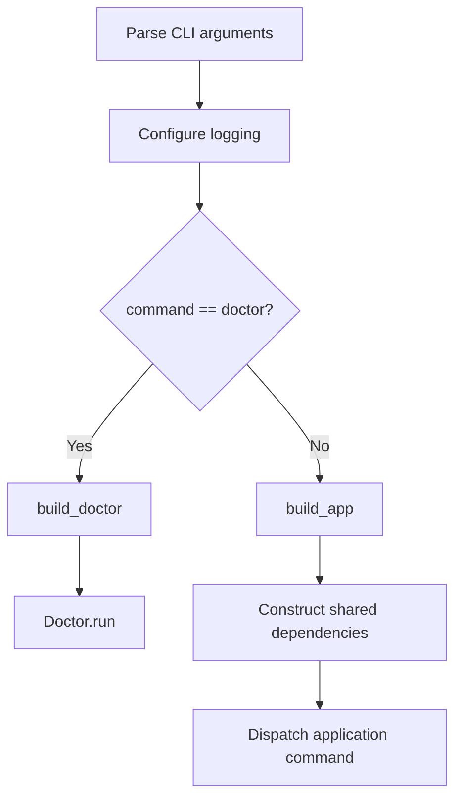

# Diagnostics

This guide documents the refactored `doctor` command in the current repository snapshot. The diagnostics flow is independent from the normal `Obsidian2Anki` facade and its service dependency graph.

## Contents

- [Purpose](#purpose)
- [Source Files](#source-files)
- [Entry-Point Routing](#entry-point-routing)
- [Phase 1: Environment Validation](#phase-1-environment-validation)
- [Phase 2: Runtime Checks](#phase-2-runtime-checks)
- [Output](#output)
- [Logging](#logging)
- [Side Effects and Network Access](#side-effects-and-network-access)
- [Exit Behavior](#exit-behavior)
- [Known Limitations](#known-limitations)
- [Extending Diagnostics](#extending-diagnostics)
- [Troubleshooting](#troubleshooting)

## Purpose

Run:

```bash
obsidian2anki doctor
```

The command answers two separate questions:

1. **Can the application settings be loaded?**
2. **When settings are valid, are the configured runtime dependencies available?**

The separation matters because malformed or incomplete settings should be presented as useful rows rather than preventing the entire application from being built.

## Source Files

| File | Responsibility |
| --- | --- |
| `src/obsidian2anki/main.py` | Routes `doctor` before `build_app()`. |
| `src/obsidian2anki/diagnostics/__init__.py` | Exposes `build_doctor()`. |
| `src/obsidian2anki/diagnostics/doctor.py` | Orchestrates environment and runtime phases. |
| `src/obsidian2anki/diagnostics/environment_checker.py` | Loads settings and normalizes Pydantic errors. |
| `src/obsidian2anki/diagnostics/runtime_checker.py` | Runs ordered runtime checks. |
| `src/obsidian2anki/diagnostics/models.py` | Defines renderable environment and runtime rows. |
| `src/obsidian2anki/diagnostics/columns.py` | Defines Rich table columns. |
| `src/obsidian2anki/diagnostics/output_manager.py` | Validates row width and prints Rich tables. |

## Entry-Point Routing

The CLI parses arguments and configures logging first. It then branches:

```python
if args.command == "doctor":
    return build_doctor().run()
```

Only non-doctor commands continue to:

```python
app = build_app()
commands_mapping = generate_app_command_mapping(app, args)
```



### Consequences

- Missing required settings can be rendered by `EnvironmentChecker`.
- `StateManager` is not constructed for `doctor`.
- The configured state directory and `state.json` are not automatically created by `doctor`.
- The application facade no longer exposes a `doctor()` method.
- The `DoctorService` protocol still present in `app/app.py` is not wired into `Obsidian2Anki`; it is currently unused residue from the earlier design.

## Phase 1: Environment Validation

`Doctor.run()` creates:

```python
environment_checker = EnvironmentChecker(get_settings)
```

The checker receives the settings factory through its constructor, which makes the settings-loading boundary explicit and testable.

### Successful load

When `get_settings()` succeeds, `check_env()` returns a `Settings` instance. Diagnostics continue to runtime checks.

### Pydantic validation errors

When Pydantic raises `ValidationError`, every `ErrorDetails` item is converted into `AppEnvironmentError`:

```text
field_name
error_type
location
message
value
```

The result is displayed in an **Environment Results** table and `Doctor.run()` returns without attempting runtime checks.

### Settings parser errors

A `pydantic_settings.SettingsError` becomes a synthetic row:

```text
Field: <settings>
Error Type: settings_error
Location: -
Value: -
```

### Sensitive-value redaction

Environment values are replaced with `<redacted>` when the field name contains any of:

- `key`
- `token`
- `secret`
- `password`

The match is case-insensitive.

Mappings are displayed as `<mapping omitted>`, `None` becomes `None`, and other `repr()` output is truncated to 120 characters.

> [!CAUTION]
> This redaction protects the environment-results table and its normalized validation logs. It does not protect every other logger call in the codebase. `AI.validate_key()` currently logs the supplied API key when authentication fails.

### Environment table columns

The table uses these columns:

| Column | Presentation |
| --- | --- |
| Field | Bold cyan, no wrapping |
| Error Type | Bold red, no wrapping |
| Location | Yellow |
| Message | Wider folded column |
| Value | Magenta with ellipsis overflow |

## Phase 2: Runtime Checks

When settings load successfully, `Doctor` constructs:

```python
RuntimeChecker(settings, AnkiManager(), AI())
```

`RuntimeChecker.check_runtime()` returns ordered `AppRuntimeCheck` rows.

### Check order

| Order | Check label | Implementation |
| :---: | --- | --- |
| 1 | Python Version | Requires `sys.version_info >= (3, 12)`. |
| 2 | `.env File` | Checks `<BASE_DIR>/.env` with `Path.is_file()`. |
| 3 | Local Vault | Checks `LOCAL_VAULT` exists and is a directory. |
| 4 | Inbox Folder | Checks `LOCAL_VAULT / INBOX_FOLDER`. |
| 5 | Main Notes Folder | Checks `LOCAL_VAULT / MAIN_NOTES_FOLDER`. |
| 6 | State Folder | Checks `BASE_DIR / STATE_FOLDER`. |
| 7 | Prompt File | Checks `BASE_DIR / PROMPT_FILE`. |
| 8 | API key | Calls `AI.validate_key(API_KEY)`. |
| 9 | Anki | Calls `AnkiManager.anki_running()`. |
| 10 | Anki Deck | Looks for `DECK_NAME` in `AnkiManager.get_decks()`. |

When Anki is unreachable, the final row is still added but contains:

```text
Skipped because Anki is unreachable.
```

and is marked as failed.

### Path handling

`BASE_DIR` is the repository root calculated from `src/obsidian2anki/config.py`.

- `.env`, `STATE_FOLDER`, and `PROMPT_FILE` are checked relative to `BASE_DIR` when configured as relative paths.
- vault subfolders are resolved relative to `LOCAL_VAULT`.
- an absolute `PROMPT_FILE` or `STATE_FOLDER` path remains absolute because of `pathlib` joining semantics.

### API-key validation

`AI.validate_key()` creates a Gemini client and calls:

```python
client.models.list()
```

A successful list operation passes the check. `APIError` returns `False`; unexpected exceptions are logged and also return `False`.

This validates current API access, not the quality of the generation prompt or successful use of the hard-coded generation model.

### Anki check

`anki_running()` posts the AnkiConnect `version` action with a one-second timeout. It does not auto-launch Anki during the runtime check.

The later deck check calls the normal `connect()` path, which has no explicit request timeout. Because it runs only after the one-second reachability check passes, it normally completes quickly, but the two calls still have different timeout behavior.

## Output

### Runtime table

Each `AppRuntimeCheck.render()` returns:

```text
status icon, check name, message
```

The table has:

- a narrow status column;
- a bold-cyan `Check` column;
- a folded `Result` column.

A passed row uses `✅`; a failed row uses `❌`.

### Generic row validation

`OutputManager.print_table()` verifies that each rendered row has the same number of cells as the supplied columns. A mismatch raises `ValueError` instead of silently producing a malformed table.

Tables use a rounded Rich border and a bold-magenta title.

## Logging

`doctor` is listed in:

```python
IGNORE_CONSOLE = "doctor", "stats"
```

The root logger therefore receives only the rotating file handler for this command. The Rich table is printed directly through `Console.print()`.

Logs are written to:

```text
logs/obsidian2anki.log
```

The file handler:

- rotates at 5 MiB;
- keeps three backups;
- uses UTF-8;
- includes timestamp, level, logger name, and message.

`--verbose` changes the file logging level to `DEBUG`:

```bash
obsidian2anki --verbose doctor
```

## Side Effects and Network Access

`doctor` does not intentionally modify vault notes, Anki notes, state contents, or configuration files.

It does perform external reads:

- reads `.env` through Pydantic Settings;
- reads the prompt during `AI` construction;
- contacts Gemini for key validation;
- contacts AnkiConnect for version and deck names;
- writes diagnostic logs;
- inspects local files and folders.

It does **not** build `StateManager`, so it does not create the state folder or state file.

## Exit Behavior

`Doctor.run()` has no explicit return value. A completed diagnostic run therefore returns `None`, which the console-script process treats as status `0`.

This remains true when:

- environment rows contain errors;
- runtime rows contain failures;
- the deck check is skipped.

The command currently communicates diagnostic health through table rows, not through a failure exit code.

Exceptions that escape `Doctor.run()` are not covered by the normal command `try/except`, because the doctor branch occurs before that block.

## Known Limitations

### Prompt check can be bypassed by prompt loading

`AI.__init__()` calls `_get_prompt()` before `RuntimeChecker.check_runtime()` runs. A missing, unreadable, or invalidly referenced prompt can therefore raise before the planned **Prompt File** row is produced.

A safer design would check paths first, then construct network clients only for checks that require them.

### Invalid API key may be written to logs

`AI.validate_key()` currently includes the supplied key in an error log. Replace that message with a redacted identifier or omit the value entirely.

### Diagnostics do not set process failure status

Automation cannot currently rely on `$?` alone. It must parse output or logs.

### No logs-directory row

The current runtime list checks the state folder but not the logs folder or log-file writability.

### Network checks are sequential

Gemini and Anki checks run synchronously. There is no global diagnostics timeout.

### Runtime dependencies use concrete classes

`RuntimeChecker` accepts concrete `AnkiManager` and `AI` types. Tests can still pass substitutes dynamically, but protocols would make the boundary clearer.

### Deck lookup assumes a list

If Anki becomes unavailable between the reachability and deck calls, `get_decks()` can return `None`, and membership testing may raise rather than produce a failed row.

## Extending Diagnostics

### Add a runtime check

1. Add a private method returning `AppRuntimeCheck` in `runtime_checker.py`.
2. Insert it in the intended order inside `check_runtime()`.
3. Keep the check read-only whenever possible.
4. Catch expected operational errors and return a failed row instead of raising.
5. Add tests for pass, fail, and exception paths.
6. Update this guide, `docs/cli.md`, and the README check list.

### Add an environment field renderer

Change `_format_value()` only when the new representation cannot expose secrets. Keep the sensitive-name rule as a final defense.

### Add a new table type

1. Create a frozen, slotted dataclass implementing `render()`.
2. Add a column factory in `columns.py`.
3. Ensure row width exactly matches column count.
4. Print through `OutputManager`.

### Improve exit codes

A future design can make `Doctor.run()` return a structured result or integer status:

- `0` when all checks pass;
- non-zero when settings or runtime checks fail;
- a separate status for unexpected internal errors.

## Troubleshooting

### Environment Results appears

Read the `Field`, `Error Type`, and `Message` columns. Correct `.env`, then rerun the command. Sensitive values will not be shown.

### No runtime table appears after valid settings

Inspect `logs/obsidian2anki.log`. The prompt is loaded while constructing `AI`, so verify `PROMPT_FILE` exists and is readable.

### API key fails

Confirm the value in `.env`, network access, and current Gemini access. Remove the key from any copied logs because the current validator may have recorded it.

### Anki fails

Open Anki Desktop, confirm AnkiConnect is installed and enabled, and verify `ANKI_URL`.

### Anki Deck is skipped

Fix Anki reachability first. The deck lookup intentionally does not run after a failed Anki check.

### State Folder fails

Create the directory manually or run a normal application command after settings and prompt configuration are valid. `StateManager` creates the folder during normal app construction; `doctor` intentionally does not.
