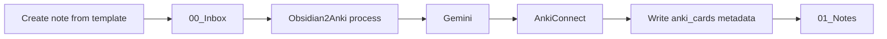

# Installation

Install **Obsidian2Anki**, connect it to Google Gemini and Anki, and configure Obsidian so every new note uses the metadata required by the processing pipeline.

This guide covers a source installation from GitHub. It also explains how to install the Obsidian **Templater** community plugin and use the note template included with the repository.

---

## Table of Contents

- [Requirements](#requirements)
- [Installation Overview](#installation-overview)
- [1. Clone the Repository](#1-clone-the-repository)
- [2. Create a Virtual Environment](#2-create-a-virtual-environment)
- [3. Install Python Dependencies](#3-install-python-dependencies)
- [4. Create the Environment File](#4-create-the-environment-file)
- [5. Create a Gemini API Key](#5-create-a-gemini-api-key)
- [6. Install Anki and AnkiConnect](#6-install-anki-and-ankiconnect)
- [7. Add the Required `NoteID` Field to Anki](#7-add-the-required-noteid-field-to-anki)
- [8. Prepare the Obsidian Vault](#8-prepare-the-obsidian-vault)
- [9. Install the Templater Plugin](#9-install-the-templater-plugin)
- [10. Install the Obsidian2Anki Note Template](#10-install-the-obsidian2anki-note-template)
- [11. Verify the Installation](#11-verify-the-installation)
- [Updating Obsidian2Anki](#updating-obsidian2anki)
- [Best Practices](#best-practices)
- [Next Steps](#next-steps)

---

## Requirements

Before installing Obsidian2Anki, make sure the following applications are available.

| Requirement            | Purpose                                       |
| ---------------------- | --------------------------------------------- |
| Python 3.12 or newer   | Runs the application                          |
| Git                    | Downloads and updates the repository          |
| Obsidian               | Stores and edits source notes                 |
| Templater for Obsidian | Generates a unique ID for every new note      |
| Anki Desktop           | Stores generated flashcards                   |
| AnkiConnect            | Allows Obsidian2Anki to communicate with Anki |
| Google Gemini API key  | Authorizes AI flashcard generation            |

> [!IMPORTANT]
> Obsidian2Anki uses Python syntax that requires Python 3.12 or newer. Check your interpreter before continuing:
>
> ```bash
> python --version
> ```

On systems where `python` points to an older interpreter, use `python3` or an explicitly versioned command such as `python3.12`.

---

## Installation Overview

```mermaid
flowchart LR
    A[Clone repository] --> B[Create virtual environment]
    B --> C[Install Python package]
    C --> D[Create .env]
    D --> E[Configure Gemini]
    E --> F[Install AnkiConnect]
    F --> G[Add NoteID field]
    G --> H[Install Templater]
    H --> I[Copy note template]
    I --> J[Run verification]
```



The complete installation has three integrations:

1. **Python application** — reads notes, tracks state, and coordinates processing.
2. **Obsidian and Templater** — create notes with the required YAML frontmatter.
3. **Anki and AnkiConnect** — receive and manage generated flashcards.

---

## 1. Clone the Repository

Clone the project and enter its root directory:

```bash
git clone https://github.com/NikaMalakmadze/Obsidian2Anki.git
cd Obsidian2Anki
```

The project root should contain at least:

```text
Obsidian2Anki/
├── data/
├── input/
│   └── prompt.md
├── logs/
├── src/
│   └── obsidian2anki/
├── template/
│   └── note.md
└── pyproject.toml
```

> [!NOTE]
> Run all commands in this guide from the repository root unless a step says otherwise.

---

## 2. Create a Virtual Environment

A virtual environment keeps Obsidian2Anki and its dependencies isolated from other Python projects.

### Linux and macOS

```bash
python3 -m venv .venv
source .venv/bin/activate
```

### Windows PowerShell

```powershell
py -m venv .venv
.venv\Scripts\Activate.ps1
```

### Windows Command Prompt

```bat
py -m venv .venv
.venv\Scripts\activate.bat
```

After activation, verify that the virtual environment's interpreter is being used:

```bash
python --version
python -c "import sys; print(sys.executable)"
```

The executable path should point inside `.venv`.

---

## 3. Install Python Dependencies

Upgrade the packaging tools first:

```bash
python -m pip install --upgrade pip setuptools wheel
```

Install Obsidian2Anki in editable mode:

```bash
python -m pip install -e .
```

> [!TIP]
> Editable installation is recommended for contributors because source changes under `src/` are immediately available without reinstalling the package.

> [!WARNING]
> Do not run the application with the system Python after installing it into `.venv`. Activate the virtual environment first, or call the virtual environment's Python executable directly.

---

## 4. Create the Environment File

Obsidian2Anki loads configuration from a `.env` file in the repository root.

Create it:

```bash
# Linux and macOS
cp /dev/null .env
```

On Windows, create a new file named exactly `.env`. Make sure the editor does not save it as `.env.txt`.

Add the following configuration and replace the example values:

```env
STATE_FOLDER=data

API_KEY=your_gemini_api_key
PROMPT_FILE=input/prompt.md

INCLUDE_TAGS=[]
EXCLUDE_TAGS=[]

ANKI_URL=http://localhost:8765/
DECK_NAME=Programming

LOCAL_VAULT=/absolute/path/to/your/obsidian/vault
INBOX_FOLDER=00_Inbox
MAIN_NOTES_FOLDER=01_Notes

MAX_RETRIES_ON_ANKI_DUPLICATE_CARD=3
```

### List syntax

`INCLUDE_TAGS` and `EXCLUDE_TAGS` are Pydantic list settings. Use JSON-style arrays:

```env
INCLUDE_TAGS=["Python", "JavaScript", "React"]
EXLUDE_TAGS=["Archive", "Draft", "Ignore"]
```

To disable a filter, use an empty list:

```env
INCLUDE_TAGS=[]
EXLUDE_TAGS=[]
```

### Vault paths

Use an absolute path for `LOCAL_VAULT`.

Linux:

```env
LOCAL_VAULT=/home/nika/Documents/MyVault
```

macOS:

```env
LOCAL_VAULT=/Users/nika/Documents/MyVault
```

Windows:

```env
LOCAL_VAULT=C:\Users\Nika\Documents\MyVault
```

See [Configuration](configuration.md) for the complete setting reference and tag-filter behavior.

---

## 5. Create a Gemini API Key

Obsidian2Anki currently uses Google Gemini through the `google-genai` Python package.

1. Open [Google AI Studio](https://aistudio.google.com/api-keys).
2. Sign in with a Google account.
3. Create an API key.
4. Copy the key.
5. Store it in `.env`:

```env
API_KEY=your_actual_api_key
```

### Prompt file

The default AI prompt is included at:

```text
input/prompt.md
```

Keep this configuration unless you intentionally move the prompt:

```env
PROMPT_FILE=input/prompt.md
```

The prompt is loaded relative to the repository root.

---

## 6. Install Anki and AnkiConnect

Obsidian2Anki sends cards to Anki through the AnkiConnect add-on.

### Install Anki Desktop

Install the desktop version of Anki from the [official Anki website](https://apps.ankiweb.net/), then open it at least once.

### Install AnkiConnect

In Anki:

1. Open **Tools → Add-ons**.
2. Select **Get Add-ons** or **Browse & Install**, depending on the Anki version.
3. Enter the AnkiConnect code:

   ```text
   2055492159
   ```

4. Confirm the installation.
5. Restart Anki.

The default AnkiConnect endpoint is:

```env
ANKI_URL=http://localhost:8765/
```

Keep Anki open while Obsidian2Anki is running. The application attempts to start Anki automatically when it can find an `anki` executable, but this is not guaranteed on every operating system or installation method.

### Test AnkiConnect

With Anki running, execute:

```bash
python -c "import requests; print(requests.post('http://localhost:8765/', json={'action': 'version', 'version': 6}).json())"
```

A successful response resembles:

```text
{'result': 6, 'error': None}
```

> [!WARNING]
> AnkiConnect is provided by a third party. Installing Anki Desktop alone is not enough; the add-on must also be installed and Anki must be running.

---

## 7. Add the Required `NoteID` Field to Anki

Obsidian2Anki serializes every generated card with three fields:

```text
Front
Back
NoteID
```

The default Anki `Basic` note type normally contains only `Front` and `Back`. Add `NoteID` before processing notes.

In Anki:

1. Open **Tools → Manage Note Types**.
2. Select **Basic**.
3. Select **Fields**.
4. Select **Add**.
5. Enter this exact field name:

   ```text
   NoteID
   ```

6. Save and close the dialogs.

The field name is case-sensitive and must match the value used by the application:

```python
"fields": {
    "Front": self.front,
    "Back": self.back,
    "NoteID": self.note_id,
}
```

`NoteID` connects an Anki note to the unique ID stored in the source Obsidian note. It supports card cleanup, note deletion, and synchronization behavior.

> [!IMPORTANT]
> If the `NoteID` field is missing, AnkiConnect will reject card creation because the submitted fields do not match the selected `Basic` note type.

> [!NOTE]
> Adding the field does not require displaying it on the front or back of the card. It may remain hidden from the card template.

---

## 8. Prepare the Obsidian Vault

Create the folders referenced by `.env` inside your Obsidian vault.

For example:

```text
MyVault/
├── 00_Inbox/
├── 01_Notes/
└── Templates/
```

Configure them as follows:

```env
LOCAL_VAULT=/absolute/path/to/MyVault
INBOX_FOLDER=00_Inbox
MAIN_NOTES_FOLDER=01_Notes
```

### Folder roles

| Folder      | Role                                                          |
| ----------- | ------------------------------------------------------------- |
| `00_Inbox`  | New notes waiting to be processed                             |
| `01_Notes`  | Processed notes and existing notes used by migration          |
| `Templates` | Obsidian templates, including the Obsidian2Anki note template |

During normal processing, Obsidian2Anki reads files from `INBOX_FOLDER`. After cards are created successfully, it writes the generated Anki IDs into the note's YAML frontmatter and moves the note to `MAIN_NOTES_FOLDER`.



> [!IMPORTANT]
> The configured inbox and main-notes directories must already exist. The current `VaultManager` expects to iterate over these folders and does not create them automatically.

---

## 9. Install the Templater Plugin

The bundled note template uses this Templater expression:

```text
<% crypto.randomUUID() %>
```

This expression creates a unique UUID whenever the template is applied. Obsidian's built-in Templates plugin does not evaluate Templater commands, so install the community plugin named **Templater**.

### Enable community plugins

In Obsidian:

1. Open **Settings**.
2. Select **Community plugins**.
3. Turn off **Restricted mode** when prompted.
4. Confirm that you understand that community plugins execute third-party code.

### Install Templater

1. Under **Community plugins**, select **Browse**.
2. Search for **Templater**.
3. Select the plugin maintained by **SilentVoid13**.
4. Select **Install**.
5. Select **Enable**.

Official Templater documentation is available at [silentvoid13.github.io/Templater](https://silentvoid13.github.io/Templater/).

> [!WARNING]
> Install the plugin named **Templater**, not only Obsidian's built-in **Templates** core plugin. The bundled template requires Templater's JavaScript expression support.

---

## 10. Install the Obsidian2Anki Note Template

The repository includes the required template at:

```text
template/note.md
```

Its current content is:

```markdown
---
id: <% crypto.randomUUID() %>
tags:
---

---
```

The first block is YAML frontmatter. The second `---` is a Markdown horizontal rule that visually separates metadata from note content.

### Copy the template into the vault

Copy `template/note.md` into the vault's template folder.

Linux or macOS example:

```bash
cp template/note.md "/absolute/path/to/MyVault/Templates/Obsidian2Anki Note.md"
```

Windows PowerShell example:

```powershell
Copy-Item "template\note.md" "C:\path\to\MyVault\Templates\Obsidian2Anki Note.md"
```

You may rename the copied file. Do not remove or rewrite the `id` expression.

### Configure Templater's template folder

In Obsidian:

1. Open **Settings → Templater**.
2. Set **Template folder location** to the folder containing the copied template, for example:

   ```text
   Templates
   ```

3. Close settings.

### Apply the template manually

To create a compatible note:

1. Create a new note inside `00_Inbox`.
2. Open the Command Palette.
3. Run **Templater: Open Insert Template modal**.
4. Select **Obsidian2Anki Note**.
5. Add one or more YAML tags.
6. Write the note below the horizontal rule.

After Templater runs, the note should resemble:

```markdown
---
id: 9fb66ee5-6778-4bf4-817d-f82646d1237e
tags:
  - Python
  - Programming
---

---

# Python Iterators

An iterator returns one item at a time and keeps track of its current state.
```

The generated `id` must be a real UUID. The literal expression must not remain in a note that will be processed:

```text
<% crypto.randomUUID() %>
```

### Automatically apply the template to inbox notes

Templater can apply templates automatically based on the destination folder.

In **Settings → Templater**:

1. Enable **Trigger Templater on new file creation**.
2. Enable **Folder Templates**.
3. Add a folder-template rule.
4. Set the folder to your configured inbox, for example:

   ```text
   00_Inbox
   ```

5. Select the copied Obsidian2Anki note template.

New notes created inside `00_Inbox` will then receive the required frontmatter automatically.

> [!TIP]
> Folder templates reduce the chance of creating notes without an ID and are the recommended setup for daily use.

### Why the template is required

`VaultManager` reads the frontmatter and accesses the ID directly:

```python
id=note["id"]
```

The note ID is then used by the state manager, Anki metadata, update detection, and deletion commands.

The `tags` list controls include/exclude filtering. Valid YAML examples include:

```yaml
tags:
  - Python
  - Algorithms
```

An empty tag list is also valid:

```yaml
tags:
```

> [!CAUTION]
> Never duplicate an existing note without generating a new `id`. Two files with the same ID will be treated as the same logical note and can overwrite each other's state.

---

## 11. Verify the Installation

Complete the following checks before processing a real vault.

### Check configuration loading

```bash
python -c "from obsidian2anki.config import get_settings; print(get_settings().LOCAL_VAULT)"
```

The command should print the configured vault path without a validation error.

### Check CLI availability

```bash
python -m obsidian2anki.main --help
```

The CLI should list these commands:

```text
migrate
process
clear
format-notes
delete-card
delete-note
```

### Check the template output

Create a test note through Templater and confirm that:

- `id` contains a generated UUID;
- `tags` is a YAML list or empty YAML property;
- the note is stored in `INBOX_FOLDER`;
- content appears below the YAML frontmatter.

### Run a first processing test

Keep Anki open, then run:

```bash
python -m obsidian2anki.main process
```

A successful first run should:

1. Read notes from the configured inbox.
2. Skip notes rejected by tag filters.
3. Send eligible note content to Gemini.
4. Create cards in the configured Anki deck.
5. Write `anki_cards` into the note's frontmatter.
6. Move the note into the main notes folder.
7. Save processing state in `data/state.json`.

After processing, frontmatter resembles:

```yaml
---
id: 9fb66ee5-6778-4bf4-817d-f82646d1237e
anki_cards: 1749920000001, 1749920000002
tags:
  - Python
---
```

### Inspect logs

Runtime logs are written to:

```text
logs/obsidian2anki.log
```

The log file rotates after reaching approximately 5 MiB, and the application keeps backup files.

> [!NOTE]
> The CLI currently runs through the module entry point because `pyproject.toml` does not define a console-script command. Use `python -m obsidian2anki.main ...` unless a future release adds an `obsidian2anki` executable.

---

## Updating Obsidian2Anki

Pull the latest source changes:

```bash
git pull
```

Reactivate the virtual environment and reinstall the project so dependency or package metadata changes are applied:

```bash
source .venv/bin/activate
python -m pip install -e .
```

On Windows PowerShell:

```powershell
.venv\Scripts\Activate.ps1
python -m pip install -e .
```

Review changes to these files before running the new version:

- `pyproject.toml`
- `src/obsidian2anki/config.py`
- `template/note.md`
- `input/prompt.md`

Do not overwrite your `.env` or vault template without comparing the new requirements.

---

## Best Practices

- Keep `.env` secret and outside version control.
- Use the bundled template as the single source of truth for new notes.
- Configure a Templater folder rule for `INBOX_FOLDER`.
- Never reuse a note UUID.
- Add the Anki `NoteID` field before the first processing run.
- Start with a temporary Anki deck and a small test note.
- Back up the Obsidian vault before running bulk formatting or migration commands.
- Keep Anki open during processing.
- Review `logs/obsidian2anki.log` when a command fails.
- Use absolute vault paths and exact folder names.

---

## Next Steps

Continue with [Configuration](configuration.md) to understand every environment variable, tag-filter rule, path setting, and retry option.
