# Installation

This guide installs the current source version of **Obsidian2Anki**, configures Google Gemini and AnkiConnect, explains automatic local-state initialization, and sets up Obsidian Templater so new inbox notes contain valid metadata.

> [!IMPORTANT]
> These instructions match the current `0.1.0` codebase. The application is not yet a one-command installer: the `.env` file, Anki deck, Anki `NoteID` field, and vault folders must be prepared before `obsidian2anki doctor` can run successfully. The state directory and `state.json` are created automatically.

## Contents

- [Before You Begin](#before-you-begin)
- [Requirements](#requirements)
- [1. Clone the Repository](#1-clone-the-repository)
- [2. Create a Virtual Environment](#2-create-a-virtual-environment)
- [3. Install Obsidian2Anki](#3-install-obsidian2anki)
- [4. Initialize Runtime Files](#4-initialize-runtime-files)
- [5. Configure the Environment](#5-configure-the-environment)
- [6. Create a Gemini API Key](#6-create-a-gemini-api-key)
- [7. Install and Configure Anki](#7-install-and-configure-anki)
- [8. Prepare the Obsidian Vault](#8-prepare-the-obsidian-vault)
- [9. Install and Configure Templater](#9-install-and-configure-templater)
- [10. Verify the Installation](#10-verify-the-installation)
- [11. Process a Test Note](#11-process-a-test-note)
- [Updating](#updating)
- [Uninstalling](#uninstalling)
- [Installation Troubleshooting](#installation-troubleshooting)
- [Current Setup Constraints](#current-setup-constraints)

## Before You Begin

Obsidian2Anki can modify three kinds of data:

- it writes `anki_cards` metadata into Obsidian notes;
- it moves successfully processed notes from the inbox folder to the main notes folder;
- it creates and deletes Anki notes referenced by its local state.

Before the first real run:

1. Back up the Obsidian vault.
2. Back up or synchronize the Anki collection.
3. Start with a temporary deck and one test note.
4. Do not process sensitive notes that should not be sent to the Google Gemini API.
5. Use `--dry-run` before bulk `process`, `migrate`, `format-notes`, or `clear` operations.

## Requirements

| Requirement                | Purpose                                                        |
| -------------------------- | -------------------------------------------------------------- |
| Python 3.12 or newer       | Runs the application and supports syntax used by the codebase. |
| Git                        | Clones and updates the repository.                             |
| Obsidian                   | Stores source Markdown notes.                                  |
| Templater community plugin | Generates a unique UUID in new note frontmatter.               |
| Anki Desktop               | Stores generated flashcards.                                   |
| AnkiConnect                | Exposes the local Anki HTTP API used by the application.       |
| Google Gemini API key      | Authorizes AI flashcard generation.                            |

Check Python before continuing:

```bash
python --version
```

The result must be `Python 3.12.x` or newer. Depending on the operating system, the command may be `python3`, `python3.12`, or `py -3.12` instead.

## Installation Flow

```mermaid
flowchart LR
    A[Clone repository] --> B[Create venv]
    B --> C[Install editable package]
    C --> D[Create .env]
    D --> E[Configure Gemini]
    E --> F[Install AnkiConnect]
    F --> G[Create deck and NoteID field]
    G --> H[Create vault folders]
    H --> I[Configure Templater]
    I --> J[Run doctor]
    J --> K[StateManager initializes state]
    K --> L[Process test note]
```



## 1. Clone the Repository

Clone the project and enter its root directory:

```bash
git clone https://github.com/NikaMalakmadze/Obsidian2Anki.git
cd Obsidian2Anki
```

The root should include:

```text
Obsidian2Anki/
├── data/
├── docs/
├── input/
│   └── prompt.md
├── logs/
├── src/
│   └── obsidian2anki/
├── template/
│   └── note.md
├── .env.example
└── pyproject.toml
```

Run the remaining shell commands from this directory. Configuration paths such as `input/prompt.md`, `data`, and `logs` are resolved relative to the repository root by the current source layout.

## 2. Create a Virtual Environment

The repository's `.gitignore` already excludes a folder named `venv`, so this guide uses that name.

### Linux and macOS

```bash
python3 -m venv venv
source venv/bin/activate
```

### Windows PowerShell

```powershell
py -3.12 -m venv venv
venv\Scripts\Activate.ps1
```

When PowerShell blocks activation, run this for the current shell and try again:

```powershell
Set-ExecutionPolicy -Scope Process -ExecutionPolicy Bypass
venv\Scripts\Activate.ps1
```

### Windows Command Prompt

```bat
py -3.12 -m venv venv
venv\Scripts\activate.bat
```

Confirm that the active interpreter belongs to the virtual environment:

```bash
python --version
python -c "import sys; print(sys.executable)"
```

## 3. Install Obsidian2Anki

Upgrade `pip`, then install the project in editable mode:

```bash
python -m pip install --upgrade pip
python -m pip install -e .
```

The canonical direct dependencies are declared in `pyproject.toml`. `requirements.txt` is a fully pinned environment snapshot and is not required for a normal editable installation.

Verify the installed distribution without starting the application yet:

```bash
python -c "from importlib.metadata import version; print(version('Obsidian2Anki'))"
```

The expected result is:

```text
0.1.0
```

Do not run `obsidian2anki --help` yet. The current module import path loads settings and application dependencies before argument parsing, so the `.env` file and configured prompt must be available first. CLI verification is performed in [Verify the Installation](#10-verify-the-installation).

## 4. Initialize Runtime Files

### State

No manual state-directory or state-file creation is required. During `StateManager` initialization, the application:

1. resolves `STATE_FOLDER` relative to the repository root;
2. creates that directory, including missing parent directories;
3. creates `state.json` when it does not exist;
4. loads an empty file as an empty state.

With the default setting, the resulting path is:

```text
data/state.json
```

The first successful state-changing operation writes a formatted JSON object to the file. Keep the state file private and backed up because it links Obsidian note IDs to generated Anki note IDs.

> [!CAUTION]
> `StateManager` creates missing paths but does not repair malformed JSON. If `state.json` already exists and contains invalid JSON, application startup will fail until the file is restored or corrected.

### Logs

No manual log-file creation is required. The logger creates `logs/obsidian2anki.log` when the first command configures logging. The repository already includes `logs/.gitkeep`.

## 5. Configure the Environment

Copy the provided example to `.env`.

Linux or macOS:

```bash
cp .env.example .env
```

Windows PowerShell:

```powershell
Copy-Item .env.example .env
```

Windows Command Prompt:

```bat
copy .env.example .env
```

Open `.env` and replace the blank values:

```env
API_KEY=your_gemini_api_key
PROMPT_FILE=input/prompt.md

ANKI_URL=http://localhost:8765/
DECK_NAME=Programming

LOCAL_VAULT=/absolute/path/to/your/obsidian/vault
INBOX_FOLDER=00_Inbox
MAIN_NOTES_FOLDER=01_Notes

STATE_FOLDER=data

INCLUDE_TAGS=[]
EXCLUDE_TAGS=[]

MAX_RETRIES_ON_ANKI_DUPLICATE_CARD=3
```

All fields are required by the current Pydantic `Settings` model. Leave list settings as `[]` rather than deleting them.

### Configuration details

| Variable                             | Example                    | Meaning                                                             |
| ------------------------------------ | -------------------------- | ------------------------------------------------------------------- |
| `API_KEY`                            | `AIza...`                  | Gemini API key.                                                     |
| `PROMPT_FILE`                        | `input/prompt.md`          | Prompt path relative to the repository root.                        |
| `ANKI_URL`                           | `http://localhost:8765/`   | AnkiConnect endpoint.                                               |
| `DECK_NAME`                          | `Programming`              | Exact destination deck name.                                        |
| `LOCAL_VAULT`                        | `/home/user/Notes/MyVault` | Absolute path to the Obsidian vault.                                |
| `INBOX_FOLDER`                       | `00_Inbox`                 | Vault-relative source folder for normal processing.                 |
| `MAIN_NOTES_FOLDER`                  | `01_Notes`                 | Vault-relative destination and migration folder.                    |
| `STATE_FOLDER`                       | `data`                     | Repository-relative folder containing `state.json`.                 |
| `INCLUDE_TAGS`                       | `["Python", "React"]`      | Optional allowlist; `[]` allows all non-excluded notes.             |
| `EXCLUDE_TAGS`                       | `["Draft", "Archive"]`     | Denylist; any match skips the note.                                 |
| `MAX_RETRIES_ON_ANKI_DUPLICATE_CARD` | `3`                        | Maximum regeneration attempts after an unsuccessful Anki insertion. |

### Tag-list syntax

Pydantic expects JSON-style arrays:

```env
INCLUDE_TAGS=["Python", "JavaScript", "React"]
EXCLUDE_TAGS=["Archive", "Draft", "Ignore"]
```

Tag comparisons are exact and case-sensitive. `Python` and `python` are different values.

To disable either filter:

```env
INCLUDE_TAGS=[]
EXCLUDE_TAGS=[]
```

### Vault paths

Use an absolute path.

Linux:

```env
LOCAL_VAULT=/home/nika/Documents/MyVault
```

macOS:

```env
LOCAL_VAULT=/Users/nika/Documents/MyVault
```

Windows can use forward slashes, which avoids backslash escaping confusion:

```env
LOCAL_VAULT=C:/Users/Nika/Documents/MyVault
```

Do not include the inbox or main folder in `LOCAL_VAULT`; those are configured separately.

## 6. Create a Gemini API Key

The current AI implementation uses the `google-genai` package and the hard-coded model ID:

```text
gemini-3.1-flash-lite
```

1. Open Google AI Studio's API-key page.
2. Sign in.
3. Create or select a Gemini API key.
4. Store it in `.env`:

```env
API_KEY=your_actual_key
```

Do not commit `.env`, paste the key into screenshots, or include it in logs or public issues.

The default prompt is already included at:

```text
input/prompt.md
```

Keep this setting unless the prompt is intentionally moved:

```env
PROMPT_FILE=input/prompt.md
```

The AI object reads the prompt during application construction, so a missing or unreadable prompt prevents every command—including `doctor`—from starting.

## 7. Install and Configure Anki

### Install Anki Desktop

Install the desktop application from Anki's official website, open it, and finish any first-run profile setup.

### Install AnkiConnect

In Anki:

1. Open **Tools → Add-ons**.

2. Select **Get Add-ons**.

3. Enter:

   ```text
   2055492159
   ```

4. Confirm the installation.

5. Restart Anki.

The default endpoint used by Obsidian2Anki is:

```env
ANKI_URL=http://localhost:8765/
```

Keep Anki open during commands that create, delete, count, or diagnose Anki notes. Although the source attempts to launch an `anki` executable, startup discovery is platform-dependent and should not be relied on for the initial setup.

### Test AnkiConnect

With Anki open:

```bash
python -c "import requests; print(requests.post('http://localhost:8765/', json={'action': 'version', 'version': 6}, timeout=5).json())"
```

A working endpoint returns:

```text
{'result': 6, 'error': None}
```

### Create the destination deck

Create a deck in Anki whose name exactly matches `DECK_NAME`.

For example:

```env
DECK_NAME=Programming
```

Then create a deck named `Programming` in Anki's main window.

> [!IMPORTANT]
> Create the deck manually before the first run. The diagnostic command expects it to exist, and the current deck-creation path should not be treated as a setup replacement.

### Add the required `NoteID` field

Generated notes use the hard-coded Anki model name `Basic` and submit these fields:

```text
Front
Back
NoteID
```

The default `Basic` note type normally has only `Front` and `Back`. Add the third field:

1. Open **Tools → Manage Note Types**.

2. Select **Basic**.

3. Select **Fields**.

4. Select **Add**.

5. Enter the exact case-sensitive name:

   ```text
   NoteID
   ```

6. Save the change.

`NoteID` does not need to appear on the visible card template. It stores the originating Obsidian UUID for traceability.

> [!WARNING]
> The current code cannot select a custom Anki note type through configuration. It always submits `modelName: Basic`, so modifying another note type will not satisfy the application.

## 8. Prepare the Obsidian Vault

Create the configured folders directly inside the vault:

```text
MyVault/
├── 00_Inbox/
├── 01_Notes/
└── Templates/
```

Corresponding `.env` values:

```env
LOCAL_VAULT=/absolute/path/to/MyVault
INBOX_FOLDER=00_Inbox
MAIN_NOTES_FOLDER=01_Notes
```

### Folder roles

| Folder      | Role                                                                           |
| ----------- | ------------------------------------------------------------------------------ |
| `00_Inbox`  | New notes processed by `obsidian2anki process`.                                |
| `01_Notes`  | Destination for successful inbox notes and source for `obsidian2anki migrate`. |
| `Templates` | Suggested location for the bundled Templater note template.                    |

The application does not create the inbox or main-note folders. Their names and capitalization must match `.env` exactly.

### File constraints

The current folder reader:

- scans only immediate files, not nested subfolders;
- attempts to parse every immediate file rather than filtering by `.md` extension;
- expects each parsed note to contain an `id` property.

Keep only compatible Markdown notes in the configured processing folders.

## 9. Install and Configure Templater

The repository includes:

```text
template/note.md
```

Its source is:

```markdown
---
id: <% crypto.randomUUID() %>
tags:
---

---
```

The first `---` block is YAML frontmatter. The final separator is a Markdown horizontal rule. Templater evaluates `crypto.randomUUID()` when the template is inserted.

### Install Templater

In Obsidian:

1. Open **Settings → Community plugins**.
2. Enable community plugins when prompted.
3. Select **Browse**.
4. Search for **Templater**.
5. Install the plugin published by SilentVoid13.
6. Enable it.

The built-in Obsidian **Templates** core plugin is not a substitute; it does not evaluate the Templater expression used by the bundled file.

### Copy the template into the vault

Linux or macOS example:

```bash
cp template/note.md "/absolute/path/to/MyVault/Templates/Obsidian2Anki Note.md"
```

Windows PowerShell example:

```powershell
Copy-Item "template\note.md" "C:\path\to\MyVault\Templates\Obsidian2Anki Note.md"
```

You may rename the copied template, but keep the `id` expression unchanged.

### Set the template folder

In **Settings → Templater**, set **Template folder location** to:

```text
Templates
```

### Apply it automatically to inbox notes

In Templater settings:

1. Enable **Trigger Templater on new file creation**.

2. Select the folder-template matching mode or enable folder templates, depending on the installed Templater version.

3. Add a rule for the configured inbox folder:

   ```text
   00_Inbox
   ```

4. Select the copied Obsidian2Anki template.

Create a new file inside `00_Inbox`. After Templater executes, the literal expression should be replaced by a real UUID:

```yaml
---
id: 9fb66ee5-6778-4bf4-817d-f82646d1237e
tags:
---
```

Do not process a file that still contains:

```text
<% crypto.randomUUID() %>
```

### Add tags

The parser recognizes tags only when the YAML value is a list:

```yaml
tags:
  - Python
  - Programming
```

An empty list property is also acceptable:

```yaml
tags:
```

A scalar such as `tags: Python` is not treated as a tag list by the current implementation.

### Do not reuse note IDs

Duplicating an existing note also duplicates its YAML unless Templater is reapplied. Generate a new UUID for every logical note. State is keyed by `id`, so duplicate IDs can overwrite or share tracking information.

## 10. Verify the Installation

The `.env` settings and configured prompt must be valid before running `doctor`, because dependency construction loads them before the diagnostic checks begin. The state directory and file are initialized automatically during this construction.

### Check the CLI

```bash
obsidian2anki --help
```

The command list should include:

```text
migrate
process
clear
format-notes
doctor
stats
delete-card
delete-note
```

### Run diagnostics

Open Anki and run:

```bash
obsidian2anki doctor
```

The Rich table checks:

- Python version;
- `.env` file;
- local vault;
- inbox folder;
- main notes folder;
- state folder;
- Gemini API key;
- prompt file;
- configured Anki deck;
- Anki connectivity.

`doctor` writes diagnostic logs to `logs/obsidian2anki.log` while reserving the terminal for the result table.

### Preview inbox processing

```bash
obsidian2anki process --dry-run
```

The current dry run reads the inbox and reports through logs without generating cards, modifying notes, saving new state, or calling the note-processing loop.

For debug output, place the global option before the command:

```bash
obsidian2anki --verbose process --dry-run
```

This does not work as intended:

```bash
obsidian2anki process --verbose
```

because `--verbose` belongs to the root parser.

## 11. Process a Test Note

Create `00_Inbox/API.md` through Templater:

```markdown
---
id: 9fb66ee5-6778-4bf4-817d-f82646d1237e
tags:
  - Programming
  - API
---

---

# API

An API is a defined interface that lets software systems communicate without exposing every internal implementation detail.
```

Keep Anki open and run:

```bash
obsidian2anki process
```

A successful run should:

1. read the note from `INBOX_FOLDER`;
2. verify include and exclude tags;
3. simplify Markdown and Obsidian wiki links for the AI request;
4. request structured flashcards from Gemini 3.1 Flash-Lite;
5. create Anki notes in `DECK_NAME`;
6. write generated IDs into `anki_cards`;
7. move the file to `MAIN_NOTES_FOLDER`;
8. save the normalized content hash and metadata in `data/state.json`.

The moved note should resemble:

```yaml
---
id: 9fb66ee5-6778-4bf4-817d-f82646d1237e
anki_cards: 1749920000001, 1749920000002
tags:
  - Programming
  - API
---
```

Inspect the following after the command:

```text
01_Notes/API.md
data/state.json
logs/obsidian2anki.log
```

In Anki, verify that each generated note contains `Front`, `Back`, and the matching Obsidian UUID in `NoteID`.

## Updating

Activate the virtual environment, pull source changes, and reinstall the editable package:

```bash
git pull
source venv/bin/activate
python -m pip install -e .
```

Windows PowerShell:

```powershell
git pull
venv\Scripts\Activate.ps1
python -m pip install -e .
```

After an update, compare changes in:

- `.env.example`
- `pyproject.toml`
- `src/obsidian2anki/config.py`
- `input/prompt.md`
- `template/note.md`

Do not overwrite `.env`, `data/state.json`, or the vault template without reviewing the changes first.

## Uninstalling

Remove the installed console package from the active virtual environment:

```bash
python -m pip uninstall Obsidian2Anki
```

Then deactivate and delete `venv` if it is no longer needed.

Uninstalling the Python package does not automatically delete:

- generated Anki notes;
- `anki_cards` metadata in Obsidian;
- moved vault notes;
- `data/state.json`;
- log files.

Use application cleanup commands only after understanding their effects and creating backups.

## Installation Troubleshooting

### Pydantic reports missing settings

Cause: `.env` is missing, stored outside the repository root, or lacks one of the required variables.

Check:

```bash
python -c "from obsidian2anki.config import get_settings; print(get_settings().model_dump())"
```

Do not share the output publicly because it includes the API key.

### The state directory cannot be created

`StateManager` normally creates `STATE_FOLDER` and `state.json` automatically. If startup fails with a filesystem error:

- confirm that `STATE_FOLDER` is a valid repository-relative path;
- confirm that the current user can write to the repository directory;
- check whether a regular file already exists where the state directory should be;
- avoid pointing `STATE_FOLDER` at a protected system location.

After correcting the path or permissions, rerun the command.

### `state.json` contains invalid JSON

An automatically created state file is empty and loads correctly. This error usually means an existing file was manually edited, truncated, or corrupted. Restore it from a backup when possible. If no state must be preserved, replace its contents with an empty JSON object:

```json
{}
```

Resetting the file discards the application's mapping between notes and generated Anki note IDs, so do this only after reviewing the consequences.

### `obsidian2anki` command is not found

Activate the same virtual environment where `python -m pip install -e .` was executed. Verify:

```bash
python -m pip show Obsidian2Anki
python -m obsidian2anki.main --help
```

### Anki cannot be reached

- Open Anki manually.
- Confirm AnkiConnect is installed and enabled.
- Restart Anki after add-on installation.
- Verify `ANKI_URL=http://localhost:8765/`.
- Run the AnkiConnect test request from this guide.

### The Anki deck check fails

Create the exact deck named by `DECK_NAME`. Matching is case-sensitive.

### Anki rejects submitted fields

Add the exact `NoteID` field to the `Basic` note type. The application submits `Front`, `Back`, and `NoteID`.

### A note fails before AI generation

Check that:

- it is an immediate file in the configured folder;
- it contains valid YAML frontmatter;
- `id` exists;
- `tags` is a YAML list or empty property;
- its file encoding is UTF-8;
- it is a compatible Markdown file.

### No notes are processed

Review tag filters. Exclude tags take priority, include matching is exact, and case matters.

Run:

```bash
obsidian2anki --verbose process --dry-run
```

Then inspect:

```text
logs/obsidian2anki.log
```

### Templater leaves the UUID expression unchanged

Confirm that:

- the community plugin **Templater** is installed and enabled;
- the file was inserted or created through Templater;
- the template folder is configured correctly;
- the folder-template rule matches the inbox path.

Obsidian's built-in Templates plugin alone will copy the expression without executing it.

## Current Setup Constraints

The following constraints come directly from the current implementation:

- `StateManager` automatically creates `STATE_FOLDER` and `state.json`, but the configured location must be writable.
- All environment settings are mandatory.
- `doctor` cannot diagnose an incomplete `.env` or missing prompt because those are loaded while building the application.
- Inbox and main-note directories must already exist.
- Folder scanning is immediate and non-recursive.
- Anki's `Basic` note type must contain `NoteID`.
- The destination deck should be created manually.
- Anki should be opened manually before integration commands.
- The Gemini model is fixed to `gemini-3.1-flash-lite` in source code.
- `format-notes` assumes a legacy note whose first line contains space-separated `#tags`; it rewrites note files and should be preceded by a backup and `--dry-run`.

## Next Step

Continue with the upcoming configuration guide for a complete explanation of environment variables, tag-filter precedence, path resolution, and retry settings.
