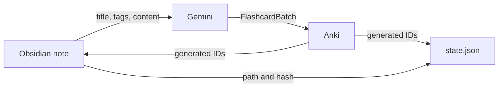
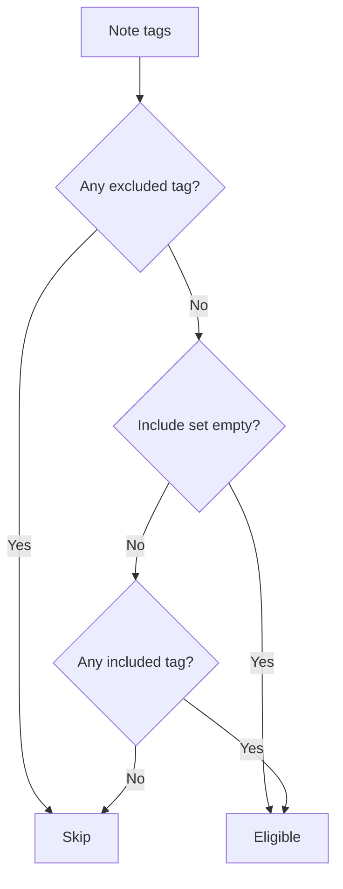
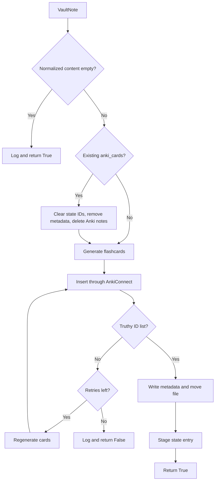
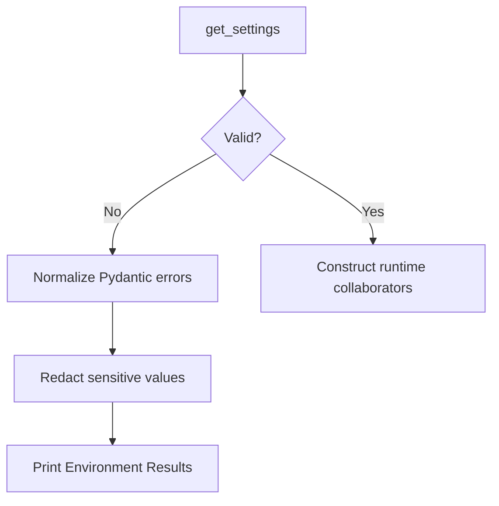

# Workflow

This guide explains how the current Obsidian2Anki code moves data among an Obsidian vault, Gemini, Anki, and local state.

## Contents

- [Data Stores](#data-stores)
- [Application Startup](#application-startup)
- [Note Reading and Normalization](#note-reading-and-normalization)
- [Tag Filtering](#tag-filtering)
- [Inbox Processing](#inbox-processing)
- [Migration](#migration)
- [Single-Note Lifecycle](#single-note-lifecycle)
- [State and Change Detection](#state-and-change-detection)
- [Formatting Legacy Notes](#formatting-legacy-notes)
- [Deletion and Clearing](#deletion-and-clearing)
- [Doctor Workflow](#doctor-workflow)
- [Statistics Workflow](#statistics-workflow)
- [Dry Run](#dry-run)
- [Failure and Recovery](#failure-and-recovery)
- [Recommended Routines](#recommended-routines)

## Data Stores

### Obsidian vault

The vault owns:

- source Markdown body;
- frontmatter `id`;
- frontmatter `tags`;
- generated `anki_cards` metadata;
- inbox/main folder location.

### Anki

Anki owns the actual generated notes. Every inserted item uses:

```text
Model: Basic
Fields: Front, Back, NoteID
```

The IDs returned by AnkiConnect are stored locally. Despite names such as `card_id`, the code uses AnkiConnect note actions and therefore tracks Anki note IDs.

### Local state

`state.json` stores the last locally recorded successful relation among:

- frontmatter ID;
- filename-derived title;
- absolute source path;
- normalized-content hash;
- generated Anki note IDs;
- card count;
- timestamps.



## Application Startup

### Parsing and logging

Every invocation first:

1. constructs the parser;
2. parses required command and options;
3. chooses `INFO` or `DEBUG`;
4. installs rotating file logging;
5. optionally installs Rich console logging.

`doctor` and `stats` omit the normal console log handler because they render their own tables.

### Doctor branch

```python
if args.command == "doctor":
    return build_doctor().run()
```

This occurs before the normal application is constructed.

### Normal application branch

Other commands call `build_app()`, which eagerly creates:

- vault manager;
- Anki manager;
- state manager;
- AI client and prompt;
- note processor;
- services;
- facade.

State storage is created and loaded during this phase. The prompt is also read during this phase.

These startup operations occur before the command invocation `try/except`.

## Note Reading and Normalization

### Recursive discovery

`process` and `migrate` call:

```python
VaultManager.get_folder_notes(folder_name)
```

The internal scanner:

- verifies the root folder on the first recursive call;
- descends into nested directories;
- includes only files with suffix `.md`;
- parses each file with `python-frontmatter`.

### Frontmatter requirements

`_process_file()` directly reads:

```python
note["id"]
```

A missing `id` raises and is not converted into a skipped-note result at the vault layer.

`tags` is accepted only when parsed as a list. Any other shape becomes `[]`.

`anki_cards` supports:

- one integer;
- comma-separated string;
- YAML list;
- other/missing values, which become `[]`.

### Title

The title is:

```python
file.name.split(".")[0]
```

Examples:

| Filename | Title |
| --- | --- |
| `Iterators.md` | `Iterators` |
| `python.iterators.md` | `python` |

### Body normalization

The body first has every newline replaced with a space. `process_note_content()` then:

1. temporarily extracts fenced code spans matched by triple backticks;
2. converts `[[target]]` to `target`;
3. converts `[[target|alias]]` to `alias`;
4. removes horizontal rules;
5. strips selected bold, italic, strike, inline-code, and heading markers;
6. restores the extracted fenced code strings.

Because newline replacement happens before extraction, fenced code delimiters and text remain, but original line layout is not preserved.

### Hash input

State hashes this normalized content. Changes only to removed formatting, tags, or non-content frontmatter do not directly alter the hash.

## Tag Filtering

Implemented by `NoteProcessor.has_right_tags()`:

```text
pass = no excluded tag
       AND
       (include set empty OR at least one included tag)
```

Matching is exact and case-sensitive.



## Inbox Processing

Run:

```bash
obsidian2anki process
```

### Service flow

1. recursively load `.md` files from inbox;
2. return when no notes are available;
3. log discovered count;
4. return immediately when dry run is enabled;
5. for each note, apply tag filter;
6. call `process_note()` for eligible notes;
7. save staged state in `finally`.

### Important behavior

Inbox processing does not check whether the note is already in state or changed. The inbox location itself is treated as the work queue.

A skipped tag-filtered note remains in its current location.

A note with empty normalized content is treated as a successful `process_note()` result but is not moved and receives no state or metadata update.

### Continuation after failure

`NoteProcessor.process_note()` catches exceptions and returns `False`. `ProcessingService` does not inspect that result, so later notes continue.

## Migration

Run:

```bash
obsidian2anki migrate
```

Migration scans `MAIN_NOTES_FOLDER` recursively.

### Eligibility

```python
has_right_tags(note) and needs_processing(note)
```

`needs_processing()` returns true when:

- `note.id` is absent from state; or
- the stored normalized-content hash differs; or
- the stored title differs.

### Preview

Migration computes candidate titles before the dry-run branch. With verbose logging, it lists each candidate.

### Execution

Candidates are processed in scanner order. The loop stops after the first `False` result.

State is saved in `finally`, preserving staged results from successful earlier notes.

### Edited notes

When a tracked note has `anki_cards`, the replacement path deletes all existing generated Anki notes before asking Gemini for replacements.

## Single-Note Lifecycle

`NoteProcessor.process_note()` coordinates one note.



### Empty content

Returns `True` without external changes. This can make service logs look successful while the note remains unprocessed.

### Existing generated IDs

`delete_note_cards()`:

1. clears IDs in state and saves;
2. reads the source path from state;
3. removes frontmatter `anki_cards`;
4. deletes each recorded Anki note.

This assumes the note has a valid state entry. An inbox note that contains `anki_cards` but is absent from state can fail when the state path lookup returns `None`.

### Gemini generation

`AI.generate_note_cards()` sends prompt plus JSON containing:

- title;
- tags;
- normalized content.

It excludes ID, path, and existing generated IDs.

### Insertion retry

After the initial insertion, a falsy result triggers up to `MAX_RETRIES_ON_ANKI_DUPLICATE_CARD` additional cycles. Every cycle regenerates the entire batch.

A non-empty list containing failed `None` entries is truthy. It may pass the insertion check and fail later when Pydantic validates `NoteInfo.card_ids` as integers.

### Vault commit

`write_metadata()` inserts one line at index 2 of the raw source file:

```text
anki_cards: <comma-separated IDs>
```

It then moves the file to the main-folder root when the path differs.

This relies on an expected frontmatter line layout and does not update parsed YAML structurally.

### State commit

A new `StateNote` is staged only after vault metadata/movement succeeds. The containing service saves later.

## State and Change Detection

### Initialization

Normal app construction creates the state folder and `state.json` and then loads it.

Doctor does not initialize state.

### Hash

```python
sha256(note.content.encode("utf-8")).hexdigest()
```

where `note.content` is normalized content.

### New successful entry

`prepare_for_state()` records:

- title;
- updated path after movement;
- generated IDs;
- card count;
- identical initial `processed_at` and `updated_at` UTC values;
- content hash.

### Save model

Staged tuples are merged into `_state`, then the entire dictionary is serialized.

There is no atomic replace, lock, backup, or schema version.

### Deletion mutations

Some state deletion methods save immediately. This means multi-system operations can persist partial progress before Anki or frontmatter mutation finishes.

### Manual drift

Examples:

- deleting Anki notes manually leaves stale IDs in vault/state;
- editing `anki_cards` manually can break deletion representation assumptions;
- moving a tracked file manually leaves stale state path;
- deleting a source file can break clear/delete operations;
- changing tags alone does not update state hash.

There is no reconciliation command yet.

## Formatting Legacy Notes

Run dry run first:

```bash
obsidian2anki format-notes --dry-run
```

### Scope

The formatter scans immediate entries only. It does not use recursive Markdown discovery.

It identifies files whose parsed frontmatter lacks either required property:

```text
id, tags
```

### Conversion

The first line is removed and split by spaces. Each token has one leading `#` removed and becomes a YAML tag. A UUID is generated.

### Risks

- non-Markdown files are not filtered before parsing;
- a normal prose first line becomes tag tokens;
- existing partial frontmatter can be rewritten under the legacy assumption;
- nested files are ignored;
- the operation rewrites full files;
- no per-file backup is created.

## Deletion and Clearing

### Delete one generated Anki note

```bash
obsidian2anki delete-card <id>
```

State is changed and saved before Anki/frontmatter completion. The stored `card_count` is not decremented.

Frontmatter list mutation expects a string and may fail when YAML parsed `anki_cards` as an integer or list.

### Delete all generated notes for one source note

```bash
obsidian2anki delete-note <frontmatter-id>
```

Deletes recorded Anki IDs, removes metadata, then removes state. It does not delete the source Markdown file.

Unknown IDs currently continue after a log message and can raise.

### Clear all managed data

```bash
obsidian2anki clear
```

Uses every state entry as the deletion plan. It removes generated IDs from Anki and source metadata, then resets state.

The operation does not discover unmanaged or orphaned Anki notes.

## Doctor Workflow

```bash
obsidian2anki doctor
```

### Environment phase



The command can now display missing/invalid `.env` settings because it runs before the application dependency container.

### Runtime phase

Checks Python, `.env`, vault, inbox, main folder, state folder, prompt, API key, Anki, and deck.

The command contacts Gemini and Anki. It writes logs but does not mutate state or notes.

### Remaining startup gap

`AI()` loads the prompt before `check_runtime()` runs. A missing prompt can still abort between environment validation and runtime table output.

### Result status

Failed rows do not currently set a non-zero process status.

See [Diagnostics](diagnostics.md).

## Statistics Workflow

```bash
obsidian2anki stats
```

`StatsService` intends to collect immediate folder counts, state entries, unprocessed main-folder files, and Anki deck note count.

Current scan behavior differs from process/migrate:

- non-recursive;
- all immediate files counted, not only Markdown.

`_processed_notes()` contains an indexing bug that can make stats fail when state is non-empty.

## Dry Run

### Supported commands

```text
process
migrate
format-notes
clear
```

### Mutation prevention

Their service methods return before their intended mutation loops.

### Startup still occurs

For normal commands, dependency construction can still:

- validate settings;
- create state directory/file;
- load state;
- read prompt;
- construct clients.

### Preview quality

| Command | Preview detail |
| --- | --- |
| `process` | Discovered inbox count only; no tag-candidate list. |
| `migrate` | Candidate count and debug candidate names. |
| `format-notes` | Legacy count and debug filenames. |
| `clear` | State-entry count only. |

## Failure and Recovery

### Gemini rate limit or client error

Every `ClientError` retries indefinitely. Delay starts at seven seconds, doubles, and caps at 60 seconds. It persists for later calls on the same AI instance.

### Other Gemini failure

Propagates to `process_note()`, which logs and returns `False`.

### Anki unavailable

Normal `connect()` may try to launch an executable named `anki` from `PATH`, poll for up to roughly 20 seconds, then still attempt the request. Request/validation failures return `None`.

### Partial insertion

Anki `addNotes` can conceptually return mixed IDs and failures. The code does not perform compensating deletion for successful partial items.

### Process failure

Later inbox notes continue. State is saved after the loop.

### Migration failure

Later main-folder candidates do not run. State staged before the failure is saved.

### Interrupted command

A `KeyboardInterrupt` during the mapped normal handler returns status `130`. Service `finally` blocks may save staged state first.

### Invalid state JSON

Raises during normal application construction, outside the command invocation error boundary. Back up and repair the file manually.

### Vault/state/Anki disagreement

There is no automated repair workflow. Preserve all three stores, inspect logs, and make one deliberate recovery plan rather than independently clearing metadata.

## Recommended Routines

### Daily inbox

```bash
obsidian2anki doctor
obsidian2anki --verbose process --dry-run
obsidian2anki process
```

Remember that process dry run does not list tag-eligible notes.

### Existing formatted notes

```bash
obsidian2anki --verbose migrate --dry-run
obsidian2anki migrate
```

### Legacy main folder

1. Back up the folder.
2. Confirm every immediate file follows the first-line hashtag convention.
3. Run dry run.
4. Run formatting.
5. Inspect frontmatter.
6. Run migration preview.

### Edited tracked note

Run migration. The current implementation deletes old generated notes before replacements are safely available, so preserve an Anki backup for important material.

### Rebuild

```bash
obsidian2anki clear --dry-run
obsidian2anki clear
obsidian2anki migrate --dry-run
obsidian2anki migrate
```

Use only with vault, state, and Anki backups.
