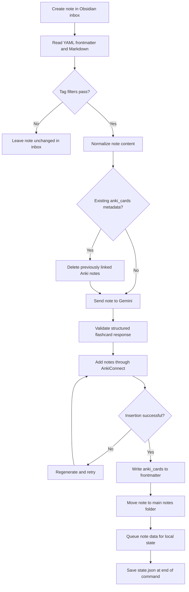
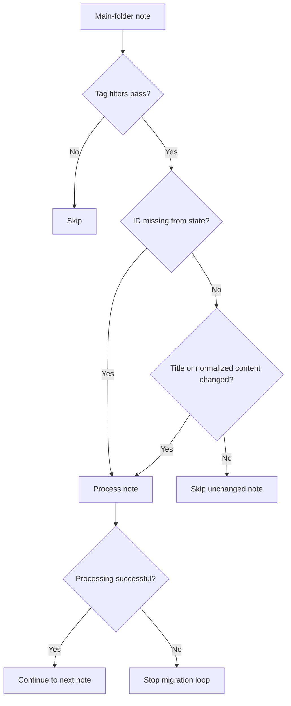

# Workflow

This guide explains how **Obsidian2Anki 0.1.0** moves information between an Obsidian vault, Google Gemini, Anki, and its local state file. It covers the normal inbox workflow, migration of existing notes, change detection, filtering, regeneration, deletion, clearing, diagnostics, statistics, and dry-run behavior.

For setup instructions, see [Installation](installation.md). For every environment variable and path rule, see [Configuration](configuration.md).

> [!CAUTION]
> Obsidian2Anki can rewrite note frontmatter, move files, delete previously generated Anki notes, and clear tracked state. Back up both the Obsidian vault and Anki collection before the first real run or any bulk operation.

## Contents

- [Workflow at a Glance](#workflow-at-a-glance)
- [The Three Data Stores](#the-three-data-stores)
- [Application Startup](#application-startup)
- [Required Note Structure](#required-note-structure)
- [How Notes Are Read](#how-notes-are-read)
- [Content Normalization](#content-normalization)
- [Tag Filtering](#tag-filtering)
- [State and Change Detection](#state-and-change-detection)
- [Normal Inbox Workflow](#normal-inbox-workflow)
- [Migration Workflow](#migration-workflow)
- [Single-Note Processing Lifecycle](#single-note-processing-lifecycle)
- [AI Generation and Retry Behavior](#ai-generation-and-retry-behavior)
- [Anki Synchronization](#anki-synchronization)
- [Vault Metadata and File Movement](#vault-metadata-and-file-movement)
- [State Persistence](#state-persistence)
- [Formatting Legacy Notes](#formatting-legacy-notes)
- [Deleting One Generated Anki Note](#deleting-one-generated-anki-note)
- [Deleting All Generated Notes for One Vault Note](#deleting-all-generated-notes-for-one-vault-note)
- [Clearing All Managed Data](#clearing-all-managed-data)
- [Doctor Workflow](#doctor-workflow)
- [Statistics Workflow](#statistics-workflow)
- [Dry-Run Behavior](#dry-run-behavior)
- [Recommended Operating Routines](#recommended-operating-routines)
- [Failure and Recovery Behavior](#failure-and-recovery-behavior)
- [Current Workflow Constraints](#current-workflow-constraints)

## Workflow at a Glance

The normal workflow starts with a correctly formatted note in the configured inbox folder:



After processing, the Obsidian note remains the source material, Anki contains the generated study notes, and `state.json` links the two systems.

## The Three Data Stores

Obsidian2Anki coordinates three persistent locations.

### 1. Obsidian vault

The vault contains:

- the original Markdown content;
- a stable frontmatter `id`;
- note `tags`;
- generated `anki_cards` metadata after successful processing;
- inbox and main-note folders configured through `.env`.

Example after processing:

```yaml
---
id: 9fb66ee5-6778-4bf4-817d-f82646d1237e
tags:
  - python
  - api
anki_cards: 1712345678901, 1712345678902
---
```

The current code and command names refer to these values as card IDs. AnkiConnect's `addNotes` and `deleteNotes` actions treat them as **Anki note IDs**.

### 2. Anki

Each generated Anki note uses the hardcoded `Basic` note type and contains:

```text
Front  <- generated question
Back   <- generated answer
NoteID <- source Obsidian note UUID
Tags   <- generated tags
```

The `NoteID` field connects every generated Anki note back to the source Obsidian note.

### 3. Local state

The state file is located at:

```text
<repository-root>/<STATE_FOLDER>/state.json
```

With the default configuration:

```text
data/state.json
```

The updated `StateManager` creates the configured directory and touches `state.json` automatically when they do not exist. An empty file is loaded as an empty state.

A state entry stores:

```json
{
	"9fb66ee5-6778-4bf4-817d-f82646d1237e": {
		"title": "Python API",
		"path": "/absolute/path/to/vault/01_Notes/Python API.md",
		"content_hash": "sha256-hash",
		"card_count": 2,
		"anki_note_ids": [1712345678901, 1712345678902],
		"processed_at": "2026-07-25T07:00:00+00:00",
		"updated_at": "2026-07-25T07:00:00+00:00"
	}
}
```

> [!IMPORTANT]
> Keep the Obsidian note metadata, Anki notes, and `state.json` together. Manually changing only one of these locations can break deletion and regeneration workflows.

## Application Startup

Every CLI command follows the same startup path:

1. Parse the selected command and global options.
2. Configure rotating file logging and, where appropriate, Rich console logging.
3. Construct the dependency container.
4. Create shared instances of `VaultManager`, `AnkiManager`, `StateManager`, `AI`, and `NoteProcessor`.
5. Construct all command services.
6. Execute the selected command.

Dependency construction has several effects before the command handler runs:

- `.env` settings are validated;
- the prompt file is read;
- the Gemini client is created;
- the state directory and state file are initialized;
- existing state JSON is loaded and validated.

This means a missing required setting, unreadable prompt, invalid state JSON, or filesystem permission problem can stop any command during startup.

The logger also creates:

```text
logs/obsidian2anki.log
```

when logging is configured.

## Required Note Structure

Normal processing expects YAML frontmatter with at least `id` and `tags`:

```markdown
---
id: 9fb66ee5-6778-4bf4-817d-f82646d1237e
tags:
  - python
  - functions
---

# Python Functions

A function is a reusable block of code.
```

### `id`

The `id` must be:

- present;
- unique within the vault;
- stable for the lifetime of the note;
- preferably a UUID generated by the supplied Templater template.

The ID is used as:

- the key in `state.json`;
- the value written to Anki's `NoteID` field;
- the argument accepted by `delete-note`.

Changing an ID makes the note appear unrelated to its previous state entry and generated Anki notes.

### `tags`

The current vault parser accepts tags only when frontmatter produces a list:

```yaml
tags:
  - python
  - backend
```

A scalar string is treated as no tags by the parser:

```yaml
tags: python
```

Use YAML list form consistently.

### `anki_cards`

Do not add `anki_cards` manually for a new note. It is written after successful Anki insertion and contains the linked Anki note IDs.

## How Notes Are Read

`VaultManager.get_folder_notes()` iterates over every regular file directly inside the selected folder. It does not currently:

- recurse into subfolders;
- filter files by `.md` extension;
- ignore hidden or non-Markdown files automatically.

Each file is parsed as frontmatter and converted to a `VaultNote` containing:

- `id` from frontmatter;
- title derived from the filename;
- list-form tags;
- normalized note body;
- absolute path;
- parsed `anki_cards` IDs.

The title is currently calculated from the text before the first period in the filename. For example:

```text
HTTP.v2.md -> HTTP
```

Keep only compatible Markdown notes in the configured inbox and main folders, and avoid filenames containing periods when the complete filename should be used as the title.

## Content Normalization

Before content is hashed or sent to Gemini, the note body is normalized.

The parser first replaces newline characters with spaces. It then:

- preserves fenced code blocks temporarily;
- converts `[[Target]]` to `Target`;
- converts `[[Target|Alias]]` to `Alias`;
- removes Markdown horizontal rules;
- removes bold, italic, underline-style emphasis, and strikethrough markers;
- removes inline-code backticks while retaining their text;
- removes Markdown heading markers;
- restores fenced code blocks.

Example input:

````markdown
## API

An **API** lets two programs communicate.
See [[HTTP|Hypertext Transfer Protocol]].

```python
print("Code blocks remain fenced")
```
````

Conceptual normalized result:

````text
API An API lets two programs communicate. See Hypertext Transfer Protocol. ```python print("Code blocks remain fenced") ```
````

The normalized content is used for both Gemini input and SHA-256 change detection. Pure formatting changes that disappear during normalization may therefore not trigger regeneration.

## Tag Filtering

A note is eligible only when both conditions are true:

1. none of its tags appear in `EXCLUDE_TAGS`;
2. `INCLUDE_TAGS` is empty, or at least one note tag appears in `INCLUDE_TAGS`.

The effective logic is:

```text
eligible = no excluded tag matches
           AND
           (include list is empty OR at least one include tag matches)
```

|               Include match                | Exclude match | Processed? |
| :----------------------------------------: | :-----------: | :--------: |
| Not required because include list is empty |      No       |    Yes     |
|                    Yes                     |      No       |    Yes     |
|                     No                     |      No       |     No     |
|                    Yes                     |      Yes      |     No     |
|                     No                     |      Yes      |     No     |

Exclusion always wins. Matching is exact and case-sensitive.

During `process`, an ineligible note remains in the inbox unchanged. During `migrate`, an ineligible main-folder note is skipped.

> [!NOTE]
> Tags are checked for eligibility, but they are not included in the state change hash. Changing only a note's tags does not itself mark a previously tracked note as changed.

## State and Change Detection

`NoteProcessor.needs_processing()` returns `True` when:

- the note ID is absent from state; or
- the stored title differs from the current title; or
- the SHA-256 hash of normalized content differs from the stored hash.

The following changes trigger migration reprocessing:

- editing meaningful note content;
- renaming the file so the derived title changes;
- restoring a note whose ID is no longer present in state.

The following changes do **not** directly trigger reprocessing:

- changing tags only;
- moving a note while keeping the same ID, title, and normalized content;
- changing frontmatter fields other than the ID used for lookup;
- making Markdown-only changes removed by normalization.

When a difference is detected, the in-memory state's `updated_at` is changed immediately. The complete replacement state entry is prepared only after successful processing.

## Normal Inbox Workflow

Run:

```bash
obsidian2anki process
```

The command reads files directly inside `INBOX_FOLDER` and follows this behavior:

1. Load every file as a vault note.
2. Report the number of inbox notes found.
3. Evaluate each note against include and exclude filters.
4. Skip notes that fail filtering.
5. Process every eligible note.
6. Save queued state updates in a `finally` block when the command ends.

Unlike migration, inbox processing does not call `needs_processing()`. Every eligible note currently present in the inbox is sent through the single-note processing lifecycle.

A successfully processed inbox note is moved to `MAIN_NOTES_FOLDER`. Therefore, a normal second run no longer sees it in the inbox.

### Notes that remain in the inbox

A note remains in place when:

- its tags fail filtering;
- its body is empty;
- processing fails before metadata is written and the file is moved;
- the application is interrupted before successful completion.

An empty-content note is treated as a non-error result, but it receives no cards, no state entry, and no move to the main folder.

### Processing after one note fails

`process` does not stop based on the Boolean result returned by `process_note()`. An exception inside one note is caught and logged by `NoteProcessor`, after which the service continues to the next inbox note.

## Migration Workflow

Run:

```bash
obsidian2anki migrate
```

Migration operates on `MAIN_NOTES_FOLDER` rather than the inbox. It is intended for:

- the initial import of an existing formatted vault;
- regeneration after editing a previously processed main note;
- processing eligible main notes that are not yet in state.

The command:

1. loads all files in the main notes folder;
2. filters out notes with disallowed tags;
3. filters out tracked notes whose title and normalized content have not changed;
4. reports how many notes require processing;
5. processes eligible new or changed notes in folder iteration order;
6. saves state in a `finally` block.



Unlike `process`, migration stops its loop when `process_note()` returns `False`. Notes successfully completed before the failure are still saved to state by the outer `finally` block.

## Single-Note Processing Lifecycle

Both `process` and `migrate` use the same `NoteProcessor.process_note()` method.

### 1. Check for content

When normalized content is empty, the processor logs that no content was found and returns success without generating cards.

No metadata, file movement, or state entry is created in this branch.

### 2. Remove old generated notes when metadata exists

When the source note already has `anki_cards`, the processor attempts to remove the old generated Anki notes before creating replacements:

1. empty the linked IDs in state;
2. remove `anki_cards` from the path stored in state;
3. call AnkiConnect `deleteNotes` for every old ID.

This is the regeneration path used for changed notes.

> [!WARNING]
> Old Anki notes are deleted before replacement generation and insertion finish. If Gemini generation or Anki insertion then fails, the previous cards may already be gone. Maintain backups before bulk migration.

### 3. Generate candidate flashcards

Gemini receives:

- the complete configured prompt;
- a JSON representation of the note;
- note title;
- note tags;
- normalized note content;
- existing `anki_cards` data, when present.

The note's filesystem path and source UUID are excluded from the Gemini payload.

### 4. Insert into Anki

The generated cards are converted to the `Basic` Anki note structure and submitted in one `addNotes` request.

### 5. Retry failed insertion

When Anki does not return an ID list, the application regenerates the whole flashcard batch and retries insertion according to `MAX_RETRIES_ON_ANKI_DUPLICATE_CARD`.

### 6. Update the vault

After successful insertion, the application:

- writes the returned IDs into `anki_cards` frontmatter;
- moves the file into the main notes folder when it came from elsewhere;
- updates the in-memory note path.

### 7. Prepare state

The application creates a new `StateNote` from the successfully processed note and queues it for the next state save.

## AI Generation and Retry Behavior

The current model is hardcoded as:

```text
gemini-3.1-flash-lite
```

Gemini is asked for JSON matching this schema:

```json
{
	"cards": [
		{
			"question": "...",
			"answer": "...",
			"tags": ["..."]
		}
	]
}
```

Pydantic validates the returned JSON before it is passed to Anki.

### Gemini rate-limit retry

When the Google client raises `ClientError`, generation waits and retries indefinitely:

```text
7 seconds -> 14 -> 28 -> 56 -> 60 -> 60 -> ...
```

The delay doubles until it reaches 60 seconds. There is currently no maximum attempt count for this loop.

### Anki insertion retry

The first insertion attempt occurs before the configured retry loop. For example:

```env
MAX_RETRIES_ON_ANKI_DUPLICATE_CARD=3
```

allows:

```text
1 initial insertion + 3 regenerate-and-retry attempts = up to 4 insertions
```

Each retry requests a newly generated batch from Gemini instead of resubmitting the same cards.

When every insertion fails, `process_note()` returns `False` and does not write new vault metadata or queue a replacement state entry.

## Anki Synchronization

Before adding notes, `AnkiManager` checks whether the configured deck appears in Anki's deck list. It attempts deck creation when the deck is missing.

Generated notes are serialized as:

```json
{
	"deckName": "Programming",
	"modelName": "Basic",
	"fields": {
		"Front": "Generated question",
		"Back": "Generated answer",
		"NoteID": "source-note-uuid"
	},
	"tags": ["python"]
}
```

Anki must expose fields named exactly:

```text
Front
Back
NoteID
```

If Anki is unreachable, the connector attempts to locate an `anki` executable on the system `PATH` and launch it. It then polls for a response. A failed connection is logged and returns `None` to the calling workflow.

> [!NOTE]
> Keep Anki open before large operations. Automatic startup depends on the executable being discoverable as `anki` and should not be treated as a replacement for proper installation and verification.

## Vault Metadata and File Movement

After Anki returns IDs, `VaultManager.write_metadata()` inserts this line at the third physical line of the source file:

```yaml
anki_cards: 1712345678901, 1712345678902
```

For a correctly structured note, that places it below the `id` field:

```yaml
---
id: 9fb66ee5-6778-4bf4-817d-f82646d1237e
anki_cards: 1712345678901, 1712345678902
tags:
  - python
---
```

The file is then moved to:

```text
<LOCAL_VAULT>/<MAIN_NOTES_FOLDER>/<original-filename>
```

Movement is skipped when the note already resolves to that exact destination path, as during migration.

The destination folder must already exist. The current processing code does not create vault folders.

A same-named file already present at the destination can cause the move to fail. The error is caught at the single-note processor level and logged.

## State Persistence

A successfully processed note is first queued in memory. The state entry contains the path **after** any inbox-to-main move.

`ProcessingService` and `MigrationService` call `state.save()` in a `finally` block. This gives two useful properties:

- successful notes completed before a later failure can still be persisted;
- queued changes are saved when the service exits normally or through an exception.

`save()` writes all state as formatted UTF-8 JSON and then clears the temporary queue.

Some deletion methods save immediately rather than waiting for the service to end.

> [!CAUTION]
> Do not edit `state.json` while Obsidian2Anki is running. The next save rewrites the complete in-memory state object.

## Formatting Legacy Notes

Run a preview first:

```bash
obsidian2anki -v format-notes --dry-run
```

The intended legacy format places space-separated hashtags on the first line:

```markdown
#python #functions

# Python Functions

A function is a reusable block of code.
```

Formatting converts the first line into YAML frontmatter, removes leading `#` characters from tags, and generates a new UUID:

```yaml
---
id: generated-uuid
tags:
  - python
  - functions
---
```

The command operates only on files directly inside `MAIN_NOTES_FOLDER`.

### Metadata detection

A note is reported as already formatted when the parsed frontmatter contains at least two keys. The current check does not verify specifically that those keys are `id` and `tags`.

### Current implementation warning

> [!WARNING]
> The current non-dry-run implementation discovers and reports legacy notes, but then calls the formatter for **every regular file** in the main notes folder rather than only the discovered legacy files. Running it against already formatted notes can rewrite them incorrectly. Back up the folder and restrict it to true legacy files before using the real command.

The formatter also assumes that the first line contains only the old hashtag list. A note without that legacy structure can receive incorrect tags or lose the intended first content line.

## Deleting One Generated Anki Note

Run:

```bash
obsidian2anki delete-card 1712345678901
```

Despite the public command name, the ID is the value returned by AnkiConnect for an Anki note.

The deletion workflow is state-first:

1. find the ID inside a tracked state's `anki_note_ids` list;
2. remove it from that list and save state;
3. delete the corresponding Anki note;
4. remove the ID from the source note's `anki_cards` metadata;
5. when no linked IDs remain, remove the complete `anki_cards` property and delete the note's state entry.

The command deletes nothing when the ID is not found in local state, even when an Anki note with that ID exists.

`delete-card` does not support `--dry-run`.

### State count detail

The stored `card_count` field is not currently decremented when one ID is deleted. The active ID list is updated, but `card_count` can remain at its original value until the complete state entry is replaced or removed.

## Deleting All Generated Notes for One Vault Note

Run:

```bash
obsidian2anki delete-note 9fb66ee5-6778-4bf4-817d-f82646d1237e
```

Use the source note's frontmatter `id`, not its filename and not an Anki ID.

The command:

1. locates the note in state;
2. reads its stored path and linked Anki note IDs;
3. deletes every linked Anki note;
4. removes `anki_cards` from the Obsidian note;
5. removes the state entry.

It does **not** delete the Obsidian Markdown file itself.

`delete-note` does not support `--dry-run` and should be used only for IDs present in state. The current implementation logs when an ID is absent but does not return immediately, so an unknown ID can lead to a later path error.

## Clearing All Managed Data

Preview:

```bash
obsidian2anki clear --dry-run
```

Execute:

```bash
obsidian2anki clear
```

`clear` works from the local state snapshot. For every tracked source note, it:

- deletes all linked Anki notes;
- removes `anki_cards` metadata from the stored vault path;
- clears the ID list in state during processing.

After all tracked notes are handled, it writes an empty state object.

The command does not:

- delete source Markdown files;
- move main notes back into the inbox;
- process untracked Anki notes;
- delete notes from other decks unless their IDs are stored in state.

After a successful clear, running `migrate` processes eligible main-folder notes again because their IDs are no longer in state.

> [!DANGER]
> `clear` is a bulk deletion command. A dry run currently reports the number of state entries but does not validate every stored file path or Anki ID in advance.

## Doctor Workflow

Run:

```bash
obsidian2anki doctor
```

`doctor` displays a Rich table for these checks:

- Python version is at least 3.12;
- `.env` exists at the repository root;
- the local vault exists;
- the configured inbox folder exists;
- the configured main notes folder exists;
- the state folder exists;
- the Gemini API key validates;
- the configured prompt file exists;
- the configured Anki deck exists;
- Anki responds through AnkiConnect.

`doctor` has no dry-run option because its purpose is read-only validation. Its Rich table is printed directly, while normal console log output is disabled for this command; detailed logs still go to the rotating log file.

Because the complete dependency graph is constructed before `Doctor.run()`, some startup failures cannot be reported as table rows. Examples include Pydantic setting errors, an unreadable prompt file, malformed state JSON, or failure to initialize the state directory.

## Statistics Workflow

Run:

```bash
obsidian2anki stats
```

The Rich table displays:

- files directly inside the inbox folder;
- files directly inside the main notes folder;
- processed notes represented by state entries;
- main-folder files whose resolved paths are absent from state;
- Anki notes returned by `findNotes` for the configured deck.

The “Generated Cards” statistic is the total number of Anki notes currently found in the configured deck. It is not restricted by `NoteID` or local state, so manually created notes in the same deck are included.

The “Unprocessed Notes” count compares absolute main-folder paths with paths stored in state. A moved or renamed file can therefore appear unprocessed even when its ID still exists in state under an older path.

Like `doctor`, `stats` prints its table directly and suppresses ordinary console logging while still writing logs to file.

## Dry-Run Behavior

These commands support `--dry-run`:

```text
process
migrate
clear
format-notes
```

These do not:

```text
doctor
stats
delete-card
delete-note
```

### What dry run prevents

The command-specific service avoids:

- Gemini generation;
- Anki insertion or deletion;
- note metadata changes;
- inbox-to-main file movement;
- state-content changes caused by the selected operation.

### What can still happen during startup

Dry run is not a completely side-effect-free process launch. Before the service checks `dry_run`, normal startup can:

- create the configured state directory;
- touch `state.json` when absent;
- create the logs directory and log file;
- read and validate configuration, prompt, and existing state.

### Detail provided by each preview

| Command                  | Current preview behavior                                                                                        |
| ------------------------ | --------------------------------------------------------------------------------------------------------------- |
| `process --dry-run`      | Reports the total number of files found in the inbox, then exits before tag evaluation and per-note processing. |
| `migrate --dry-run`      | Calculates eligible new or changed notes, reports the count, and logs their titles at debug level.              |
| `format-notes --dry-run` | Reports detected legacy-note count and logs their titles at debug level.                                        |
| `clear --dry-run`        | Reports the number of tracked state entries, then exits.                                                        |

Use global verbose mode before the subcommand to see debug-level preview details:

```bash
obsidian2anki -v migrate --dry-run
obsidian2anki -v format-notes --dry-run
```

## Recommended Operating Routines

### Daily inbox routine

```bash
obsidian2anki doctor
obsidian2anki process --dry-run
obsidian2anki process
obsidian2anki stats
```

Practical sequence:

1. Create notes through the Templater-enabled inbox.
2. Add or verify tags.
3. Keep Anki open.
4. Preview the inbox run.
5. Process notes.
6. Review generated cards and the updated note frontmatter.
7. Check statistics or logs when counts look unexpected.

### Initial migration of an already formatted vault

```bash
obsidian2anki doctor
obsidian2anki -v migrate --dry-run
obsidian2anki migrate
obsidian2anki stats
```

Before migration:

- confirm every candidate note has a unique `id` and list-form `tags`;
- remove non-Markdown files from the main folder;
- verify include and exclude filters;
- back up the vault, state, and Anki collection.

### Updating cards after editing a main note

1. Edit the note in `MAIN_NOTES_FOLDER`.
2. Keep the existing frontmatter `id` unchanged.
3. Run:

```bash
obsidian2anki -v migrate --dry-run
obsidian2anki migrate
```

Migration detects a changed title or normalized-content hash, deletes the old linked Anki notes, and creates replacements.

### Removing one generated item

For one linked Anki note:

```bash
obsidian2anki delete-card <anki-note-id>
```

For all linked Anki notes belonging to one source note:

```bash
obsidian2anki delete-note <obsidian-note-id>
```

### Rebuilding all tracked cards

The destructive rebuild sequence is:

```bash
obsidian2anki clear --dry-run
obsidian2anki clear
obsidian2anki -v migrate --dry-run
obsidian2anki migrate
```

Use this only with verified backups. It deletes all Anki notes referenced by state before generating replacements.

## Failure and Recovery Behavior

### A note fails during inbox processing

The error is logged, the note normally remains in the inbox, and processing continues with later notes. Any old cards deleted earlier in that note's regeneration path may already be gone.

Inspect:

```text
logs/obsidian2anki.log
```

Fix the underlying problem, then run `process` again.

### A note fails during migration

Migration stops at the first note that returns failure. Successful notes processed earlier in the run are saved. Fix the failed note or external dependency, then rerun migration; unchanged successful notes should be skipped through state comparison.

### The process is interrupted

The CLI catches `KeyboardInterrupt` and exits with status code `130`. Service-level `finally` blocks attempt to save queued state changes when control unwinds through them.

### State JSON is empty

An empty file is interpreted as an empty state. The next successful state-changing operation writes a JSON object.

### State JSON is malformed

Startup fails while decoding JSON. Restore a valid backup or correct the file. Replacing it with an empty file discards tracking information and causes eligible main notes to appear new during migration.

### Vault metadata and state disagree

Use backups and determine which copy is authoritative before changing anything. Avoid blindly running migration when a note has stale `anki_cards` IDs but no matching state entry, because the regeneration path expects stored state data to locate and remove the old metadata safely.

### Anki is unavailable

Open Anki manually, verify AnkiConnect, confirm `ANKI_URL`, then run `doctor`. The connector may attempt automatic startup, but a failed connection returns no insertion result and can trigger regeneration retries.

## Current Workflow Constraints

The following behaviors are important when designing a safe routine around version `0.1.0`:

- only files directly inside the configured folders are processed;
- files are not filtered by extension before frontmatter parsing;
- note IDs and tags are assumed to exist during normal parsing;
- tags must be represented as a YAML list;
- title extraction stops at the first period in a filename;
- content normalization flattens line breaks before AI generation and hashing;
- tag changes alone are not part of change detection;
- inbox processing does not compare against state before processing;
- changed-note regeneration deletes old Anki notes before replacements are guaranteed;
- Gemini `ClientError` retries have no total attempt limit;
- the Anki note type and Gemini model are hardcoded;
- `format-notes` currently applies formatting to every regular file during a real run;
- `delete-card` and `delete-note` do not support dry run;
- `delete-note` removes generated Anki notes and tracking data but keeps the source Markdown file;
- statistics count all Anki notes in the configured deck, not only notes generated by this application;
- state, note frontmatter, and Anki are synchronized through sequential operations rather than a transaction, so partial failure is possible.

Treat the Obsidian vault as the source of knowledge, maintain recoverable backups, and use small test runs before processing a large collection.
